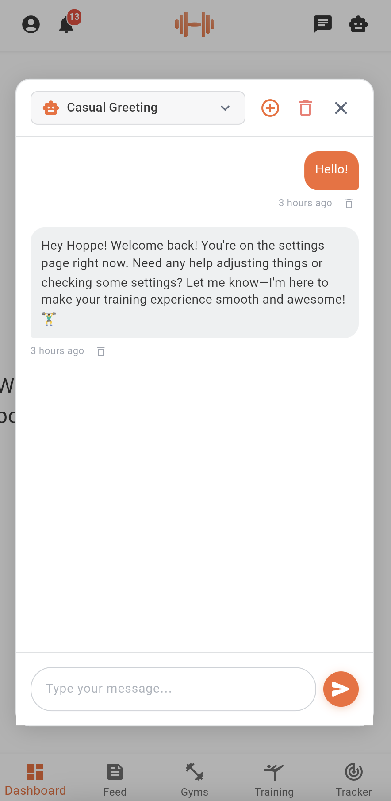

# AI Assistant Guide

Welcome to the AI Assistant feature in Dambel. This guide will help you understand how to use the AI-powered assistant to get personalized help and guidance throughout your fitness journey.

## Overview

The Dambel AI Assistant is an intelligent helper that provides context-aware assistance while you use the app. It can answer questions, provide workout advice, help with nutrition, and guide you through app features. The assistant maintains conversation history in organized threads, allowing you to continue previous conversations or start new ones at any time.

The AI Assistant understands what you're doing in the app (which page you're viewing, what forms you're filling, etc.) and uses this context to provide more relevant and helpful responses.

## Accessing the AI Assistant

### Step 1: Locate the AI Assistant Icon

The AI Assistant can be accessed from most screens in the app through the app bar at the top:

1. Look for the **robot icon** (🤖) in the top-right corner of the screen
2. The icon appears next to the chat icon in the app bar

*The robot icon in the app bar provides quick access to the AI Assistant from any screen*

### Step 2: Open the AI Assistant

Simply tap on the robot icon to open the AI Assistant dialog. The assistant will appear as a floating window in the center of your screen with a clean chat interface.

## Using the AI Assistant

### Starting a New Conversation

When you first open the AI Assistant, you'll see a new empty conversation:

1. The chat area will be empty, ready for your first message
2. At the bottom, you'll see a message input field with a send button (paper plane icon)
3. Type your question or message in the input field
4. Tap the **Send** button to send your message

**What Happens Next**:
- Your message will be sent to the AI
- The app automatically creates a new conversation thread
- The AI processes your message along with your current app context
- You'll receive a response from the AI assistant
- The thread title is automatically generated based on your first message

*The AI Assistant window showing the chat interface with message history, input field, and controls*

### Sending Messages

To send a message in an active conversation:

1. **Type Your Message**: Click in the input field at the bottom and type your question or request
2. **Include Context**: The AI automatically knows what you're doing in the app, so you can reference "this page" or "this workout"
3. **Send**: Press Enter or tap the send button
4. **Wait for Response**: The AI will process your message and respond automatically

The send button shows a loading indicator while the AI is generating a response.

### Viewing Chat History

The AI Assistant maintains a history of all your conversations:

1. **Access History**: Click on the chat selector dropdown at the top of the AI Assistant dialog (shows current thread title with dropdown arrow)
2. **Browse Threads**: Scroll through your previous conversation threads
3. **Select a Thread**: Tap on any thread to view and continue that conversation

Each thread in the history shows:
- Thread title (auto-generated from the conversation)
- Last updated time (e.g., "2 hours ago", "Just now")
- A chat icon indicator
- Delete button (if available)

**Pagination**: If you have many conversation threads, you can scroll to load more as you reach the end of the list.

### Continuing Previous Conversations

To continue a previous conversation:

1. Open the chat history by clicking the dropdown at the top
2. Find the conversation you want to continue
3. Tap on it to load that thread
4. The previous messages will load automatically
5. Type a new message to continue the conversation

The AI remembers the context of previous messages in the same thread.

### Creating Multiple Conversations

You can organize different topics into separate conversation threads:

1. **New Chat Button**: Tap the **+** (plus) icon in the header, next to the chat selector dropdown
2. **New Thread**: A fresh empty conversation will open
3. **Send First Message**: Type and send your first message
4. **Auto Title**: The thread will be automatically titled based on your message

This is useful for:
- Separating workout discussions from nutrition advice
- Keeping different workout programs in separate threads
- Organizing general questions separately from specific feature help

## Advanced Features

### Context-Aware Assistance

The AI Assistant is context-aware, meaning it knows:

- **Current Page**: What screen or page you're viewing
- **Active Forms**: What information you're entering
- **Viewing Entity**: Which gym, workout, or profile you're looking at
- **Applied Filters**: What search or filter criteria you've set

This means you can ask questions like:
- "Help me fill out this form"
- "What does this page do?"
- "Explain these options to me"
- "What should I enter here?"

The AI will understand what "this" refers to based on your current context.

### Message Management

You can manage individual messages in a conversation (if available):

1. **Delete Message**: Tap the small delete icon that appears next to the timestamp of any message
2. **Confirmation**: Confirm that you want to delete the message in the dialog that appears
3. **Cascade Delete**: Deleting a message will remove it and all messages after it in the thread

### Thread Management

Manage your conversation threads (if available):

1. **Delete Current Thread**: Tap the trash icon in the header (top-right of the AI Assistant dialog)
2. **Delete from History**: Or tap the delete icon next to any thread in the chat history dropdown
3. **Confirmation**: Confirm that you want to delete the entire thread
4. **Permanent**: This action cannot be undone

### Pagination and Loading

The AI Assistant supports pagination for both threads and messages:

**Thread Pagination**:
- Scroll to the bottom of the chat history
- More threads will load automatically
- A loading indicator appears while fetching

**Message Pagination**:
- Scroll to the bottom of the messages
- Older messages will load automatically (if available)
- Useful for very long conversations

## Tips for Best Results

### Writing Effective Questions

For the best AI responses:

1. **Be Specific**: Instead of "help", say "help me create a workout plan for beginners"
2. **Provide Context**: Even though the AI knows your app context, additional details help
3. **One Topic Per Thread**: Keep different topics in separate threads for better organization
4. **Follow-up Questions**: Feel free to ask clarifying questions in the same thread

### Organizing Conversations

Best practices for managing your threads:

1. **Descriptive First Messages**: Your first message becomes the thread title, make it clear
2. **Delete Old Threads**: Remove conversations you no longer need
3. **Continue Relevant Threads**: Use existing threads for related follow-up questions
4. **Create New for New Topics**: Start a new thread when changing subjects

### Using App Context

Take advantage of the context-aware features:

1. **Ask While Viewing**: Open the AI Assistant while viewing a specific page or item
2. **Reference Current Screen**: Say "this page", "this workout", "these options"
3. **Form Assistance**: Get help while filling out forms - the AI can see what you're entering
4. **In-Context Help**: Ask about features while using them

## Troubleshooting

### Cannot See AI Assistant Icon

If you don't see the robot icon in the app bar:

1. **Update App**: Ensure you're using the latest version of Dambel
2. **Login Again**: Try logging out and back in
3. **Contact Support**: If the issue persists, contact support for assistance

### Messages Not Sending

If your messages aren't sending:

1. **Check Internet**: Ensure you have a stable internet connection
2. **Wait for Response**: Don't send multiple messages while one is processing
3. **Try Again**: If an error occurs, the message will be restored to the input field - try again
4. **Restart App**: If problems persist, try restarting the app

### Threads Not Loading

If your conversation history isn't loading:

1. **Refresh**: Close and reopen the AI Assistant dialog
2. **Check Connection**: Verify your internet connection is stable
3. **Retry Button**: If an error appears, use the retry button
4. **Reload App**: Force close and reopen the entire app

### Slow Responses

If the AI is responding slowly:

1. **Network Speed**: Check your internet connection speed
2. **Server Load**: Response times may vary based on server load
3. **Be Patient**: AI processing can take 5-15 seconds for complex responses
4. **Simplify Question**: Very complex queries may take longer to process

### Context Not Working

If the AI doesn't seem to understand your app context:

1. **Explicit References**: Try being more explicit instead of using "this" or "here"
2. **Screen Navigation**: Ensure you're on the screen you want to reference
3. **Refresh Context**: Close and reopen the AI Assistant to refresh context
4. **Report Issue**: If context consistently fails, contact support

## Privacy and Data

### What Information is Shared

When you use the AI Assistant:

- **Your Messages**: All messages you send are processed by the AI
- **App Context**: Current page, forms, filters, and viewing state
- **Conversation History**: All threads and messages are stored
- **Timestamp Data**: When messages were sent

### Data Storage

- **Server Storage**: Conversations are stored on Dambel servers
- **Account-Linked**: Your threads are linked to your account
- **Persistent**: Threads remain until you delete them
- **Secure**: All data is transmitted securely and encrypted

### Privacy Best Practices

For your privacy:

1. **Don't Share Sensitive Info**: Avoid sharing passwords or personal sensitive data
2. **Review Before Sending**: Double-check messages before sending
3. **Delete Old Threads**: Remove conversations you no longer need
4. **Account Security**: Keep your account credentials secure

## Getting Help

If you need additional assistance:

1. **Ask the AI**: The AI Assistant can help with most questions about the app
2. **Check Other Guides**: Browse other help documentation in the app
3. **Contact Support**: Reach out to Dambel support for technical issues
4. **Community**: Join the Dambel community for user tips and advice

The AI Assistant is designed to make your fitness journey easier and more personalized. Don't hesitate to ask questions and explore its capabilities!

