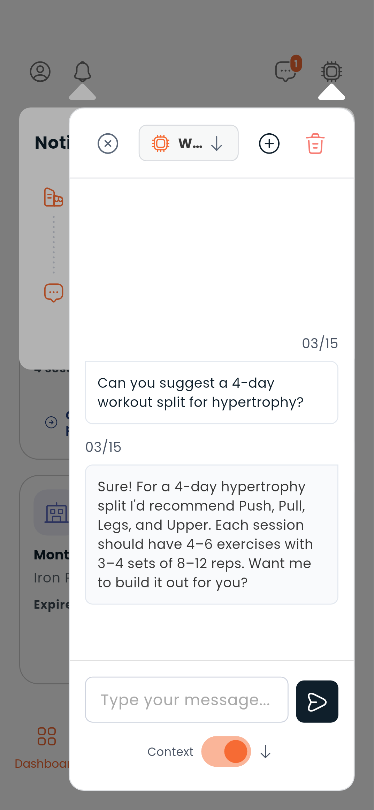

# AI Assistant

Dambel has a built-in AI assistant that understands what you're doing in the app and can actually help — not just answer generic questions.

---

## Opening the assistant

Look for the **sparkle icon** (✦) on any screen that supports it — workout plans, diet plans, profile, and more. Tap it to open a chat panel with the assistant.

---

## What it knows

The assistant is context-aware. When you open it on the workout plan screen, it knows you're working on a workout plan. When you're in the diet plan form, it knows your current nutritional goals. This means you can ask things like:

- "Suggest 3 exercises for my chest session"
- "What should my daily protein be for a cut?"
- "Fill in today's lunch based on chicken breast and rice"
- "Explain what a super set is"

---

## Form auto-fill

On supported screens, the assistant can fill in form fields for you. Just describe what you want:

> "Add a push day session with bench press, overhead press, and tricep dips"

The assistant will populate the fields — you just review and save.

---

## Navigating via chat

The assistant can navigate you to a different part of the app. Say "take me to the gyms map" or "open my tracker history" and it'll go there.

---

## Conversation threads

Each chat is saved as a named thread. Threads are auto-titled based on what you talked about. You can:
- Switch between past threads
- Delete a thread you no longer need
- Start a fresh thread anytime

---

## Tips for best results

- Be specific — "suggest a 4-day workout split for hypertrophy" works better than "make me a plan"
- The assistant works best when you're already on the relevant screen
- It can't make API calls on your behalf — it helps you fill in information, not submit forms automatically

---

> **Next:** [Go back to the docs index](README.md)
