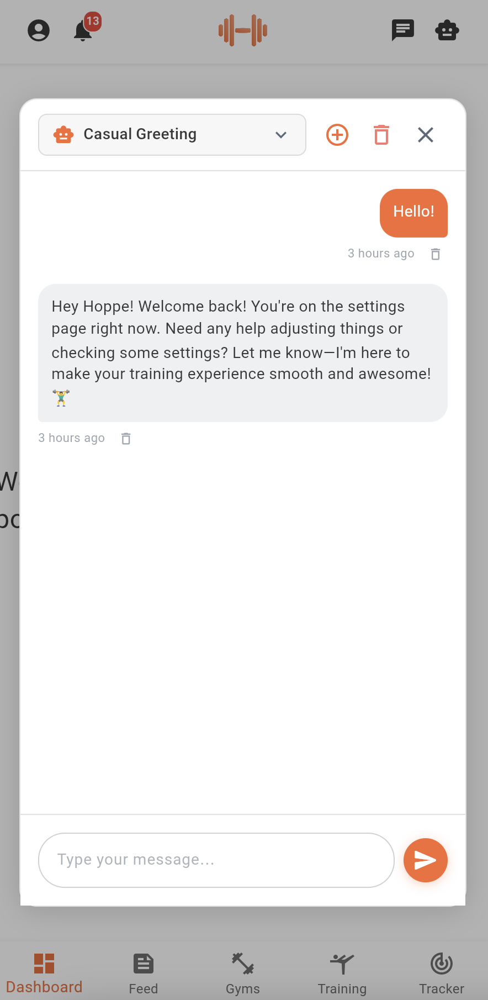

# AI Assistant

Your personal AI helper that knows what you're doing in the app and can actually help you get things done. Think of it as having a fitness-savvy friend who's always available to answer questions, fill out forms, or guide you through features.

## Getting There

See that robot icon in the top-right corner of most screens? That's your AI assistant. Tap it and a chat window pops up right there.

## How It Works

The AI assistant is context-aware, which is a fancy way of saying it knows what you're looking at. Viewing a workout plan? It knows. Filling out your profile? It sees that too. This means you can ask things like "help me fill this out" or "what should I put here" and it'll actually understand what you're talking about.

All your conversations are saved in threads, so you can pick up where you left off or start fresh whenever you want.

## Your First Chat

When you open the assistant for the first time, you'll see an empty chat with a message box at the bottom. Just type your question and hit send (the paper plane icon).

Here's what happens: the app creates a new conversation thread, sends your message along with info about what you're currently doing in the app, and the AI responds. The thread gets a title automatically based on your first message, so make it count if you want to find it easily later.

## Chatting

Type your message in the box at the bottom and send it. The AI processes your question along with your current app context and replies. You'll see a loading indicator while it's thinking.

You can reference what you're looking at directly – "this page", "this workout", "these options" – and the AI will know what you mean. Pretty handy when you're trying to figure something out.

## Managing Conversations

Tap the dropdown at the top of the chat window to see all your previous conversations. Each one shows its title, when it was last updated, and a delete button if you want to clean things up.

Got a lot of threads? Just scroll down and more will load automatically.

Want to continue an old conversation? Find it in the dropdown, tap it, and your message history loads up. The AI remembers what you talked about before, so you can just keep going.

Need a fresh start? Hit the + icon next to the thread selector to create a new conversation. Your first message will become the thread title.

## The Smart Stuff

The AI knows what page you're on, what forms you're filling out, which gym or workout you're viewing, and what filters you've applied. This context gets sent with your messages automatically, so the AI can give you relevant answers without you having to explain everything.

You can ask it to help fill out forms, explain features, or guide you through tasks. If the AI updates something on a form, you'll see a blue notification. Just review the changes and save when you're ready.

Sometimes the AI can even navigate you to different pages if that's what you need. It'll close the chat window and take you there.

## Cleaning Up

Want to delete a specific message? Look for the small delete icon next to its timestamp. Keep in mind that deleting a message also removes everything that came after it in that thread.

To delete an entire conversation, either tap the trash icon in the chat header or use the delete button next to the thread in your history dropdown. This is permanent, so make sure you mean it.

## When Things Go Wrong

Can't see the robot icon? Make sure you're on the latest version of the app. Try logging out and back in. Still nothing? Reach out to support.

Message won't send? Check your internet connection and make sure you're not spamming the send button while the AI is still processing. If you get an error, your message will pop back into the text box so you can try again.

Threads not loading? Close and reopen the chat window. If that doesn't work, check your connection or try restarting the app.

AI taking forever? Could be your internet speed or server load. Give it 10-15 seconds before worrying. Complex questions take longer to process.

AI not understanding your context? Try being more specific instead of saying "this" or "here". Make sure you're actually on the screen you're asking about. Closing and reopening the chat can refresh the context too.

## Privacy Stuff

Your messages, conversation history, and app context all get sent to the AI and stored on Dambel servers. Everything's encrypted and linked to your account. Threads stick around until you delete them.

Don't share passwords or super sensitive info in the chat. Review your messages before sending. Clean up old conversations you don't need anymore.

## Tips

Be specific with your questions. "Help me create a beginner workout plan" works way better than just "help".

Keep different topics in separate threads. One for workouts, one for nutrition, one for general questions – whatever makes sense to you.

Your first message becomes the thread title, so make it descriptive if you want to find it later.

Open the assistant while you're actually looking at what you need help with. The context makes a huge difference.

If you need more help, the AI can usually answer questions about the app. For technical issues, hit up support through settings.

