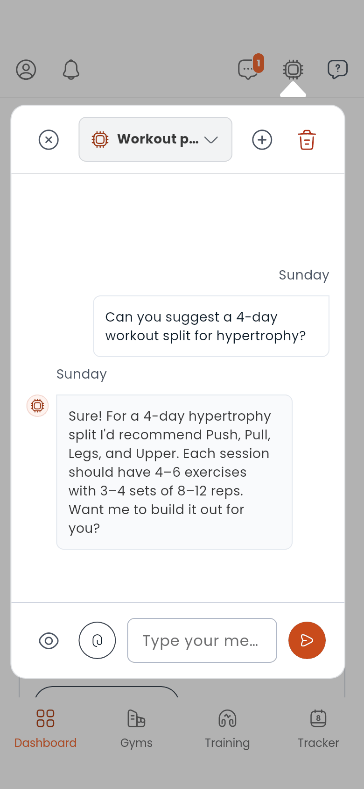

# AI Assistant

Dambel has a built-in AI assistant that understands what you're doing in the app and can actually help — not just answer generic questions.



---

## Opening the assistant

Look for the **sparkle icon** (✦) on any screen that supports it — workout plans, diet plans, profile, and more. Tap it to open a chat panel with the assistant.

---

## What it knows

The assistant is context-aware. When you open it on the workout plan screen, it knows you're working on a workout plan. When you're in the diet plan form, it knows your current nutritional goals. This means you can ask things like:

- "Suggest 3 exercises for my chest session"
- "What should my daily protein be for a cut?"
- "Fill in today's lunch based on chicken breast and rice"
- "Explain what a super set is"

---

## Live actions

The assistant can do real work while you watch. As it looks something up, searches the web, or remembers a detail about you, you'll see a live status line — "Reading data…", "Searching the web…", "Saving a memory…" — so you always know what it's doing.

For anything sensitive — creating or changing a plan, forgetting something it remembered about you — it asks first. The prompt tells you exactly what it wants to do: the action's name and all the data it is about to use, so you can check the details before deciding. Tap **Show all details** to see the full data. Nothing happens until you choose **Allow** or **Deny**.

If you trust an action and don't want to be asked every time, tap **Always allow this action**. From then on the assistant runs that particular action straight away — other actions still ask. This choice is remembered on your device only, and you can undo it at any time from **Settings → AI assistant permissions**.

The assistant reads what's on your screen to give better answers, but it never changes your screen or submits forms for you.

---

## Attaching files

Tap the **attachment** button to add up to **5 files** (images or PDFs, 10 MB each) to a message — handy for asking about a photo of a meal, a training plan PDF, or a screenshot. Attached files show as thumbnails in the conversation.

---

## Conversation threads

Each chat is saved as a named thread. Threads are auto-titled based on what you talked about. You can:
- Switch between past threads
- Delete a thread you no longer need
- Start a fresh thread anytime

---

## Using Dambel from other AI apps

The assistant inside Dambel isn't the only way in. Dambel also publishes a **connector** that other AI apps — Claude, and any other assistant that supports custom connectors — can plug into, so you can ask them about your training without leaving the app you're already in.

**The address to add is:**

```
https://api.dambel.io/mcp
```

### Adding it

1. Open your AI app's connector settings — in Claude that's **Settings → Connectors → Add custom connector**.
2. Paste the address above and confirm.
3. A Dambel sign-in page opens in your browser. Sign in with your usual Dambel account and approve access.
4. That's it — no token to copy, no password to paste anywhere except the Dambel sign-in page itself.

The exact menu names differ from app to app, but the step you're looking for is always the one that asks for a **custom connector** or **MCP server address**.

### What it can do there

Once connected, the other assistant can, on your behalf:

- Read your profile, gyms, workout and diet plans, and your tracker history
- Look through the exercise, equipment and supplement catalogues
- Create and edit workout plans, sessions and exercises, and diet plans, meals and supplements
- Remember details about you — the same memory the in-app assistant uses, so both stay in sync

### Good to know

- It only ever sees what your own account can see, and it acts as you.
- Creating and editing plans is a **premium** feature, and works only on plans you own or coach.
- Deleting a plan also deletes everything inside it, and cannot be undone. Be specific about what you want removed.
- Changes made from another app go straight to your account — refresh the Dambel app to see them.
- To cut access off, remove the connector in that app. You can reconnect any time.

---

## Tips for best results

- Be specific — "suggest a 4-day workout split for hypertrophy" works better than "make me a plan"
- The assistant works best when you're already on the relevant screen — it reads that context to answer
- Attach a photo or PDF when your question is about something visual

---

> **Next:** [Go back to the docs index](README.md)

---

[← Previous: Profile](profile.md) | [Next: Chat →](chat.md)
