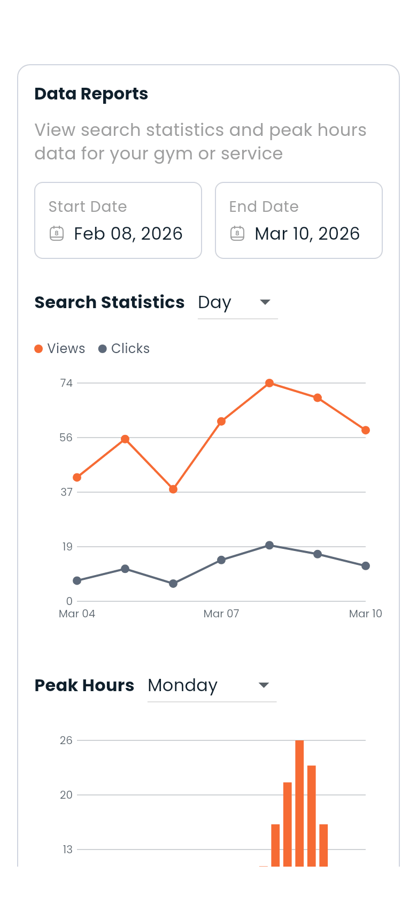

# Analytics

If you run a gym or sell a training service, Dambel keeps count of how often people found it and opened it, and when they were looking. It's under **Data reports**, on the gym's or the service's own form.

---

## Where to find it

| For | Where |
|---|---|
| **A gym** | Open the gym for editing from **My Gyms**, and scroll to **Data reports** at the foot of the form |
| **A training service** | Open the service for editing from **My services**, and scroll to **Data reports** |

The section only exists once the gym or service does — there is nothing to count before it is saved.

---

## Who can see it

- **A gym's owner**, always.
- **A gym admin**, if the owner gave them the reports permission — and while the gym owner's Premium is active. See [Gyms](gyms.md).
- **The trainer who published a service**, for that service.

Nobody else, and there is no shared or public version of these figures.

---

## Search statistics

Pick a **start date** and an **end date**, then choose whether to group the result by **day**, **week** or **month**. The chart plots two lines over that range:

| Line | What it counts |
|---|---|
| **Views** | Times your gym or service appeared in someone's search results |
| **Clicks** | Times someone opened it from those results |

Read together they tell you two different things: views are about how findable you are, clicks are about whether the listing is doing its job. A lot of views and few clicks usually means the photos, the name or the price are the problem, not the reach.

Under the chart, the same numbers are listed as rows, so you can read an exact figure rather than estimating it from the line.

---

## Peak hours

Choose a **day of the week**, and the bar chart shows which hours of that day people were searching. It is the closest thing Dambel has to a picture of demand — useful for setting opening hours, staffing a front desk, or deciding when a boost is worth buying.

---

## What it does not show

- **Who** searched or clicked. There is nothing here about individuals.
- **Your members' visits.** These are search figures, not attendance. Check-ins are on the subscription, not here.
- **Money.** Earnings live in your [Wallet](wallet.md).

If a range has no activity in it, the section says so rather than drawing an empty chart.

---

> **Next:** [Premium, Boost and money](monetization.md) or [Gyms](gyms.md)

---

[← Previous: Reporting](reporting.md) | [Next: Premium, Boost and money →](monetization.md)
