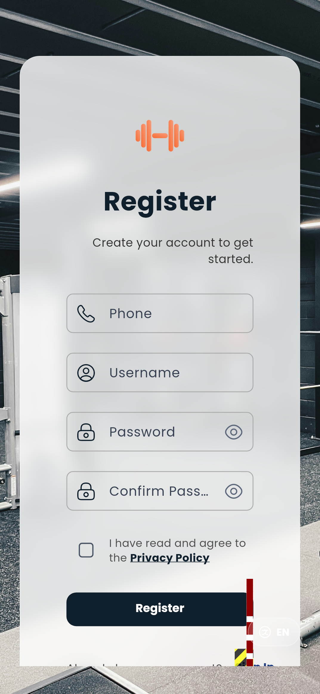
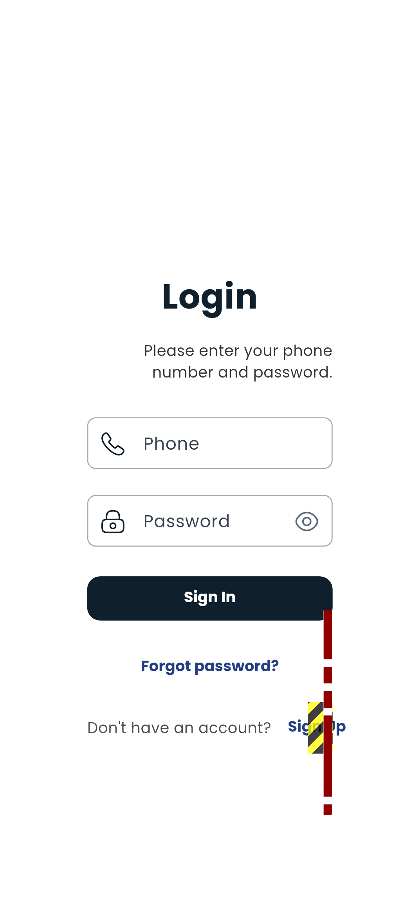

# Getting Started

Your journey with Dambel starts here. Whether you're signing up for the first time or logging back in, we've got you covered.

## Signing Up

New to Dambel? Here's how to get your account set up.

From the login screen, tap "Sign Up" at the bottom. You'll see a registration form with a few fields to fill out.

The essentials are your phone number (at least 10 digits), a username (minimum 3 characters, and it needs to be unique), and a password (at least 8 characters). You'll need to type your password twice to make sure it matches.

Everything else is optional. You can add your email if you want (it needs to be a valid email format if you do), plus your first and last name. There's also a referral code field if someone invited you to join.

Once you've filled everything out, hit "Register". The app will send a 6-digit verification code to your phone via SMS. When it arrives, enter it in the confirmation code field that appears, then tap "Verify and Register".

If everything checks out, you're in. The app logs you in automatically and takes you straight to the main screen.

## Logging In

Already have an account? Just enter your phone number and password, then tap "Sign In". That's it.

The password needs to be at least 8 characters. If you get it wrong, the app will let you know what went wrong.

## Forgot Your Password

It happens. Tap "Forgot Password" on the login screen.

Enter your phone number and hit "Send Reset Code". You'll get a 6-digit code via SMS. Enter that code along with your new password (twice to confirm), then tap "Reset Password".

Your password gets updated and you can log in with the new one right away.

## When Things Go Wrong

Can't log in? Double-check your phone number and password. Make sure you've got a stable internet connection. If you're still stuck, try the forgot password flow.

Registration not working? The most common issues are username already taken, passwords not matching, or an invalid email format. The app will show you specific error messages for each field that needs fixing.

Didn't get the verification code? Give it a minute – sometimes SMS takes a bit. Check that you entered your phone number correctly. If it still doesn't show up, try registering again.

Code expired or wrong? Request a new one by going through the registration process again with the same phone number.

## A Few Notes

Your phone number is your login ID, so make sure it's one you have access to. The app uses it for verification and password resets.

Passwords are encrypted and stored securely. We can't see them, which is why there's a reset process instead of a "show me my password" button.

Username needs to be unique across all users. If the one you want is taken, try adding numbers or underscores.

Email is completely optional, but if you add one, it needs to be properly formatted (something@something.com).

Once you're logged in, you stay logged in until you explicitly log out or clear the app data. No need to sign in every time you open the app.
