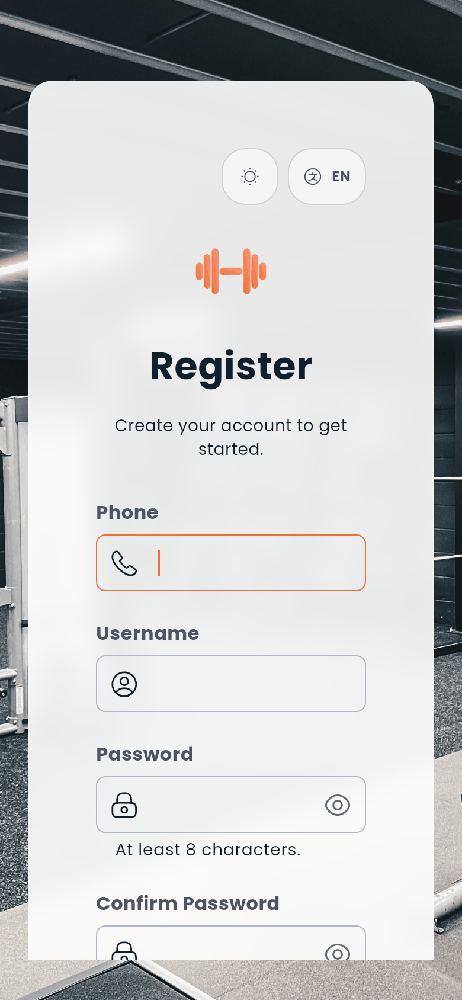
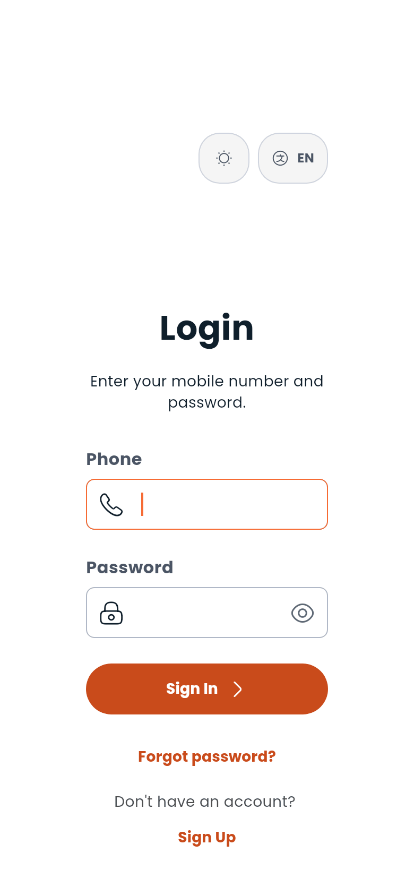
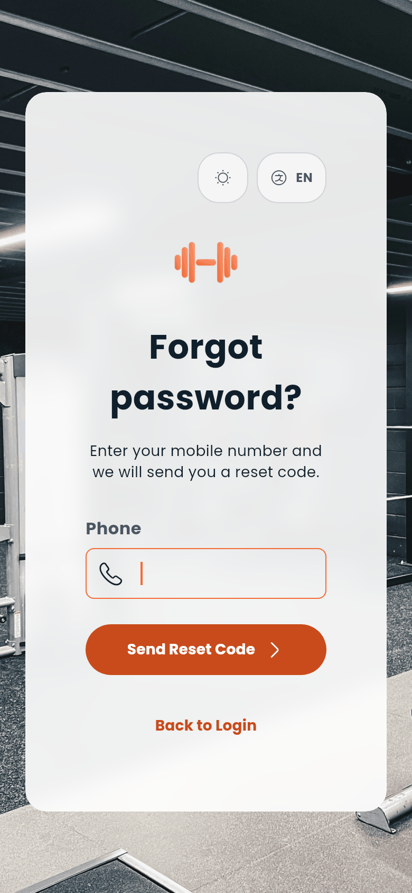
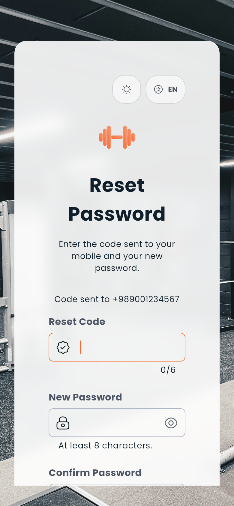

# Authentication

Everything in Dambel starts with your account. Here's how to create one, log in, and recover your password if you forget it.

---

## Create an account

Tap **Sign Up** on the welcome screen and fill in:

| Field | Requirement |
|---|---|
| Phone number | At least 10 digits - used for verification |
| Username | At least 3 characters, must be unique |
| Password | At least 8 characters |

Tick the box beside **I have read and agree to the Privacy Policy** before you continue - tapping the sentence ticks it, and tapping **Privacy Policy** opens the policy in a sheet over the form, so you never leave your half-filled registration to read it.

After you tap **Register**, the form is replaced by a single verification screen. A **6-digit SMS code** is sent to your phone - enter it there and tap **Verify and Register** to activate your account.

If you didn't receive the code, tap **Resend Code** once the one-minute cooldown expires.

> **Invited by a friend?** If someone shared their referral link with you, opening it takes you straight to the registration page with their referral code applied automatically - no need to type anything.

---

## Log in

Enter your **phone number** and **password**, then tap **Login**. That's it.

---

## Forgot your password?

1. Tap **Forgot password?** on the login screen
2. Enter your registered phone number
3. Enter the 6-digit SMS verification code you receive
4. Set a new password

Your password is updated immediately — log in with the new one right away.

---

## Signing out

Tap your photo in the top bar and choose **Logout**. It sits in that menu rather than in Settings, so you can't reach it by accident while changing a setting.

To sign out a *different* device instead of this one, see [Login sessions](login-sessions.md).

---

## Coming back to where you were

If you followed a link to a gym, a plan or a service while signed out, Dambel takes you to the login screen first and then opens what you were after - you don't have to find it again.

The same holds if your session expires while you're using the app: you're returned to the login screen, and signing in puts you back on the screen you were reading.

---

> **Next:** [Set up your profile](profile.md) or [explore the Dashboard](dashboard.md)

---

[← Previous: What is Dambel?](getting-started.md) | [Next: Profile →](profile.md)
