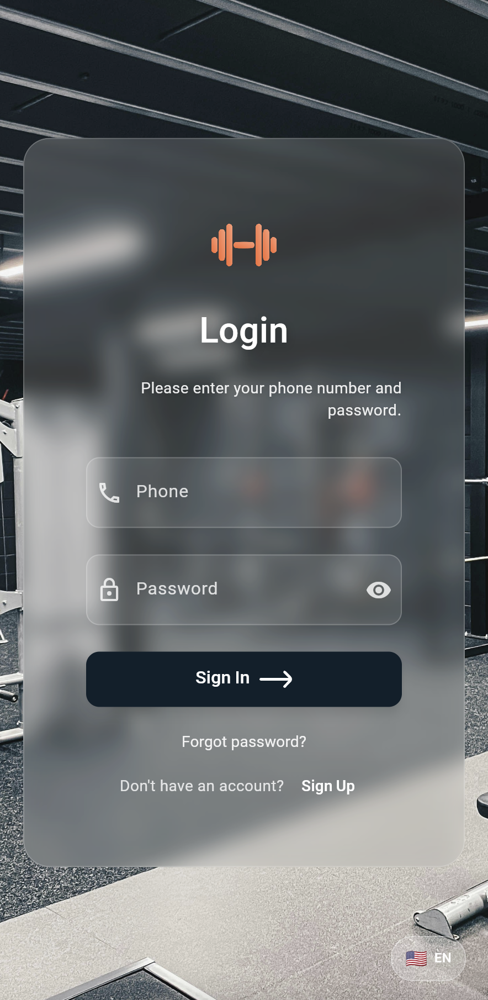

# Authentication Guide

Welcome to Dambel! This guide will help you get started with creating an account and signing in to the app.

## Getting Started

When you first open the Dambel app, you'll see the login screen. This is where you can either sign in to your existing account or create a new one.

## Creating a New Account

If you're new to Dambel, you'll need to create an account first. Here's how:

### Step 1: Access the Registration Screen

1. On the login screen, tap the **"Create new account"** button at the bottom
2. You'll be taken to the registration screen

### Step 2: Fill Out Your Information

The registration form includes the following fields:

- **First Name** (required): Your first name
- **Last Name** (required): Your last name  
- **Username** (required): A unique username (3+ characters, letters, numbers, and underscores only)
- **Email** (required): Your email address
- **Phone Number** (optional): Your phone number
- **Password** (required): A secure password (6+ characters)
- **Confirm Password** (required): Re-enter your password to confirm

### Step 3: Submit Your Registration

1. Fill out all required fields
2. Make sure your passwords match
3. Tap the **"Register"** button
4. Wait for the confirmation message
5. You'll be automatically signed in and taken to the main app

## Signing In

If you already have an account, signing in is quick and easy:

### Step 1: Enter Your Credentials

1. Open the Dambel app
2. Enter your **email address** in the email field
3. Enter your **password** in the password field

### Step 2: Choose Your Preferences

- **Remember me**: Check this box if you want to stay signed in longer (up to 1 hour without checking this box)
- **Forgot password?**: Tap this if you need to reset your password (coming soon!)

### Step 3: Sign In

1. Tap the **"Login"** button
2. Wait for the app to verify your credentials
3. You'll be taken to the main dashboard

## Language Selection

You can change the app language at any time:

1. Look for the language selector in the top-right corner (shows "EN" or "FA")
2. Tap on it to open the language menu
3. Choose between:
   - **🇺🇸 English**
   - **🇮🇷 فارسی (Persian)**

The language change takes effect immediately and is saved for future sessions.

## Troubleshooting

### Common Issues

**"Email address is already in use"**
- This means someone has already registered with this email
- Try signing in instead, or use a different email address

**"Username can only contain letters, numbers, and underscores"**
- Make sure your username doesn't have spaces or special characters
- Use only letters (a-z, A-Z), numbers (0-9), and underscores (_)

**"Passwords do not match"**
- Make sure both password fields have exactly the same text
- Check for any extra spaces or typos

**"Password must be at least 6 characters long"**
- Your password needs to be at least 6 characters
- Consider using a mix of letters, numbers, and symbols for better security

### Network Issues

If you're having trouble connecting:

1. Check your internet connection
2. Make sure you're not on a restricted network
3. Try again in a few moments
4. If problems persist, contact support

## Security Tips

- Use a strong, unique password
- Don't share your login credentials with others
- Log out from shared devices
- Keep your app updated to the latest version

## Need Help?

If you're still having trouble with authentication:

1. Check the troubleshooting section above
2. Make sure you're using the latest version of the app
3. Contact our support team for assistance

---

*Last updated: [Current Date]*
