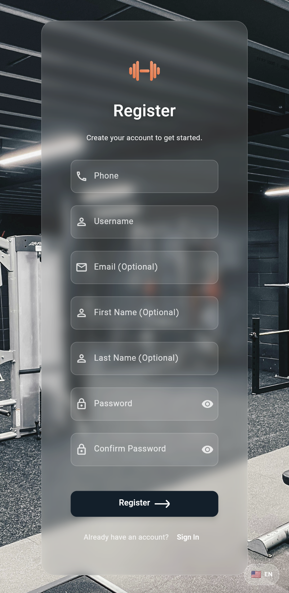

# Authentication Guide

Welcome to Dambel's authentication system. This guide will walk you through the process of logging in and registering for a new account in the Dambel app.

## Overview

Dambel uses a phone number-based authentication system where you can create an account using your phone number and access all features of the app. The authentication is secure and your information is protected.

## How to Login

### Step 1: Access the Login Screen

When you open the Dambel app for the first time or if you're not logged in, you'll see the login screen.

### Step 2: Enter Your Credentials

The login screen has a simple form with only two required fields:

1. **Phone Number**: Enter your registered phone number (minimum 10 digits)
2. **Password**: Enter your account password (minimum 6 characters)

### Step 3: Tap Login

After entering your credentials, tap the "Login" button to sign in to your account.

### Step 4: Access Main App

Once successfully logged in, you'll be automatically redirected to the main app interface where you can access all features.

## How to Register

### Step 1: Access the Registration Screen

From the login screen, you can access the registration screen by tapping "Sign Up" at the bottom.

### Step 2: Fill Out Registration Form

The registration form requires the following information:

#### Required Fields:
- **Phone Number**: Your mobile phone number (minimum 10 digits)
- **Username**: Choose a unique username (minimum 3 characters)
- **Password**: Create a secure password (minimum 6 characters)
- **Confirm Password**: Re-enter your password to confirm it matches

#### Optional Fields:
- **Email**: Your email address (optional, but if provided must be valid format)
- **First Name**: Your first name (optional)
- **Last Name**: Your last name (optional)

### Step 3: Submit Registration

After filling out the form, tap the "Register" button to create your account.

### Step 4: Automatic Login

Once your account is successfully created, you'll be automatically logged in and redirected to the main app.

## Password Requirements

- Your password must be at least 6 characters long
- Choose a password that combines letters, numbers, and special characters for better security
- Confirm your password exactly in the confirmation field

## Phone Number Requirements

- Enter your phone number without country code
- The phone number should be at least 10 digits long
- Ensure the phone number is active as it may be used for account recovery

## Troubleshooting

### Login Issues

If you're having trouble logging in:

1. **Check your phone number**: Ensure you're entering the correct phone number used during registration
2. **Verify password**: Make sure your password is entered correctly
3. **Check internet connection**: Ensure you have a stable internet connection
4. **Try again**: If there's a temporary error, wait a few moments and try again

### Registration Issues

If you're having trouble registering:

1. **Check required fields**: Ensure all required fields are filled out
2. **Password confirmation**: Make sure both password fields match exactly
3. **Username availability**: The username you chose might already be taken, try a different one
4. **Internet connection**: Ensure you have a stable internet connection

## Account Security

- Your login credentials are stored securely
- Password is encrypted and protected
- Always log out when using the app on shared devices
- Do not share your account credentials with others
