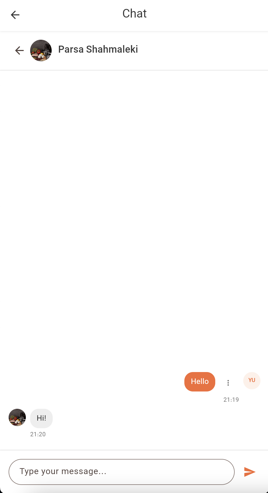

# Chat Guide

Welcome to the Chat feature in Dambel. This guide will help you understand how to communicate with other users through direct messages and group chats, manage your conversations, and use all chat features effectively.

## Overview

The Dambel Chat system allows you to communicate with other users in the app through text messages. You can have one-on-one conversations (direct chats) or group conversations with multiple participants. The chat system supports real-time messaging, message editing, and conversation management.

Key features:
- **Direct Chats**: Private conversations between two users
- **Group Chats**: Conversations with multiple participants (3 or more users)
- **Real-time Messaging**: Messages appear instantly as they're sent
- **Message Management**: Edit or delete your own messages
- **Unread Counts**: Track unread messages per chat
- **Chat Management**: Create, update, and delete chats
- **Message History**: Scroll through conversation history with pagination

## Accessing Chat

### Step 1: Navigate to Chat

You can access the Chat feature from the main navigation:

1. Look for the **chat icon** (💬) in the app bar at the top of the screen
2. The icon appears next to other navigation icons
3. Tap on the chat icon to open the Chat screen

### Step 2: View Chat Screen

When you open Chat, you'll see:

- **Mobile**: A list of your chats. Tap any chat to view messages.
- **Desktop**: A split view with chat list on the left and messages on the right.

*The chat screen showing the list of conversations on mobile and split view on desktop*

## Chat List

The chat list displays all your conversations, organized with the most recent activity at the top.

### Chat List Features

Each chat in the list shows:

- **Avatar**: Profile picture or initials of the other user(s)
- **Chat Title**: 
  - For direct chats: The other user's display name
  - For group chats: Names of participants (e.g., "John and 2 others")
- **Last Message Preview**: A snippet of the most recent message
- **Unread Badge**: A numbered badge showing unread message count (if any)
- **Delete Button**: Option to delete the chat (if you have permission)

### Empty State

If you don't have any chats yet, you'll see:

- A message: "No chats yet"
- A button to create your first chat (if you have permission)

### Pagination

If you have many chats:

- Scroll down to load more chats
- Older chats load automatically as you reach the bottom
- A loading indicator appears while fetching more chats

## Creating a New Chat

### Step 1: Open Create Dialog

To start a new conversation:

1. Tap the **+ (plus)** icon in the chat list header
2. A dialog opens with a user selection interface

*The create chat dialog showing user selection interface*

### Step 2: Select Users

In the create dialog:

1. **Search or Browse**: Use the search field to find users, or scroll through the list
2. **Select Participants**: Tap on users to add them to the chat
   - You can select multiple users for a group chat
   - You must select at least one other user (you're automatically included)
3. **Selected Users**: Selected users appear highlighted
4. **Current User**: Your own profile is pre-selected and cannot be removed

### Step 3: Create Chat

1. Once you've selected at least one other user, the **"Create Chat"** button becomes enabled
2. Tap **"Create Chat"** to create the conversation
3. The chat is created and opens automatically
4. A success message appears: "Chat created"

**Note**: If you try to create a direct chat (2 users total) with someone you already have a direct chat with, the existing chat will open instead of creating a duplicate.

## Viewing Messages

### Opening a Chat

To view messages in a chat:

1. **Mobile**: Tap on any chat in the list
2. **Desktop**: Click on any chat in the left sidebar
3. The chat opens showing the message history

### Chat Header

When viewing a chat, the header shows:

- **Back Button** (Mobile only): Returns to chat list
- **Chat Avatar**: Profile picture or initials
- **Chat Title**: Name of the conversation
- **Edit Button** (Group chats only): Edit participants (if you're the owner)

### Message Display

Messages are displayed in a conversation view:

- **Your Messages**: Appear on the right side with primary color background
- **Other Users' Messages**: Appear on the left side with gray background
- **Message Bubbles**: Each message is in a rounded bubble
- **Sender Name**: Group chats show the sender's name above their message
- **Avatars**: User avatars appear next to messages
- **Timestamps**: Time shown below each message
  - Today: Shows time (e.g., "14:30")
  - Yesterday: Shows "Yesterday"
  - This week: Shows day name (e.g., "Monday")
  - Older: Shows date (e.g., "06/15")

*An opened chat showing conversation with different message styles for sent and received messages*

### Empty Chat

If a chat has no messages yet:

- You'll see a message icon and text: "No messages"
- The input field is ready for your first message

### Message Pagination

For long conversations:

- Scroll up to load older messages
- Older messages load automatically when you scroll near the top
- A loading indicator appears while fetching older messages

## Sending Messages

### Step 1: Type Your Message

1. Tap in the message input field at the bottom of the chat
2. Type your message
3. The input field supports multi-line text

### Step 2: Send Message

To send your message:

1. **Option 1**: Tap the **Send** button (paper plane icon)
2. **Option 2**: Press **Enter** on your keyboard

**What Happens**:
- Your message is sent immediately
- A loading indicator appears on the send button while sending
- The message appears in the chat once sent
- The chat list updates to show your message as the last message
- Unread counts update for other participants

### Message Status

While sending:
- Send button shows a loading spinner
- Input field is disabled
- Message appears in chat once sent successfully

If sending fails:
- An error message appears
- Your message text is preserved in the input field
- You can try sending again

## Editing Messages

You can edit your own messages after sending them.

### Step 1: Open Edit Menu

1. Find your message in the conversation
2. Tap the **⋮ (three dots)** menu icon next to your message
3. A menu appears with options

### Step 2: Edit Message

1. Tap **"Edit"** from the menu
2. A dialog opens with the message content in an editable field
3. Modify the text as needed
4. Tap **"Save"** to update the message
5. The message is updated in the chat
6. A success message appears: "Message updated"

**Note**: Only you can edit your own messages. You cannot edit messages from other users.

## Deleting Messages

You can delete your own messages from a conversation.

### Step 1: Open Delete Menu

1. Find your message in the conversation
2. Tap the **⋮ (three dots)** menu icon next to your message
3. A menu appears with options

### Step 2: Delete Message

1. Tap **"Delete"** from the menu
2. A confirmation dialog appears: "Are you sure you want to delete this message?"
3. Tap **"Delete"** (red button) to confirm
4. The message is removed from the chat
5. A success message appears: "Message deleted"

**Note**: 
- Only you can delete your own messages
- This action cannot be undone
- Deleting a message removes it for all participants

## Managing Chats

### Updating Group Chats

If you're the owner of a group chat, you can add or remove participants.

#### Step 1: Open Edit Dialog

1. In a group chat, tap the **Edit** button (pencil icon) in the chat header
2. A dialog opens showing current participants

#### Step 2: Modify Participants

1. **Add Users**: Tap on users in the list to add them
2. **Remove Users**: Tap on selected users to remove them (except the owner)
3. **Owner**: The chat owner cannot be removed (shown as disabled)

#### Step 3: Save Changes

1. Tap **"Update Chat"** to save changes
2. The chat is updated with new participants
3. A success message appears: "Chat updated"

### Deleting Chats

You can delete chats you're part of.

#### Step 1: Open Delete Dialog

1. In the chat list, tap the **Delete** button (trash icon) next to any chat
2. A confirmation dialog appears: "Are you sure you want to delete this chat?"

#### Step 2: Confirm Deletion

1. Tap **"Delete"** (red button) to confirm
2. The chat is removed from your chat list
3. A success message appears: "Chat deleted"

**Note**: 
- This action cannot be undone
- Deleting a chat removes it for all participants
- You need appropriate permissions to delete chats

## Direct Chats vs Group Chats

### Direct Chats

Direct chats are conversations between exactly two users:

- **Title**: Shows the other user's display name
- **Avatar**: Shows the other user's profile picture
- **Features**: Standard messaging features
- **No Edit**: Cannot add/remove participants (always 2 users)

### Group Chats

Group chats include three or more users:

- **Title**: Shows participant names (e.g., "John, Jane and 2 others")
- **Avatar**: Shows first participant's profile picture or initials
- **Features**: All messaging features plus participant management
- **Edit Participants**: Chat owner can add/remove participants
- **Sender Names**: Messages show who sent them

## Real-time Updates

The chat system supports real-time message updates:

- **New Messages**: Appear automatically when received
- **Message Edits**: Updates appear instantly when someone edits a message
- **Message Deletes**: Messages disappear immediately when deleted
- **Unread Counts**: Update automatically as messages arrive

You don't need to refresh the chat to see new messages - they appear automatically!

## Unread Message Counts

### Chat List Badges

Each chat in the list shows an unread count badge:

- **Number Badge**: Circular badge with number of unread messages
- **Color**: Primary color background with white text
- **Position**: Top-right of chat item
- **Updates**: Automatically updates as you read messages

### App Bar Badge

The chat icon in the app bar shows:

- **Total Unread**: Sum of all unread messages across all chats
- **Badge**: Appears on the chat icon
- **Updates**: Updates in real-time as messages arrive

**Note**: Unread counts for the currently open chat are not included in the total.

## Permissions

Chat features require specific permissions:

### Viewing Chats
- **Permission**: `chats.view`
- **Required for**: Viewing your chat list

### Creating Chats
- **Permission**: `chats.create`
- **Required for**: Creating new chats

### Updating Chats
- **Permission**: `chats.update`
- **Required for**: Adding/removing participants in group chats (owner only)

### Deleting Chats
- **Permission**: `chats.delete`
- **Required for**: Deleting chats

### Viewing Messages
- **Permission**: `chat_messages.view`
- **Required for**: Viewing messages in chats

### Sending Messages
- **Permission**: `chat_messages.create`
- **Required for**: Sending messages

### Editing Messages
- **Permission**: `chat_messages.update`
- **Required for**: Editing your own messages

### Deleting Messages
- **Permission**: `chat_messages.delete`
- **Required for**: Deleting your own messages

If you don't have a required permission, you'll see an error message explaining what permission is needed.

## Troubleshooting

### Chats Not Loading

If your chat list isn't loading:

1. **Check Internet**: Ensure you have a stable internet connection
2. **Refresh**: Pull down to refresh the chat list
3. **Retry**: Tap the "Retry" button if an error appears
4. **Restart App**: Close and reopen the app
5. **Check Permissions**: Verify you have `chats.view` permission

### Messages Not Sending

If your messages aren't sending:

1. **Check Internet**: Ensure you have a stable internet connection
2. **Wait**: Don't send multiple messages while one is processing
3. **Try Again**: If an error occurs, the message is preserved - try again
4. **Check Permissions**: Verify you have `chat_messages.create` permission
5. **Restart App**: Close and reopen the app

### Messages Not Appearing

If new messages aren't appearing:

1. **Check Internet**: Ensure you have a stable internet connection
2. **Scroll Down**: New messages appear at the bottom
3. **Refresh**: Close and reopen the chat
4. **Check Permissions**: Verify you have `chat_messages.view` permission

### Cannot Create Chat

If you can't create a new chat:

1. **Check Permissions**: Verify you have `chats.create` permission
2. **Select Users**: Ensure you've selected at least one other user
3. **Try Again**: Wait a moment and try again
4. **Contact Support**: If the issue persists

### Cannot Edit/Delete Messages

If you can't edit or delete messages:

1. **Check Permissions**: Verify you have `chat_messages.update` or `chat_messages.delete` permission
2. **Your Messages Only**: You can only edit/delete your own messages
3. **Try Again**: Wait a moment and try again

### Cannot Update Group Chat

If you can't update a group chat:

1. **Check Ownership**: Only the chat owner can update participants
2. **Check Permissions**: Verify you have `chats.update` permission
3. **Group Chats Only**: This feature only works for group chats (3+ users)
4. **Try Again**: Wait a moment and try again

### Real-time Updates Not Working

If real-time updates aren't working:

1. **Check Internet**: Ensure you have a stable internet connection
2. **Refresh**: Close and reopen the chat
3. **Restart App**: Close and reopen the entire app
4. **Check Settings**: Verify app notifications are enabled

## Privacy and Data

### What Information is Shared

When you use Chat:

- **Your Messages**: All messages you send are stored and visible to chat participants
- **Chat Participants**: Other users in the chat can see all messages
- **Profile Information**: Your profile picture and display name are visible to chat participants
- **Timestamps**: When messages were sent is recorded

### Data Storage

- **Server Storage**: All chats and messages are stored on Dambel servers
- **Account-Linked**: Your chats are linked to your account
- **Persistent**: Messages remain until deleted
- **Secure**: All data is transmitted securely and encrypted

### Privacy Best Practices

For your privacy:

1. **Be Mindful**: Only share information you're comfortable with others seeing
2. **Review Before Sending**: Double-check messages before sending
3. **Delete When Needed**: Remove messages or chats you no longer need
4. **Account Security**: Keep your account credentials secure
5. **Report Issues**: Contact support if you encounter inappropriate content

## Best Practices

### Organizing Conversations

Best practices for managing your chats:

1. **Use Group Chats**: Create group chats for team discussions
2. **Direct Messages**: Use direct chats for private one-on-one conversations
3. **Clear Titles**: Group chat titles help identify conversations
4. **Delete Old Chats**: Remove conversations you no longer need

### Effective Communication

Tips for better communication:

1. **Be Clear**: Write clear, concise messages
2. **Edit When Needed**: Use edit feature to correct mistakes
3. **Respect Others**: Be respectful in group conversations
4. **Check Unread**: Regularly check and respond to unread messages

### Managing Group Chats

For group chat owners:

1. **Add Relevant Users**: Only add users who need to be in the conversation
2. **Remove Inactive Users**: Keep group chats focused and relevant
3. **Communicate Changes**: Let participants know when you add/remove users

## Getting Help

If you need additional assistance:

1. **AI Assistant**: Ask the AI Assistant for help with chat features (tap robot icon 🤖)
2. **Check Other Guides**: Browse other help documentation in the app
3. **Contact Support**: Reach out to Dambel support for technical issues
4. **Community**: Join the Dambel community for user tips and advice

The Chat feature is designed to make communication easy and efficient. Don't hesitate to reach out and start conversations with other users in the Dambel community!

