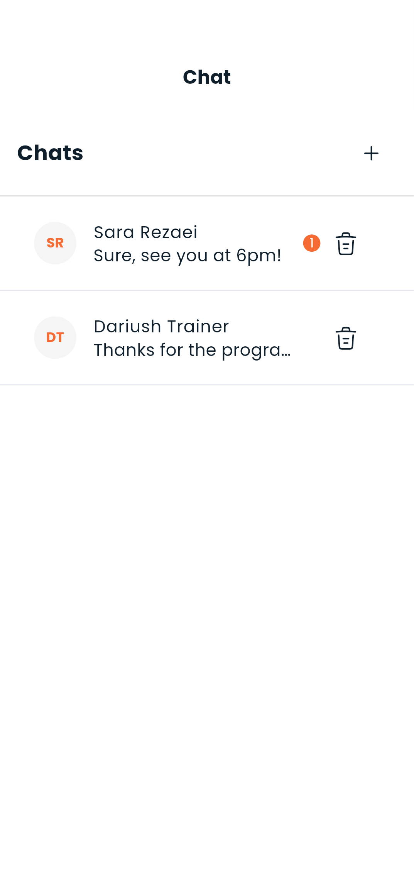

# Chat

Chat with your trainer, gym, or training partners right in the app.

---

## Starting a conversation

Go to the **Chat** tab (speech bubble icon). You'll see a list of all your conversations.

To start a new chat, tap **+** and search for a user by name or username.

---

## Direct messages

One-on-one conversations work just like any messaging app:
- Type and send messages in real time
- Edit or delete your own messages (long-press a message)
- Messages are paginated — scroll up to load older history
- Timestamps show Today, Yesterday, or the full date

---

## Group chats

Group chats let multiple people talk in the same thread — useful for training groups or gym communities.

- The group name is automatically generated from participant names
- Group owners can **add or remove participants**
- Everyone in the group can send and receive messages

---

## Unread badge

The chat tab icon shows a badge with the count of unread messages. It clears as you open conversations.

---

## Real-time delivery

Messages are delivered instantly via WebSocket. No refresh needed — new messages appear as they arrive.

---

> **Next:** [Set up notifications](notifications.md) or [find people to chat with](trainers.md)
