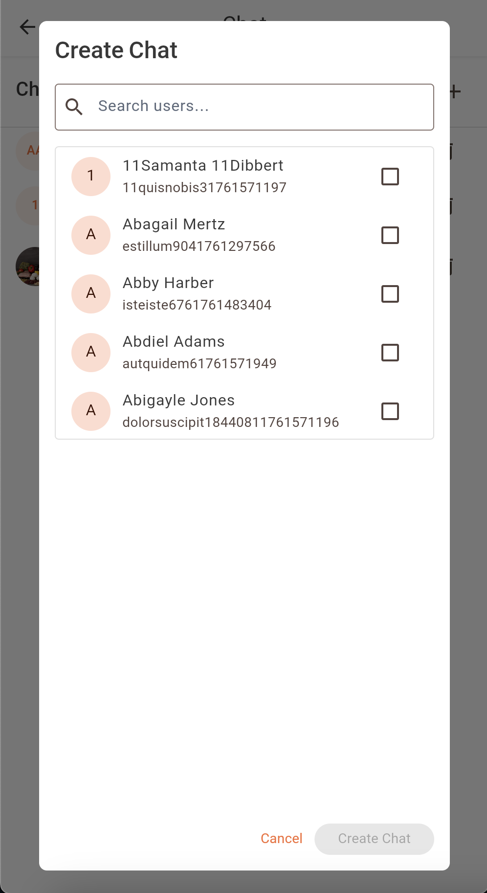
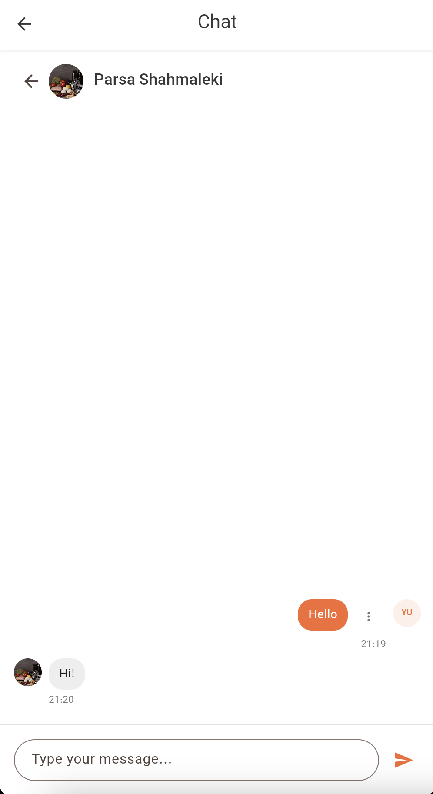

# Chat

Chat is where you connect with other people in the app. Whether you're messaging your trainer, coordinating with workout buddies, or chatting in a group, it all happens here.

## Getting There

Tap the chat icon in the top navigation bar. If you've got unread messages, you'll see a little badge with the count.

## How It Works

On mobile, you'll see your list of conversations. Tap one to open it. On desktop, it's a split view – chats on the left, messages on the right. Pretty straightforward.

Each chat shows the person's name (or names if it's a group), a preview of the last message, and when you've got unread messages, a badge with the count. If there's a delete button next to a chat, you can tap it to remove that conversation.

## Starting a New Chat

Hit the + button at the top of your chat list. You'll get a dialog where you can search for people and select who you want to chat with. Pick one person for a direct chat, or multiple people for a group chat. You're automatically included, so just choose everyone else.

Once you've selected at least one other person, tap "Create Chat" and you're good to go. The chat opens right away.

If you try to create a direct chat with someone you're already chatting with, the app just opens that existing conversation instead of making a duplicate. Smart.

## Sending Messages

Open any chat and you'll see the message history. Your messages appear on the left with a colored background, and messages from others show up on the right in gray. In group chats, you'll see everyone's name above their messages so you know who said what.

Type your message in the box at the bottom and hit send (or press Enter). That's it. Messages show up instantly for everyone in the chat thanks to real-time updates.

Each message shows a timestamp – today's messages show the time, yesterday shows "Yesterday", this week shows the day name, and older stuff shows the date.

If a chat doesn't have any messages yet, you'll see a friendly "No messages yet" prompt. Just start typing.

## Editing and Deleting Messages

Made a typo? No problem. Tap the three-dot menu next to any of your own messages and choose "Edit". Fix whatever needs fixing and save. The message updates for everyone in the chat.

Want to delete a message? Same deal – tap the three dots, choose "Delete", confirm you're sure, and it's gone. This removes it for everyone, not just you, so use it wisely.

You can only edit or delete your own messages. Other people's messages are off limits.

## Group Chats

Group chats work just like direct chats, but with more people. The chat title shows the participants' names (like "Alex, Jordan and 2 others"). Everyone's name appears above their messages so you can follow who's saying what.

If you created the group chat, you're the owner. That means you can edit the participant list – add new people or remove existing ones. Just tap the edit button in the chat header. The owner can't be removed from their own group chat, obviously.

## Managing Chats

Want to clean up your chat list? Tap the delete button next to any chat and confirm. This removes the chat for everyone involved, not just you. There's no undo, so make sure you mean it.

For group chats you own, you can update who's in the conversation anytime. Open the chat, tap the edit button, and adjust the participant list. Add people by tapping them, remove people by tapping them again. Save when you're done.

## Real-Time Updates

Everything happens live. When someone sends a message, it pops up instantly. Edit a message? Everyone sees the update right away. Delete something? It vanishes immediately for all participants. The unread count badge updates automatically too.

You don't need to refresh anything – it all just works.

## Scrolling Through History

Got a long conversation? Scroll up to load older messages. They load automatically as you get near the top. Same goes for your chat list – scroll down and older chats load as needed.

If you're deep in a conversation and new messages come in, you'll see a little "scroll to bottom" button appear. Tap it to jump back down to the latest messages.

## When Things Go Wrong

Chat list not loading? Check your internet connection and pull down to refresh. If you see an error, there's usually a retry button.

Messages not sending? Make sure you're online. If a message fails, your text stays in the input box so you can try again. Don't spam the send button while one is already going through.

Can't create a chat or edit messages? You might not have the right access. The app will let you know if that's the case.

Real-time updates acting weird? Try closing and reopening the chat, or restart the app. Usually fixes it.

## Tips

Keep conversations organized by deleting old chats you don't need anymore. Use group chats for team discussions and direct chats for one-on-one stuff.

Profile pictures show up next to messages – tap them to view that person's profile. Handy for checking out someone's credentials or achievements.

The AI assistant can help with chat-related questions too. Just open it (tap the robot icon) and ask away.

That's pretty much it. Chat is designed to be simple and get out of your way so you can focus on the conversation.
