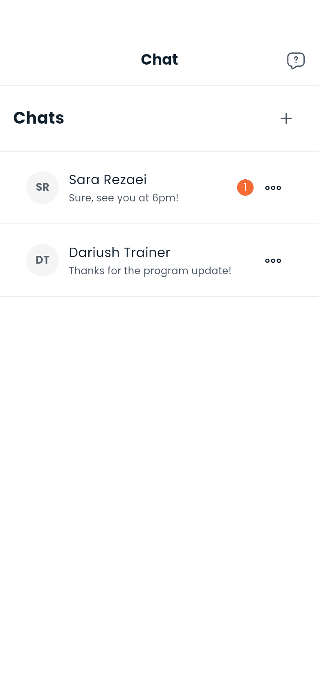
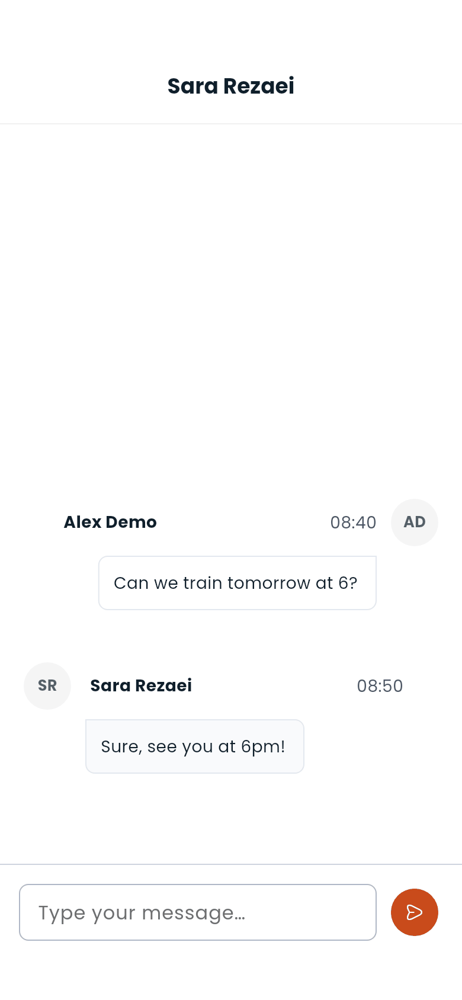

# Chat

Chat with your trainer, gym, or training partners right in the app.

---

## Starting a conversation

Chat is the **speech-bubble icon in the top bar**, not one of the four tabs — it is there on every tab, with a badge when you have unread messages. Tap it for the list of your conversations.

There are two ways to start one:

- **From the list** — tap **+**, then search for people by name or username and pick them. Choosing one person starts a direct conversation; choosing several starts a group.
- **From the person** — **Message** on a trainer's profile, on a trainee, or beside a service you bought. If you already have a conversation with them it opens that one rather than starting a second.

To leave a conversation behind for good, delete it from the list.

---

## Direct messages

One-on-one conversations work just like any messaging app:
- Type and send messages in real time
- Edit or delete your own messages (long-press a message)
- Messages are paginated — scroll up to load older history
- Timestamps show Today, Yesterday, or the full date

---

## Group chats

Group chats let multiple people talk in the same thread — useful for training groups or gym communities.

- The group is named after the people in it, so there is no name to invent
- Who is in the conversation can be changed afterwards, if your account is allowed to
- Everyone in the group can send and receive messages

---

## Unread badge

The chat icon carries a badge with the count of unread messages. It clears as you open conversations.

---

## Real-time delivery

Messages arrive as they are sent — nothing to refresh.

## The list and the conversation

Your conversations and a single conversation are two separate screens with their own addresses, so a link to one chat opens that chat, and the back gesture takes you from a conversation to the list rather than out of chat entirely. On a wide screen the two sit side by side.

---

> **Next:** [Set up notifications](notifications.md) or [find people to chat with](trainers.md)

---

[← Previous: AI Assistant](ai-assistant.md) | [Next: Notifications →](notifications.md)
