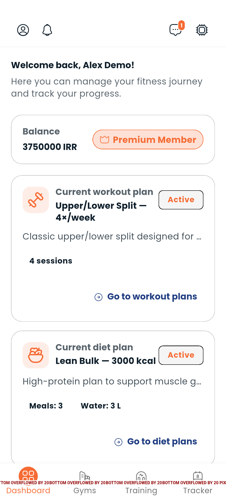

# Dashboard

The Dashboard is your home screen — a single view of everything happening today.

---

## What's on the Dashboard

### Today's quick-log cards

Six color-coded cards let you log your daily activities without navigating anywhere:

| Card | What it logs |
|---|---|
| **Sleep** | Duration and notes |
| **Weight** | Body weight in kg |
| **Workout** | Active workout session |
| **Meals** | Food intake with macros |
| **Supplements** | Supplements taken |
| **Water** | Number of glasses |

Tap any card to open a quick-log form. Your entries are saved to your tracker history automatically.

### Active plans

If you have an active workout or diet plan, the Dashboard shows it here — with a shortcut to open the full plan.

### Wallet balance

Your current Dambel balance is displayed at the top. Tap it to go to your [Wallet](wallet.md).

### Gym subscription status

If you have an active gym subscription, you'll see the gym name and expiry date.

---

## Daily habit

The Dashboard is designed for one quick check-in per day. Open it, tap the relevant cards to log what you did, and you're done. Your history builds up over time in the [Tracker](tracker.md).

---

> **Next:** [Learn how to track in detail](tracker.md) or [build a workout plan](workout-plans.md)
