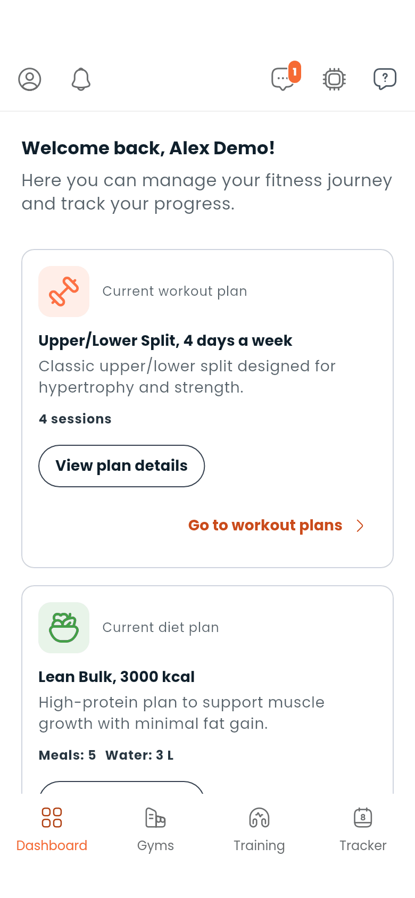
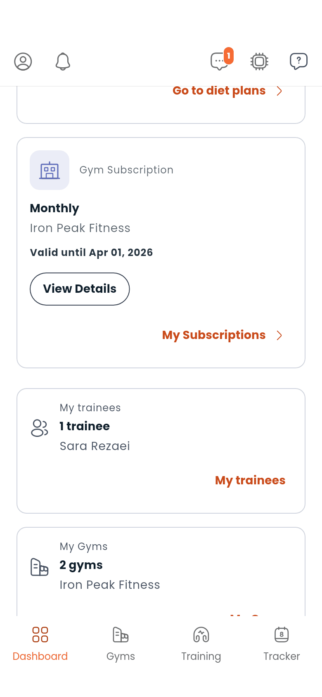

# Dashboard

The Dashboard is your home screen — where the day starts, and what it shows depends on who you are.

---

## What's on the Dashboard

### Your first visit

A brand-new account sees one card: **Start here**, with two ways in — find a trainer to write you a plan, or ask the assistant to build one now. It goes away as soon as there is something to show.

### Active plans

Your current workout plan, diet plan and gym subscription, one card each. Each card names the plan, a few of its numbers, and opens it with **View plan details**; the quieter link below goes to the full list.

If you are not a member of any gym yet, the gym card offers **Find gyms** rather than the empty list.

### Today

A one-line summary of what you have logged today — water, meals, workouts, supplements — with **Log today** to open the [Tracker](tracker.md), which is where logging happens. The Dashboard reports; the Tracker records.

### Premium

Where your premium membership stands: active and until when, ending this week, ended, or never started — with **Renew** or **Upgrade to Premium** where either applies. See [Wallet](wallet.md).

### Wallet balance

Your current Dambel balance. Tap it to go to your [Wallet](wallet.md).

### If you are a trainer or a gym owner

Extra cards appear for what you run rather than what you follow:

| Card | What it shows |
|---|---|
| **My trainees** | How many trainees you have, and the newest |
| **My gyms** | How many gyms you own, and one of them |
| **Trainer licence** | Whether your licence is under review, or needs a clearer copy — until it is approved, your services are not listed |

---

## On a wide screen

Given the room, the cards lay out in columns rather than one long stack, and the four tabs move to a rail down the side. See [Using Dambel on a computer](on-a-computer.md).

---

## Daily habit

Open the Dashboard for the shape of your day, then go to the [Tracker](tracker.md) to log it. Your history builds up over time.

---

> **Next:** [Learn how to track in detail](tracker.md) or [build a workout plan](workout-plans.md)

---

[← Previous: Login Sessions](login-sessions.md) | [Next: Workout Plans →](workout-plans.md)
