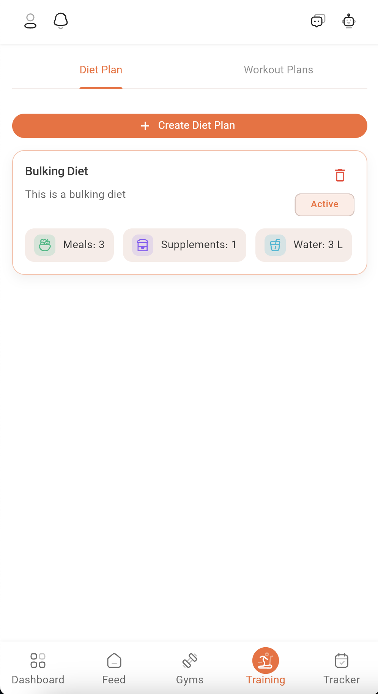
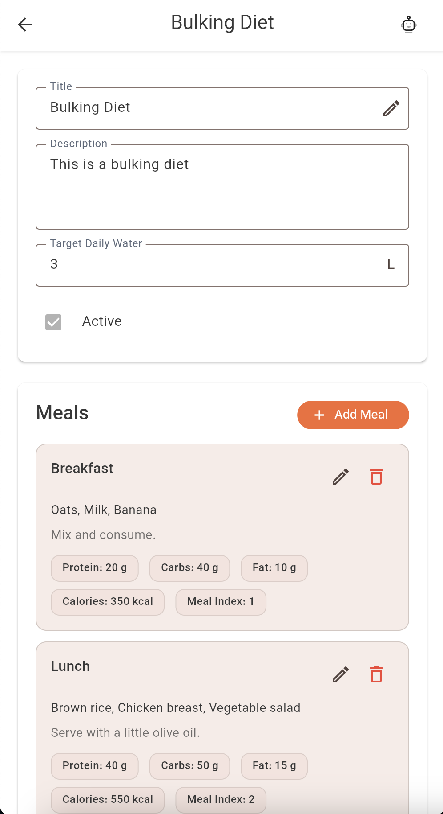

# Diet Plans Guide

Welcome to the Diet Plans section of Dambel. This comprehensive guide will walk you through all features of diet plans, including viewing plans, managing meals, tracking supplements, and understanding nutritional information.

## Overview

The Diet Plans section allows you to create, view, and manage personalized nutrition plans. Each diet plan contains meals with detailed nutritional information (protein, carbohydrates, fat, calories) and optional supplements. You can track your daily water intake target and organize meals by meal index.

Diet plans serve multiple purposes:
- **Nutritional Planning**: Structure your daily meals with specific macronutrient targets
- **Meal Management**: Add, edit, and organize meals with ingredients and descriptions
- **Supplement Tracking**: Include supplements with specific amounts and timing
- **Water Goals**: Set and track daily water intake targets
- **Active Plan Management**: Mark plans as active or inactive

## Accessing Diet Plans

You can access diet plans from the Training page:

1. Navigate to the **Training** section from the main navigation
2. Select the **"Diet Plans"** tab at the top
3. You'll see a list of all available diet plans

*The diet plans list showing all available plans with meal counts and supplement badges*

## Viewing Diet Plans

The diet plans list displays all plans you have access to:

**Plan Information**:
- **Title**: The name of the diet plan
- **Description**: Optional description of the plan
- **Meal Count**: Number of meals in the plan (displayed as a badge)
- **Supplement Count**: Number of supplements (if available)
- **Active Status**: Indicates if the plan is currently active

**Empty State**:
If no diet plans exist, you'll see a message: "No diet plans yet" with an option to create your first plan.

**Pagination**:
If you have many plans, use pagination controls at the bottom to navigate through pages.

## Opening a Diet Plan

Tap on any diet plan card to open the detailed view. The detail screen shows:

### Plan Header

The plan header displays:
- **Title**: The plan name (editable)
- **Description**: Optional plan description (editable)
- **Target Daily Water**: Daily water intake goal in liters (editable)
- **Active Status**: Checkbox to mark plan as active or inactive

*The diet plan detail screen showing plan information, meals section, and supplements section*

### Meals Section

The Meals section displays all meals in the plan:

**Meal Information**:
- **Title**: Name of the meal
- **Ingredients**: List of ingredients
- **Description**: Optional meal description or instructions
- **Nutritional Values**: Protein, carbs, fat, and calories in grams/kilocalories
- **Meal Index**: Order number for the meal in the day

**Meal Display**:
Each meal shows:
- Title in bold
- Ingredients list
- Description (if provided)
- Nutritional chips showing protein, carbs, fat, calories, and meal index

**Totals Section**:
At the bottom of the meals list, you'll see a totals card showing:
- Total protein (grams)
- Total carbohydrates (grams)
- Total fat (grams)
- Total calories (kilocalories)

**Empty State**:
If no meals exist, you'll see: "No meals yet" with an "Add Meal" button.

### Supplements Section

The Supplements section displays all supplements in the plan:

**Supplement Information**:
- **Supplement Name**: Selected from available supplements
- **Amount**: Quantity of supplement
- **Amount Unit**: Unit of measurement (e.g., "g", "ml", "capsule", "tablet")
- **After Meal Index**: Which meal number to take the supplement after
- **Description**: Optional notes about the supplement

**Empty State**:
If no supplements exist, you'll see: "No supplements yet" with an "Add Supplement" button.

## Editing a Diet Plan

To edit plan information:

1. Tap the **edit icon** (pencil) next to the title field
2. Modify the title, description, target daily water, or active status
3. Tap **"Save"** to save changes or **"Cancel"** to discard

**Validation**:
- Title is required
- Target daily water must be a positive number (if provided)

## Managing Meals

### Adding a Meal

1. In the Meals section, tap the **"Add Meal"** button
2. Fill out the meal form:
   - **Title** (Required): Name of the meal
   - **Ingredients** (Required): List of ingredients
   - **Description** (Optional): Additional notes or instructions
   - **Protein** (Required): Protein in grams (must be ≥ 0)
   - **Carbs** (Required): Carbohydrates in grams (must be ≥ 0)
   - **Fat** (Required): Fat in grams (must be ≥ 0)
   - **Calories** (Required): Calories in kilocalories (must be ≥ 0)
   - **Meal Index** (Required): Order number (must be ≥ 0)
3. Tap **"Save"** to create the meal

### Editing a Meal

1. Tap the **edit icon** (pencil) on any meal card
2. Modify the fields as needed
3. Tap **"Save"** to update or **"Cancel"** to discard changes

### Deleting a Meal

1. Tap the **delete icon** (trash) on any meal card
2. Confirm deletion in the dialog
3. The meal will be permanently removed

**Note**: Deleting a meal cannot be undone.

## Managing Supplements

### Adding a Supplement

1. In the Supplements section, tap the **"Add Supplement"** button
2. Fill out the supplement form:
   - **Supplement** (Required): Select from available supplements dropdown
   - **Amount** (Required): Quantity (must be ≥ 0)
   - **Amount Unit** (Required): Unit of measurement
   - **After Meal Index** (Required): Meal number to take after (must be ≥ 0)
   - **Description** (Optional): Additional notes
3. Tap **"Save"** to create the supplement

### Editing a Supplement

1. Tap the **edit icon** (pencil) on any supplement card
2. Modify the fields as needed
3. Tap **"Save"** to update or **"Cancel"** to discard changes

### Deleting a Supplement

1. Tap the **delete icon** (trash) on any supplement card
2. Confirm deletion in the dialog
3. The supplement will be permanently removed

## AI Assistant Integration

The Diet Plan detail screen integrates with the AI Assistant:

**AI Can Help**:
- Fill out meal forms with nutritional information
- Suggest meal combinations based on goals
- Calculate nutritional totals
- Organize meals by meal index
- Add supplements based on diet plan requirements

**How to Use**:
1. Open AI Assistant while viewing a diet plan (tap robot icon 🤖)
2. Ask for help: "Add a high-protein breakfast meal"
3. AI automatically populates form fields
4. Review and adjust as needed
5. Save when satisfied

A blue notification appears when AI updates the form: "AI updated the form"

## Troubleshooting

### Plans Not Loading

**Solutions**:
1. Check internet connection
2. Pull down to refresh
3. Tap "Retry" button if error screen appears
4. Logout and login again
5. Contact support if issue persists

### Cannot Edit Plan

**Solutions**:
1. Ensure you're logged in
2. Close and reopen the app
3. Check that the plan belongs to you or you have editing access
4. Contact support if issue persists

### Meals Not Loading

**Solutions**:
1. Verify stable internet connection
2. Pull down to refresh
3. Check error message for specific issues
4. Contact support if issue persists

### Cannot Add/Edit/Delete Meals

**Solutions**:
1. Ensure all required fields are filled
2. Check validation errors (red messages on fields)
3. Verify you have editing access to the plan
4. Try again after a moment
5. Contact support if issue persists

### Supplements Not Loading

**Solutions**:
1. Verify stable internet connection
2. Pull down to refresh
3. Contact support if issue persists

### Cannot Add/Edit/Delete Supplements

**Solutions**:
1. Ensure supplement is selected from dropdown
2. Check all required fields are filled
3. Verify amount and after meal index are valid numbers
4. Verify you have editing access to the plan
5. Contact support if issue persists

## Best Practices

### Organizing Meals

- Use meal index to order meals chronologically (1 = breakfast, 2 = lunch, etc.)
- Include detailed ingredients for meal preparation
- Add descriptions for cooking instructions or special notes
- Keep nutritional values accurate

### Managing Supplements

- Set appropriate "after meal index" to indicate timing
- Use clear amount units (g, ml, capsule, tablet)
- Add descriptions for special instructions
- Coordinate supplements with meal timing

### Plan Management

- Mark only one plan as active at a time
- Set realistic water intake targets
- Keep plan descriptions informative
- Update plans as your goals change

## Getting Help

If you need assistance:

1. **AI Assistant**: Ask for help (tap robot icon 🤖)
2. **In-App Support**: Check support options in settings
3. **Documentation**: Browse other help articles
4. **Contact Support**: Reach out to Dambel support team

Diet plans are an essential part of your fitness journey. Use them to structure your nutrition and achieve your goals!

