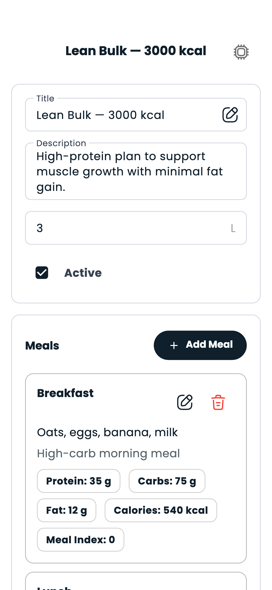

# Diet Plans

A diet plan in Dambel lets you structure your daily nutrition — meals, macros, supplements, and water targets — all in one place.

---

## Create a plan

1. Go to **Training → Diet Plans**
2. Tap **+** to create a new plan
3. Name it (e.g., "Cut Phase", "Maintenance")
4. Set your daily **water target** (in glasses)
5. Save

---

## Add meals

Each meal represents a distinct eating window in your day (breakfast, pre-workout, lunch, etc.).

Inside your plan:
1. Tap **Add Meal**
2. Give it a name and an order number (1, 2, 3... determines when it appears in the day)
3. Enter nutritional values:
   - Protein (g)
   - Carbs (g)
   - Fat (g)
   - Calories (kcal)
4. Save

The plan automatically totals up your daily macros and calories across all meals.

---

## Add supplements

Supplements are attached to meals and shown alongside them.

Inside a meal:
1. Tap **Add Supplement**
2. Select the supplement from the list
3. Set the amount and unit (e.g., 5g, 1 capsule)
4. Choose timing relative to the meal: **before**, **with**, or **after**
5. Save

---

## Water goal

Set a daily water target when creating or editing the plan. The Tracker and Dashboard water card let you log glasses throughout the day and track progress toward your goal.

---

## Set a plan as active

Only one diet plan can be active at a time. Activate it by opening the plan and tapping **Set as Active** — it'll then appear on your Dashboard.

---

## Nutritional totals

At the top of any diet plan you'll see a summary of your **total daily protein, carbs, fat, and calories**. This updates automatically as you add or edit meals.

---

## AI assistance

Tap the AI button inside your diet plan to get help — ask for meal suggestions, get macro targets based on your goals, or let it fill in a meal for you.

---

> **Next:** [Track your daily meals](tracker.md) or [find a nutrition coach](trainers.md)
