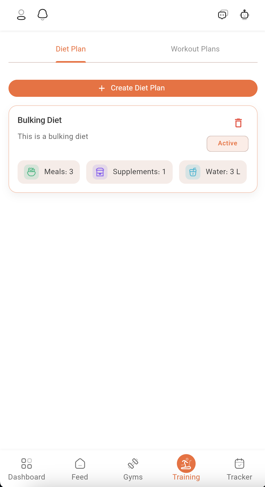
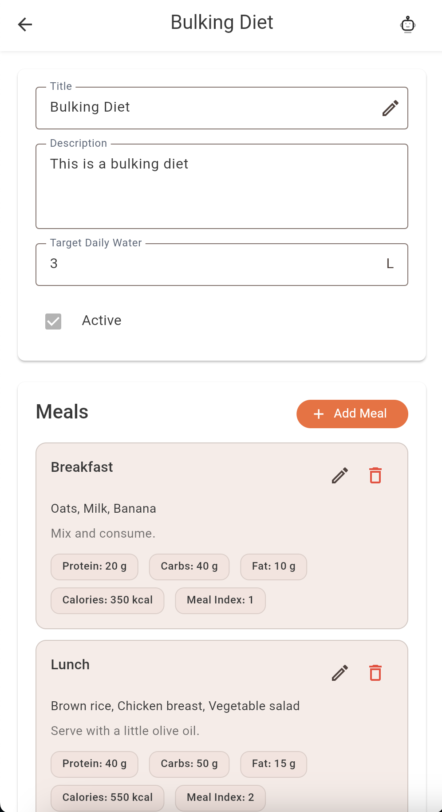

# Diet Plans

Your diet plans are where you map out your nutrition game. Think of them as your meal blueprints – complete with macros, ingredients, supplements, and even your daily water goals.

## Getting There

Head to the Training section from the main navigation, then tap the "Diet Plans" tab at the top. You'll see all your nutrition plans laid out.

## What You'll See

Each diet plan card shows the plan title and description (if you added one). There's a badge showing how many meals are in the plan, and if you've got supplements, you'll see a count for those too. Active plans get a special badge so you know which one you're currently following. Plans with a daily water target show that in liters.

If you don't have any plans yet, you'll see an empty state inviting you to create your first one. Got a bunch of plans? Pagination controls at the bottom let you browse through them.

## Opening a Plan

Tap any plan card to dive into the details.

At the top, you've got the plan basics: title, description, your daily water target in liters, and a checkbox to mark it as active. Hit the pencil icon next to the title to edit any of these. Title is the only required field – everything else is optional. When you're done editing, tap "Save" or "Cancel" to bail.

Below that, the screen splits into two main sections: Meals and Supplements.

## Meals

This is where your actual food lives. Each meal card shows the meal name, ingredients list, and any description you added (like cooking notes or timing). You'll see nutritional chips displaying protein, carbs, fat, and calories – all in grams except calories which are in kilocalories. There's also a meal index number that determines the order (1 for breakfast, 2 for lunch, and so on).

At the bottom of the meals section, there's a totals card that adds up all your macros across every meal. Handy for seeing if you're hitting your daily targets.

No meals yet? You'll see an empty state with an "Add Meal" button.

### Adding & Editing Meals

Tap "Add Meal" to create a new one. You'll need to fill in the meal name, ingredients, and all the nutritional values (protein, carbs, fat, calories). Description is optional. The meal index determines where it sits in your day – use 1 for your first meal, 2 for the second, and so on.

To edit an existing meal, tap the pencil icon on its card. Make your changes and save. Want to delete one? Tap the trash icon and confirm. Just know that deleting is permanent – there's no undo.

### AI Can Help

The AI assistant can fill out meal forms for you. Open it (tap the robot icon) while you're on the diet plan screen and tell it what you want. Something like "Add a high-protein breakfast with eggs and oats" works great. The AI will populate all the fields including nutritional values, then you can review and save. You'll see a blue notification when the AI updates something.

The AI can also delete meals if you ask it to, but it'll always confirm with you first.

## Supplements

If you're taking supplements, this section ties them to your meals. Each supplement card shows the supplement name, amount with its unit (grams, milliliters, capsules, tablets), and which meal to take it after. There's also an optional description field for notes like "take with food" or "before workout".

The "after meal index" field links the supplement to a specific meal number. So if you want to take creatine after your first meal, you'd set it to 1.

### Adding & Editing Supplements

Tap "Add Supplement" to create a new one. Pick the supplement from the dropdown (these come from a global list), enter the amount and unit, specify which meal to take it after, and optionally add a description.

Editing and deleting work the same as meals – pencil icon to edit, trash icon to delete with confirmation. The AI can help with supplements too, just like with meals.

## Refreshing

Pull down from the top of the list to refresh and load the latest data. Useful if you just made changes from another device or if something's not loading right.

## When Things Go Wrong

Plans not loading? Check your internet connection and try pulling down to refresh. If you see an error screen, there's usually a "Retry" button. Still stuck? Try logging out and back in.

Can't edit a plan? Make sure you're logged in and that you have editing access. Sometimes closing and reopening the app helps.

Changes not saving? Look for red error messages on the fields – they'll tell you what's wrong. Common issues are missing required fields or invalid numbers. Make sure you've got a stable internet connection too.

Meals or supplements not showing up? Give them a moment to load – sometimes they take a bit. Pull down to refresh if they're stuck. If it keeps happening, reach out to support.

AI not updating the form? Make sure you're on the diet plan detail screen when you ask for help, and be specific about what you want. "Add a breakfast meal with 30g protein" works better than "add a meal". If it's still not working, try closing and reopening the AI assistant.

## Tips

Keep your meal index numbers organized – they determine the order of your meals throughout the day. Include detailed ingredients so you know exactly what to prep. Use the description field for cooking notes or timing reminders.

For supplements, make sure the "after meal index" matches an actual meal in your plan. Use clear units (g, ml, capsule, tablet) so there's no confusion.

Only mark one plan as active at a time – that's the one you're currently following. Set realistic water targets you can actually hit. Update your plans as your goals change.

If you need help, the AI assistant is always there (tap that robot icon), or check out the support options in settings.

