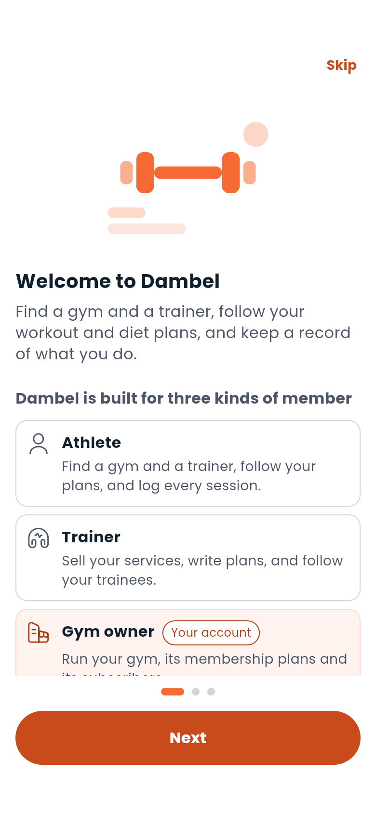

# Getting Started with Dambel

Dambel brings together everything you need for your fitness journey in one place. Whether you're an athlete tracking your progress, a trainer managing clients, or a gym owner growing your business — Dambel has a role for you.

---

## What can you do with Dambel?

**As an athlete:**
- Build structured workout and diet plans
- Log every workout, meal, sleep session, and more
- Find gyms near you and subscribe to memberships
- Hire a certified trainer and stay connected through chat

**As a trainer:**
- Create and sell training and nutrition services
- Manage your trainees and monitor their progress
- Communicate directly with clients via chat

**As a gym owner:**
- List your gym with hours, equipment, and subscription plans
- Manage members and track subscriptions

---

## Your first run

The first time you open Dambel after signing in, it asks three short questions: who you are — an athlete, a trainer or a gym owner — what you came to do, and where you'd like to start. Your answers just choose the screen you land on; nothing is locked in, and you can skip the whole thing.

You'll be dropped straight into whatever you picked: a gym search, a trainer search, the assistant with a plan request already written for you, or the Tracker.

---

## The four main areas

Once you're logged in, you'll see four tabs at the bottom of the screen:

| Tab | What it's for |
|---|---|
| **Dashboard** | Your daily home base — active plans, today's summary, your balance |
| **Gyms** | Discover gyms on a map, or as a list |
| **Training** | Trainers, workout plans, diet plans, and your trainees |
| **Tracker** | Log the day, and see your averages, charts, records and history |

On a wide screen — a tablet, or a browser window — the four move to a rail down the side of the window instead of a bar along the bottom. See [Using Dambel on a computer](on-a-computer.md).

### The icons at the top

Three things live in the top bar on every one of the four tabs, rather than in the tabs themselves:

| Icon | What it opens |
|---|---|
| **Chat** | Your [conversations](chat.md) |
| **Bell** | The newest [notifications](notifications.md), and a way to the rest |
| **Sparkle** | The [AI assistant](ai-assistant.md) |

Your photo, top left, opens a short menu: your profile, your wallet, your referral link, settings, and logging out.

---

## Help, whenever you want it

Every main screen has a **?** in its top bar. It opens a short guide to that screen — three things worth knowing and a link to the matching page here.

The first time you reach a screen, Dambel walks you through it with a few highlighted steps. You can skip a tour, and you can see any of them again: **Settings → Help and the intro tour** replays the introduction, replays one section's tour, or resets the lot so everything is offered again.

---

## Where to go next

1. [Create your account](authentication.md) — takes about 2 minutes
2. [Set up your profile](profile.md) — add a photo and your details
3. [Build your first workout plan](workout-plans.md) or [diet plan](diet-plans.md)
4. [Start tracking](tracker.md) — log your day from the Tracker

---

> **Speaking Persian?** Switch the app language anytime in [Settings](settings.md). Dambel fully supports Persian with a right-to-left layout.

---

[Next: Authentication Guide →](authentication.md)
