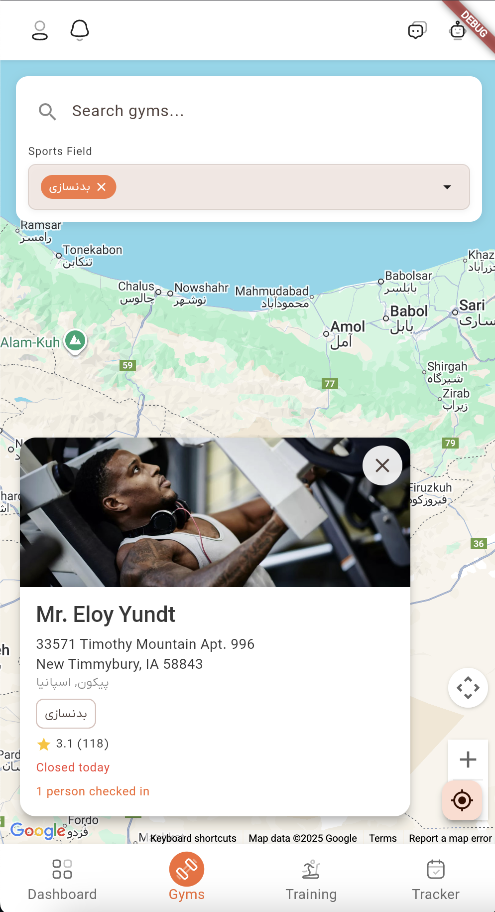

# Gyms Guide

Welcome to the Gyms Search feature in Dambel. This guide will help you understand how to search for gyms and fitness centers, filter results by sports fields, explore gym locations on an interactive map, and find the perfect fitness facility for your needs.

## Overview

The Gyms Search page allows you to discover and explore gyms and fitness centers in your area using an interactive Google Maps interface. You can search by name, filter by sports fields (majors), view gym locations on a map, and access detailed information about each facility.

Key features:
- **Interactive Map**: Explore gyms on Google Maps with location markers
- **Search Functionality**: Find gyms by name or keywords
- **Sports Field Filters**: Filter gyms by the sports fields they offer
- **Location-Based Search**: Automatically find gyms near your current location or map center
- **Gym Details**: View detailed information about each gym including ratings, address, and facilities
- **My Location**: Quickly navigate to your current location on the map
- **Marker Colors**: Different colored markers indicate gym status and promotional boosts

## Accessing Gyms Search

### Step 1: Navigate to Gyms Section

1. Open the main navigation menu
2. Select the **Gyms** section from the bottom navigation bar
3. The Gyms page will open with the map interface

### Step 2: View Gyms Search Page

When you open the Gyms page, you'll see:
- An interactive Google Maps interface showing gym locations
- A search bar at the top for text-based search
- Filter options for sports fields (majors)
- Gym markers on the map indicating facility locations

*The gyms search page showing interactive map, search bar, filters, and gym location markers*

## Search Functionality

### Using the Search Bar

The search bar is located at the top of the page, in a white container overlay on the map.

**How to Search**:
1. Tap in the search input field
2. Type the gym name or any keywords
3. Results update automatically as you type (with a 300ms delay)
4. A dropdown list appears showing matching gyms (up to 5 results)
5. Tap on a result to view that gym on the map

**Search Behavior**:
- **Real-time Updates**: Results filter automatically as you type
- **Debounced Input**: Small delay prevents excessive API calls while typing
- **Clear Search**: Tap the X icon to clear the search field and return to map view
- **Dropdown Results**: Shows gym name and address for quick selection
- **Map Navigation**: Selecting a result centers the map on that gym

**Empty State**:
- If no gyms match your search, you'll see: "No gyms found"
- Clear the search to return to the map-based view

### Location-Based Search

The map automatically searches for gyms based on the visible map area:

**How It Works**:
- **Map Center**: Gyms are searched within a radius around the map center
- **Zoom Level**: The search radius automatically adjusts based on zoom level
- **Camera Movement**: When you pan or zoom the map, gyms are automatically refreshed
- **Debounced Updates**: Small delay after map movement prevents excessive API calls

**Radius Calculation**:
- The search radius is calculated from the current zoom level
- Zooming in (higher zoom) = smaller radius = more precise local search
- Zooming out (lower zoom) = larger radius = broader area search
- Radius ranges from 0.5km (very zoomed in) to 2000km (very zoomed out)

## Filtering Results

### Sports Field Filters (Majors)

You can filter gyms by the sports fields or facilities they offer (majors).

**How to Use**:
1. Look for the "Sports Field" filter section in the search panel
2. Tap on the dropdown to expand available sports fields
3. Select one or more sports fields to filter by
4. Selected filters appear as removable chips
5. Results update automatically when filters change

**Selected Filter Tags**:
- When sports fields are selected, they appear as removable chips
- Each chip shows the sports field name
- Tap the X icon on a chip to remove that filter
- Use "Clear All" button to remove all filters at once

**Filter Behavior**:
- Filters apply to both map-based and text search results
- Multiple filters can be selected simultaneously (AND logic)
- Clear all filters to see all gyms again

### Combining Search and Filters

You can combine multiple search methods for precise results:
- **Text Search + Filters**: Search for specific gyms offering certain sports fields
- **Map Location + Filters**: Filter gyms in a specific area by sports field
- **All Methods**: Combine text search, map location, and filters for the most specific results

## Viewing Results on the Map

### Gym Markers

Each gym appears as a marker on the map with different colors indicating status:

**Marker Colors**:
- **Red**: Standard active gym
- **Orange/Amber**: Gym with marketing boost (promoted)
- **Violet/Purple**: Closed or inactive gym

**Interacting with Markers**:
- **Tap a Marker**: Opens a detailed popup with gym information
- **Marker Info Windows**: Shows gym name and address when marker is tapped
- **Multiple Markers**: All matching gyms are displayed simultaneously

### Gym Details Popup

When you tap a gym marker, a detailed popup appears showing:

**Gym Information**:
- **Name**: The gym's name
- **Address**: Full address including street address
- **City and Country**: Location details
- **Sports Fields**: Tags showing available sports facilities (up to 3 shown)
- **Rating**: Star rating with average score and review count
- **Image**: Gym photo if available
- **Working Status**: Current open/closed status if applicable

**Working Periods**:
- Shows operating hours for each day of the week
- Displays current working status (open/closed)

**Crowd Information**:
- If available, shows current crowd level at the gym
- Helps you plan visits during less busy times

**Popup Actions**:
- View all gym details
- Close popup by tapping outside or using close button

## Map Navigation

### Zooming and Panning

**Zoom Controls**:
- **Pinch to Zoom**: On mobile, pinch to zoom in or out
- **Double Tap**: Double tap to zoom in
- **Scroll Wheel**: On desktop, use mouse wheel to zoom
- **Zoom Buttons**: Use standard map zoom controls if available

**Panning**:
- **Drag**: Click and drag to move the map
- **Arrow Keys**: On desktop, use arrow keys to pan (if focused)

**Auto-Refresh**:
- Gyms automatically refresh when you stop moving the map
- Wait for the map to settle to see updated gym locations

### My Location Button

A floating action button allows you to quickly navigate to your current location:

**How to Use**:
1. Tap the location button (usually bottom-right of map)
2. Grant location permission if prompted
3. The map will animate to your current location
4. Gyms near you will be automatically loaded

**Location Permissions**:
- **First Time**: App will request location permission
- **Denied**: You may need to enable location in device settings
- **Web**: Browser will request location permission
- **Mobile**: Uses device GPS if permission granted

**Location Accuracy**:
- Uses high accuracy GPS when available
- Shows a blue circle marker indicating your location
- Updates as you move (if movement tracking enabled)

## Loading States

### Initial Load

When first opening the page:
- **Map Loading**: A loading indicator appears while Google Maps initializes
- **Gyms Loading**: Once map loads, gyms are fetched for the visible area
- **Filters Loading**: Sports field options are loaded
- **Location Loading**: Current location is detected (if permission granted)

### Subsequent Loads

When loading new gyms or refreshing:
- **Silent Updates**: Gyms refresh in the background when map moves
- **No Interruption**: Existing markers remain visible during updates
- **Smooth Experience**: New markers appear once loaded

### Error States

**Map Loading Errors**:
- If Google Maps fails to load, an error message appears
- Check internet connection and API key configuration
- Refresh the page to retry

**Location Errors**:
- If location permission is denied, map defaults to Tehran coordinates
- You can manually navigate to your area
- Enable location permission in settings to use "My Location" feature

**Search Errors**:
- If search fails, an error message appears
- Retry the search or check internet connection
- Clear search and try again

## Troubleshooting

### Gyms Not Loading

If gyms aren't appearing on the map:

1. **Check Internet**: Ensure you have a stable internet connection
2. **Check Zoom Level**: Zoom in closer - you may be too zoomed out
3. **Check Location**: Pan to an area with gyms (try major cities)
4. **Wait for Refresh**: Allow map to settle after moving - gyms load after movement stops
5. **Refresh Page**: Reload the page if issues persist

### Search Not Working

If search isn't returning results:

1. **Clear Search**: Try clearing the search field and searching again
2. **Check Spelling**: Verify your search terms are spelled correctly
3. **Broaden Search**: Try more general keywords or gym names
4. **Remove Filters**: Clear all filters and search again
5. **Check Internet**: Ensure stable internet connection

### Filters Not Applying

If filters aren't working:

1. **Check Selection**: Ensure filters are actually selected (chips visible)
2. **Clear and Reapply**: Clear all filters and select them again
3. **Wait for Update**: Allow a moment for results to refresh
4. **Check Internet**: Ensure stable internet connection

### Map Not Loading

If the map doesn't appear:

1. **Check API Key**: Verify Google Maps API key is configured (for developers)
2. **Check Internet**: Ensure stable internet connection
3. **Refresh Page**: Reload the page
4. **Check Console**: Look for JavaScript errors in browser console (for developers)
5. **Try Different Browser**: Some browsers may have compatibility issues

### Location Not Working

If "My Location" button doesn't work:

1. **Check Permissions**: Ensure location permission is granted
2. **Enable Location**: Turn on location services on your device
3. **Check Settings**: Go to app settings and enable location access
4. **Try Manual Navigation**: Manually pan to your area if location fails
5. **Check GPS**: Ensure GPS is enabled on mobile devices

### Markers Not Showing

If gym markers aren't visible:

1. **Check Zoom**: Zoom in closer - markers may be clustered or hidden
2. **Check Filters**: Ensure filters aren't excluding all gyms
3. **Check Area**: Try navigating to a major city known to have gyms
4. **Wait for Load**: Allow time for gyms to load after map movement
5. **Refresh**: Pull to refresh or reload the page

## Best Practices

### Effective Searching

Tips for finding the right gym:

1. **Start with Location**: Use "My Location" or navigate to your area
2. **Use Text Search**: Search by gym name if you know it
3. **Apply Filters**: Filter by sports fields you're interested in
4. **Zoom In**: Zoom in for more precise local results
5. **Check Multiple Areas**: Explore different neighborhoods or cities

### Using Filters

Best practices for filtering:

1. **Specific First**: Start with specific sports fields you need
2. **Add Gradually**: Add multiple filters one at a time
3. **Clear When Needed**: Don't hesitate to clear filters and start over
4. **Combine Wisely**: Too many filters may return no results

### Map Navigation

Tips for efficient map use:

1. **Use My Location**: Start from your current location for nearby gyms
2. **Zoom Appropriately**: Zoom in for local search, out for broader search
3. **Let It Settle**: Wait for map to stop moving before expecting results
4. **Explore Areas**: Pan to different areas to discover gyms
5. **Save Favorites**: Note gyms you're interested in for later

### Reading Gym Details

Tips for evaluating gyms:

1. **Check Ratings**: Look at average rating and review count
2. **Review Sports Fields**: Verify they offer the facilities you need
3. **Check Address**: Ensure the location is convenient for you
4. **View Working Hours**: Check if hours work with your schedule
5. **Check Crowd Levels**: If available, consider visiting during off-peak times

## Privacy and Data

### What Information is Visible

When searching for gyms:

- **Public Information**: Gym information is visible to all users
- **Location Data**: Your location is only used locally for search (not shared)
- **Search History**: Your search queries are not stored or shared

### Data Usage

- **Server Requests**: Searches and map updates send requests to Dambel servers
- **Google Maps**: Map display uses Google Maps services (subject to Google's privacy policy)
- **Location Services**: Your location is requested for map functionality but handled locally
- **Real-time Updates**: Results update based on current database state
- **Caching**: Some data may be cached for performance

### Location Permissions

- **Required For**: "My Location" feature and automatic location-based search
- **Not Required For**: Manual map navigation and text search
- **Permission Handling**: App requests permission when needed
- **Privacy**: Location data is used only for displaying your position on the map

## Getting Help

If you need additional assistance:

1. **AI Assistant**: Ask the AI Assistant for help finding gyms (tap robot icon 🤖)
2. **Check Other Guides**: Browse other help documentation in the app
3. **Contact Support**: Reach out to Dambel support for technical issues
4. **Community**: Join the Dambel community for user tips and advice

The Gyms Search feature helps you discover fitness facilities that match your needs and location. Use the interactive map, search, and filters effectively to find the perfect gym for your fitness journey!

