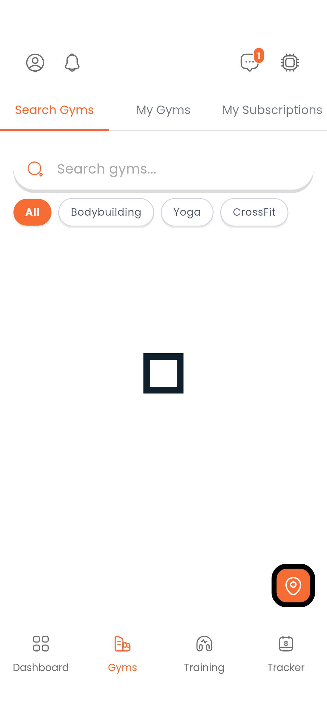
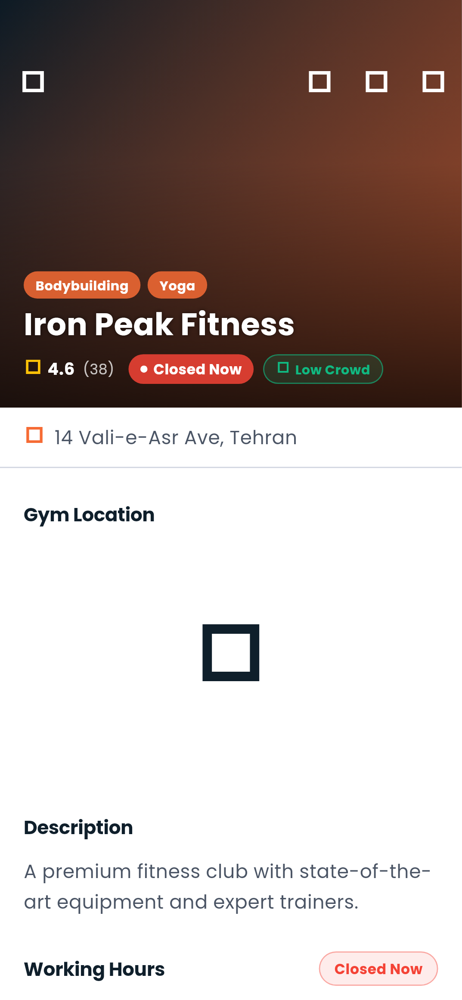
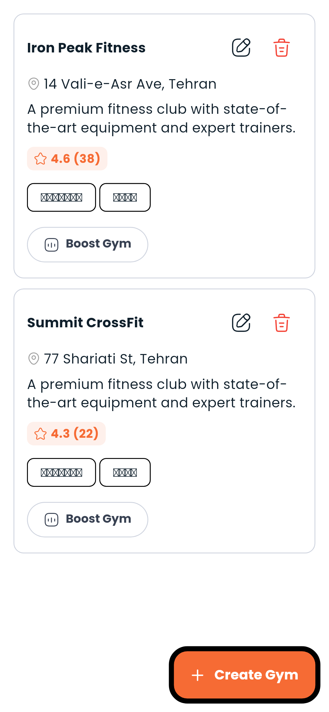
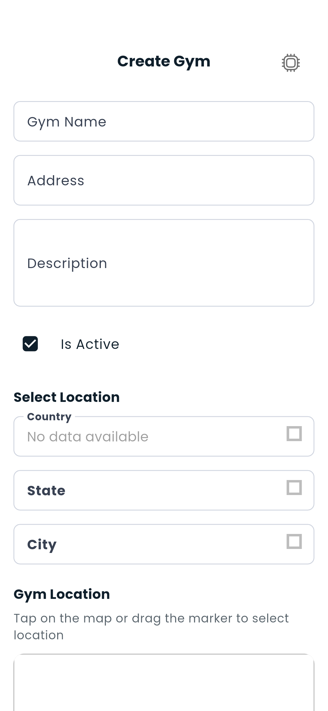
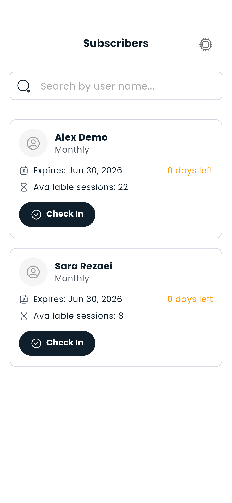
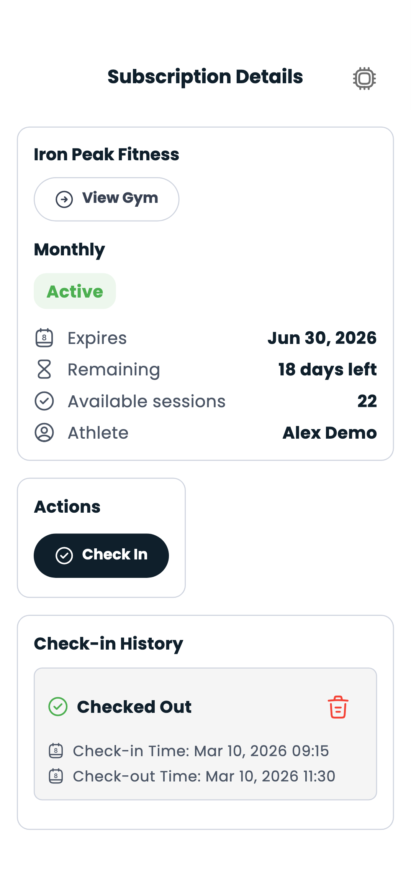

# Gyms

The Gyms tab is built around a map. Find gyms near you, check what they offer, and subscribe without leaving the app.

---

## Finding gyms

### The map

The **Gyms** tab opens a full-screen map. Gym markers are color-coded by status:

| Color | Meaning |
|---|---|
| Green | Open right now |
| Yellow | Opens later today |
| Red | Closed |
| Orange | Boosted listing |

Tap a marker to see a quick summary. Tap the card to open the full gym detail.

### Search and filter

Use the search bar at the top to find gyms by name. Use the filter button to narrow results by **sports field** (bodybuilding, CrossFit, yoga, etc.).

### Your location

Tap the location button to zoom the map to where you are.

---

## Gym details

A gym's detail page shows:
- Name, address, and opening hours
- Sports fields and equipment available
- Current subscription plans and pricing
- Reviews and ratings from members

---

## Subscribing to a gym

On the gym detail page, select a subscription plan and complete the payment through your Dambel wallet. Your active subscription shows up on the Dashboard.

---

## Managing your own gym

If you're a gym owner, you can list and manage your gyms through **My Gyms**.

### Create a gym

Go to **My Gyms → +** and fill in:
- Name, address, contact info
- Opening hours
- Sports fields
- Equipment list
- Subscription plans
- Buffet/café items (optional)

### View subscribers

Open your gym and tap **Subscribers** to see a list of all active members with their subscription details.

### Manage a subscription

Tap any subscriber to view or edit their subscription details.

---

> **Next:** [Find a trainer](trainers.md) or [check your wallet balance](wallet.md)
