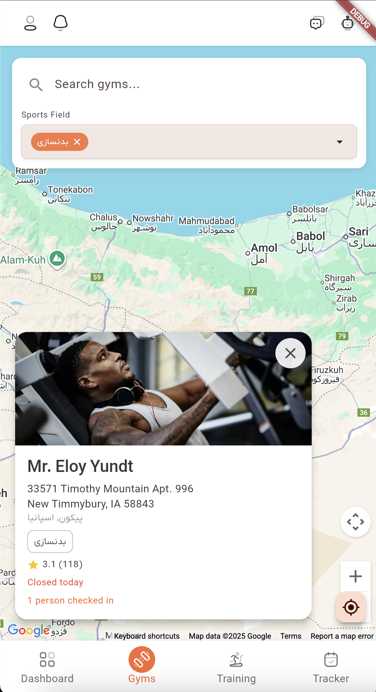

# Finding Gyms

Looking for a place to train? The gyms section helps you discover fitness centers around you. Search by name, filter by what they offer, and see everything on an interactive map.

## Getting There

Tap the Gyms icon in the bottom navigation bar. You'll land on a map showing gyms in your area.

## What You'll See

The map takes up most of the screen, with colored markers showing where gyms are located. Green markers mean the gym is open right now, yellow means it opens later today, red means it's closed, and orange means the gym has a promotional boost going on.

At the top, there's a search bar and filter options tucked into a white box. Type a gym name to search, or tap the sports field filter to narrow things down by what you're looking for – bodybuilding, CrossFit, yoga, whatever.

## Searching for Gyms

Start typing in the search bar and you'll see matching gyms pop up in a dropdown – up to 5 results at a time. Each result shows the gym name and address. Tap one to jump straight to it on the map.

Want to clear your search? Hit the X button on the right side of the search bar.

The map is smart about location too. As you move around or zoom in and out, it automatically updates to show gyms in the visible area. Zoom in close for nearby options, zoom out to see a wider area. The app waits a moment after you stop moving the map before refreshing, so it's not constantly loading while you're panning around.

## Filtering by Sports Fields

Tap the sports field dropdown to see what's available – things like bodybuilding, CrossFit, martial arts, swimming, and more. Pick one or multiple fields to filter the map.

Your selected filters show up as little chips below the dropdown. Each chip has an X you can tap to remove it. There's also a "Clear All" button if you want to start fresh.

Filters work with everything else – so you can search for a gym name and filter by sports field at the same time, or just filter what's visible on the map. Mix and match however you want.

## Gym Markers and Details

Tap any marker on the map to see a quick info card about that gym. You'll see the name, address, what sports fields they offer (up to 3 shown), their rating with star count, and whether they're open or closed right now.

If the gym has uploaded photos, you'll see one in the card. Some gyms also show their current crowd level, which is handy if you prefer to train when it's quieter.

Want more details? Tap anywhere on the card to open the full gym details screen. There you'll find everything – complete equipment list, subscription plans, buffet items if they have any, full operating hours for each day, and user ratings with comments.

## Moving Around the Map

Pinch to zoom on mobile, or use your mouse wheel on desktop. Double-tap to zoom in quickly. Drag the map around to explore different areas.

There's a location button (usually in the bottom-right corner) that takes you straight to where you are. First time you tap it, the app will ask for location permission. Grant it, and the map jumps to your current location with gyms nearby loaded automatically.

If you denied location permission earlier and want to use it now, you'll need to enable it in your device settings.

## When Things Load

First time you open the page, you'll see a loading indicator while the map initializes. Once it's ready, gyms in the visible area load automatically, along with the sports field filter options.

When you move the map around, gyms update in the background without interrupting what you're doing. Existing markers stay visible while new ones load.

If the map doesn't load, check your internet connection and try refreshing. If location permission is denied, the map defaults to Tehran – you can still navigate manually to your area.

## When Things Go Wrong

Gyms not showing up? Check your internet connection first. If you're zoomed way out, try zooming in closer – you might just be looking at too wide an area. Let the map settle after moving it around; gyms load once you stop panning.

Search not working? Clear it and try again, or check your spelling. Remove any filters that might be too restrictive.

Map won't load at all? Refresh the page and make sure you've got a stable connection. If you're on web, try a different browser.

Location button not working? Make sure you've granted location permission. Check your device settings if needed. If it's still not working, just navigate manually to your area.

## Tips

Start with your location or navigate to where you want to train. Use filters to narrow down by what matters to you – the sports fields you're interested in. Check ratings and reviews when you find a gym that looks good.

If you need help, the AI assistant is always there (tap that robot icon). It can help you find gyms based on what you're looking for.

