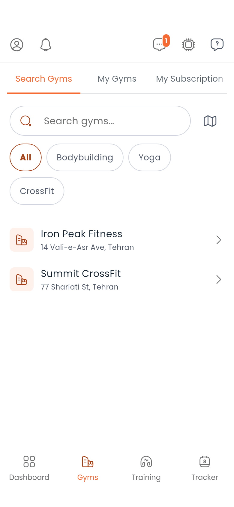
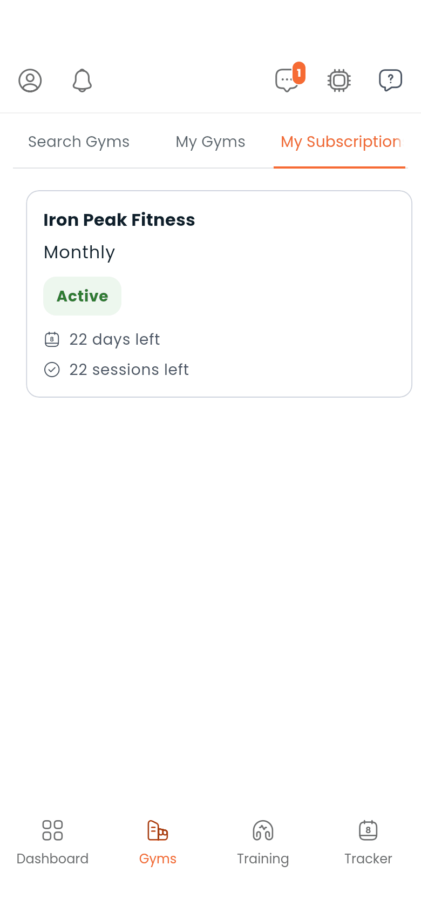
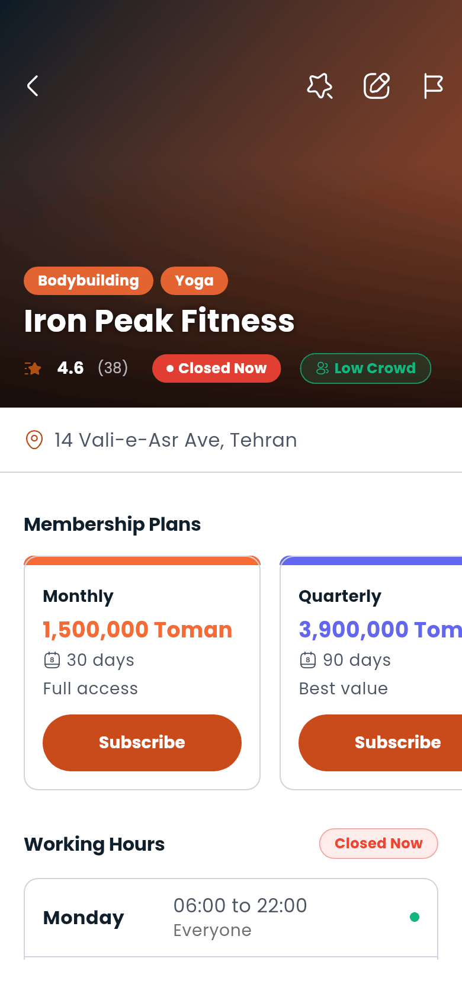
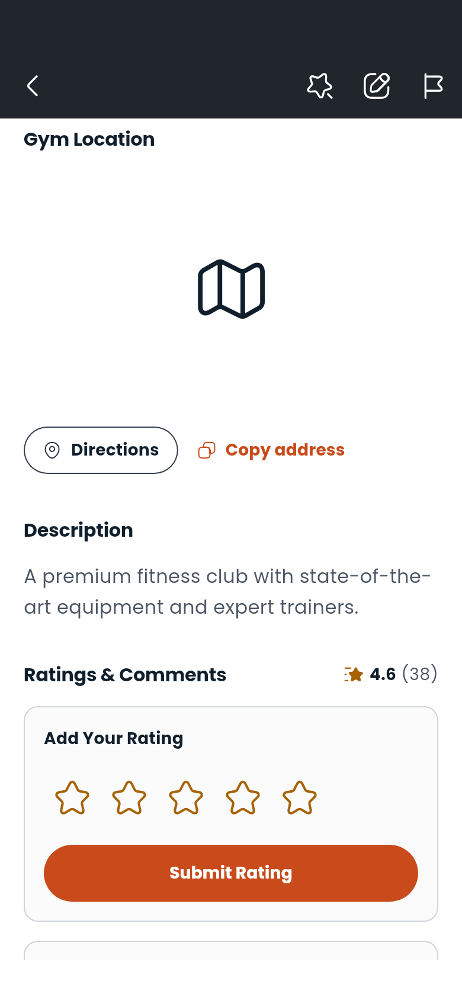
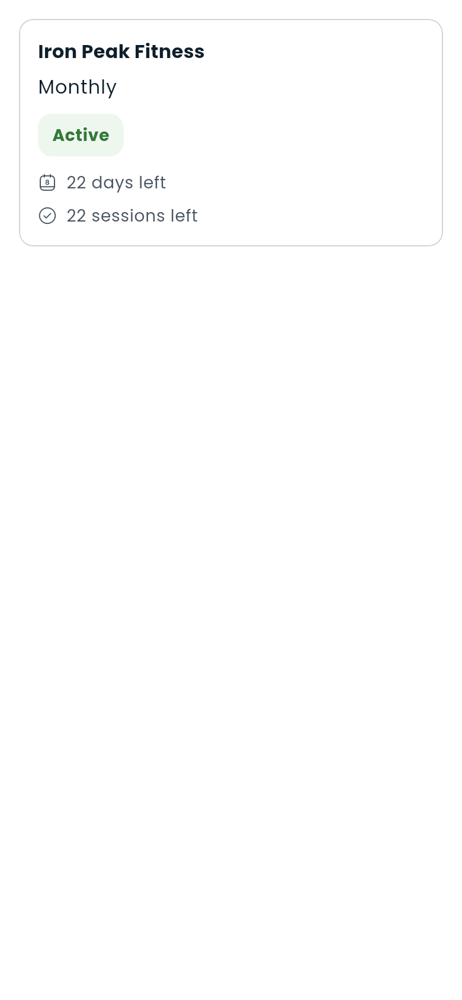
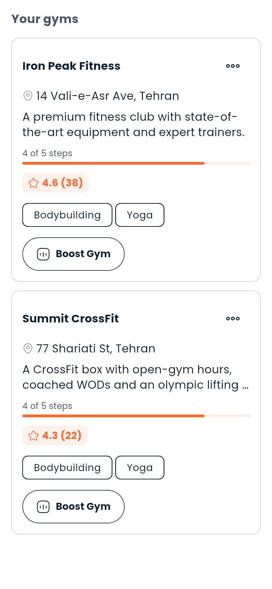
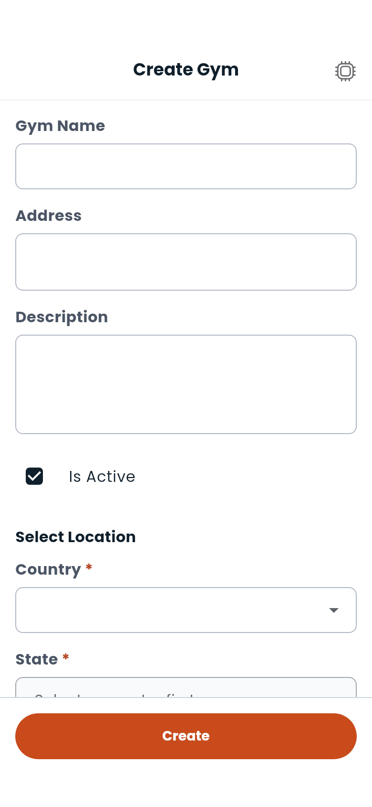
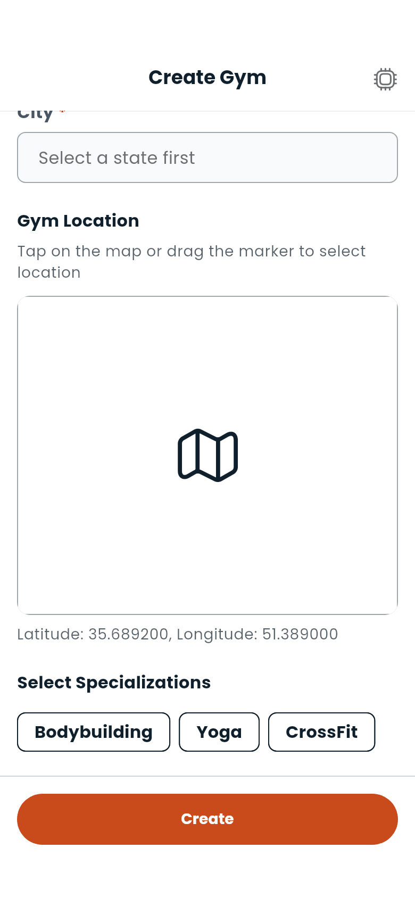
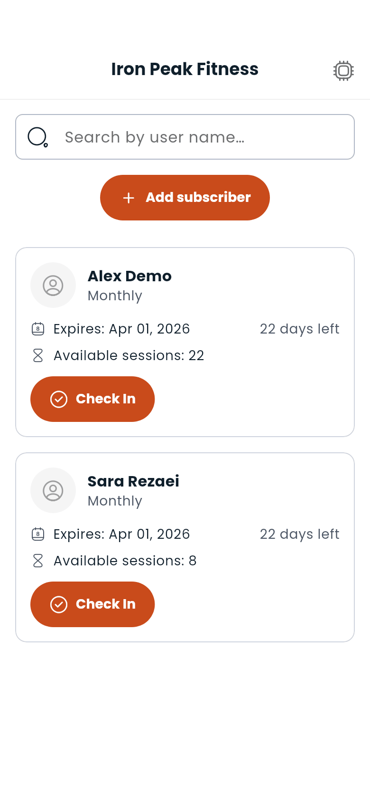
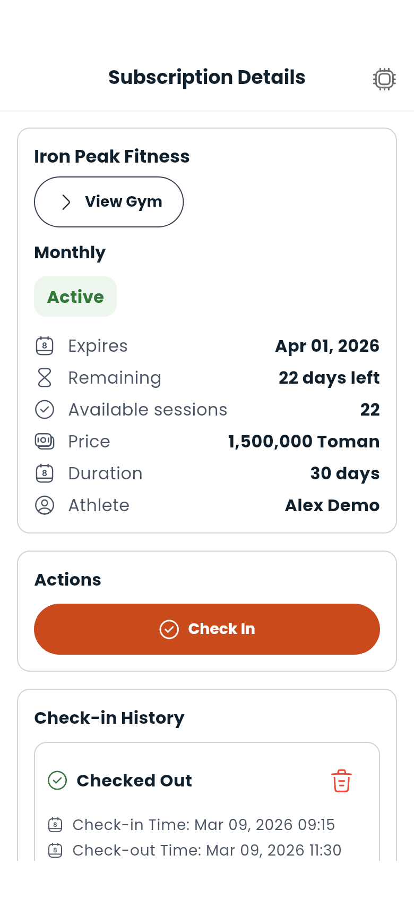

# Gyms

The Gyms tab is built around a map. Find gyms near you, check what they offer, and subscribe without leaving the app.

---

## Finding gyms

### The map

The **Gyms** tab opens on a map. Gym markers are colour-coded, and a legend on the map says what each colour means, so you don't have to tap a pin to find out:

| Colour | Meaning |
|---|---|
| Green | Open right now |
| Yellow | Opens later today |
| Red | Closed |
| Orange, with a badge | Boosted listing |

Tap a marker for a quick summary. Tap the summary to open the gym.

### The list

The map is not the only view. **Show list** turns the results into a list you can read straight down; **Show map** puts them back. Underneath the map there is also a sheet of the gyms currently matching, with a link to see all of them as a list.

### Search and filter

Use the search bar at the top to find gyms by name. Under it, a row of **chips** narrows by sports field — bodybuilding, CrossFit, yoga and the rest — with **All** to clear them again. There is no separate filter screen.

### Your location

Tap the location button to zoom the map to where you are.

### If the map won't load

A map that fails to load says so and offers to try again, and the search, the chips and the list all keep working in the meantime.

---

## Gym details

A gym's detail page shows:
- Name, address and photos
- **Opening hours**, as a week's table, saying whether the gym is open *right now* and when it next opens
- **Where it is** — with **Get directions**, which hands the address to your maps app, and **Copy address**
- Sports fields, equipment, and anything the buffet sells
- Current subscription plans and pricing
- The members' star rating, and their comments

### Will my plan work here?

From a gym's page you can check one of your workout plans against the gym's equipment before you join. Pick the plan and Dambel lists anything it needs that the gym doesn't have.

### Something wrong with a listing?

**Report** on a gym's page sends it to us with a short description of the problem. See [Reporting](reporting.md).

---

## Subscribing to a gym

On the gym detail page, select a subscription plan and complete the payment through your Dambel wallet. Your active subscription shows up on the Dashboard, and you can review all of your subscriptions in **My Subscriptions**.

A gym page opens for anyone, signed in or not — you can send someone a link to a gym and they'll see it. Subscribing is what needs an account, and the plan card says so rather than failing.

---

## Managing your own gym

If you're a gym owner, you can list and manage your gyms through **My Gyms**.

### Create a gym

Go to **My Gyms → +**. Creating a gym asks only for what identifies it:

- Name, address and description
- Country, province and city
- The spot on the map
- The sports it is for

Save, and the gym exists. The form stays open and becomes the edit form, now carrying everything else a gym needs — photos, opening hours, subscription plans, buffet items, equipment, admins and the licence — and a note at the top says so.

You can leave and come back whenever you like. Until a gym has its photos, opening hours, plans and licence, its card in **My Gyms** shows how many of the five steps are done, so a half-finished gym never comes as a surprise.

If your account already has a gym and cannot add another, the **+** button is not offered, and the list says why.

Inside the form the two halves save differently, and each says which it is. The gym's own details — name, address, description, location, sports — are written by the **Save** button docked at the bottom of the screen. Everything else, from plans to opening hours, is saved the moment you add it; those sections carry a note under their titles saying so. **Delete gym** sits in the menu at the end of the top bar, well away from Save. If you go back with something in the top half still unsaved — a moved pin included — Dambel asks before letting it go.

### Gym license

Every gym needs its operating licence on file. Open the gym for editing and find the **Gym license** box, below the photo gallery but separate from it — your gallery photos are public, your licence never is.

Tap **Upload license** to photograph the document or pick it from your gallery. The status underneath tells you where it stands:

| State | What it means |
|---|---|
| **Not uploaded** | No document on file yet. |
| **Awaiting review** | We've got it and our team is checking it. |
| **Approved** | The gym's licence is verified. |
| **Rejected** | Something was wrong with it. The reason is shown below the status. |

**Replace license** swaps in a new document and **Remove** takes it down; either way the licence goes back to awaiting review, since a new document needs a fresh check.

Anything other than approved also shows as a small badge on the gym's card in **My Gyms**, so you can spot a rejected licence without opening the gym. You'll get a notification when the review finishes.

Only you and our review team can see the document.

### Getting seen

**Boost** on the gym's form puts your listing at the top of the results for a set number of days, with a badge on the pin and the card. It is paid from your wallet. See [Premium, Boost and money](monetization.md).

### How your gym is doing

Once a gym exists, its form carries a **Data reports** section: how often it turned up in search, how often people opened it, and which hours are busiest. See [Analytics](analytics.md).

### View subscribers

Open your gym and tap **Subscribers** to see a list of all active members with their subscription details. You can search for a specific subscriber by entering their user name in the search box.

### Add a subscriber

If a member paid at your gym rather than in the app, tap **Add subscriber** on the subscribers list, search for their name, and choose the membership plan they paid for. Their subscription starts straight away, with the expiry date and session count taken from that plan.

Dambel's commission for the plan is charged to the gym owner's wallet, because the member pays nothing in the app. The commission rate is shown before you confirm.

### Manage a subscription

Tap any subscriber to view or edit their subscription details.

### Gym admins

You do not have to run a gym alone. From the gym's page, add other Dambel users as **gym admins** and choose exactly what each of them may do — add members, check people in and out, keep the plans, equipment, buffet items or working hours up to date. You can give each admin a role title of your own, like "Front desk", so the list tells you who does what at a glance.

Appointing admins needs a Premium subscription, and it keeps needing one: while your Premium is active your admins can do everything you gave them, and if it lapses their permissions stop working until you renew. Nothing is lost in the meantime — the moment you renew, they pick up exactly where they were.

Admins find the gym under **My gyms**, in a section called *Gyms you help run*, alongside any gym of their own. They only ever see the parts you gave them, and never the gym's own settings, licence or admin list — those stay yours.

---

> **Next:** [Find a trainer](trainers.md) or [see how your gym is doing](analytics.md)

---

[← Previous: Trainers](trainers.md) | [Next: Reporting →](reporting.md)
