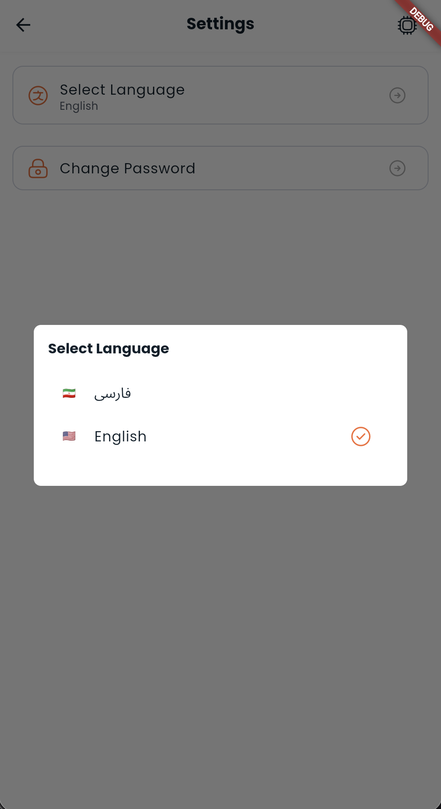

# Language Settings

The app speaks both English and Persian. Switch between them anytime you want – it takes about two seconds.

## Switching Languages

Head to Settings from the bottom navigation. You'll see a language option right at the top with a globe icon. Tap it and pick your language – either Persian (🇮🇷 فارسی) or English (🇺🇸 English). Your current language has a checkmark next to it.

The moment you tap a language, everything switches over. All the text updates, and if you're switching to Persian, the whole interface flips to right-to-left. If you're going to English, it flips back to left-to-right. Your choice gets saved automatically, so next time you open the app, it'll be in the language you picked.

## What Changes

When you switch languages, pretty much everything adapts. All the buttons, labels, messages, and screens show up in your chosen language. The layout direction changes too – Persian reads right-to-left, English reads left-to-right. Even things like date formats adjust to match the language conventions.

The app defaults to Persian when you first install it, but after you make a choice, it remembers. Your language preference sticks around even if you close the app or restart your phone.

## AI Can Help

The AI assistant can switch languages for you. Just open it (tap the robot icon 🤖) while you're on the settings screen and say something like "Change language to English" or "Switch to Persian". The AI will handle it, and you'll see a notification when it's done.

## When Things Go Wrong

Language not switching? Make sure you actually tapped one of the language options in the dialog, not just opened it and closed it. If it's still stuck, try closing the app completely and opening it again.

Seeing some text that's not translated? Some newer features might still be getting their translations. Check if there's an app update available – we're always adding more complete translations.

Layout looking weird after switching? Close and reopen the app. If that doesn't fix it, try clearing the app cache in your device settings. Still having issues? Reach out to support.

## The Technical Bit

The app supports two languages: Persian (fa) and English (en). Your language choice is stored securely on your device. When you switch, the change happens instantly without needing to restart anything. The app also sends your language preference to the server so things like notifications and emails come in the right language.

If you're curious, the language files live in the app's localization folder, and there's a fallback to English if something goes wrong with loading translations.
