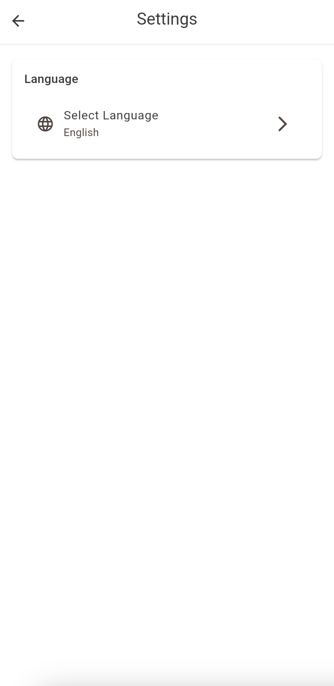
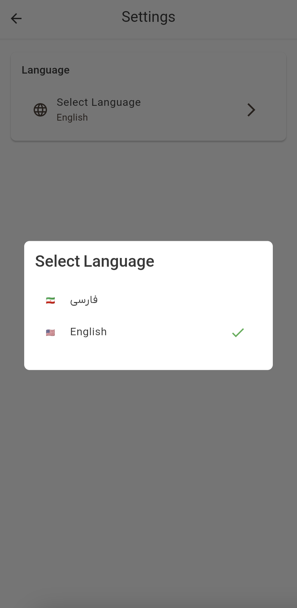

# Localization Guide

This guide explains how to change the app language in Dambel. The app supports both English and Persian languages and allows users to switch between them easily.

## Overview

Dambel supports multiple languages and automatically detects your device's language preference. You can change the language manually through the settings screen at any time.

## Supported Languages

- **English (انگلیسی)**: Default language for international users
- **Persian/Farsi (فارسی)**: Primary language for Persian users

## How to Change App Language

### Step 1: Navigate to Settings

From the main app screen:

1. Look for the **Settings** tab or option in the bottom navigation bar
2. Tap on **Settings** to open the settings screen

You can also access settings from:
- The **Profile** tab → Settings option
- The **Profile menu** in the top right corner

### Step 2: Find Language Settings

In the settings screen, you'll see a **Language** section with:
- A section header labeled "Language" (or "زبان" in Persian)
- A language selection option showing your current language

### Step 3: Select New Language

1. Tap on the **Language** or **Select Language** option
2. A dialog will appear with language options:
   - **🇮🇷 فارسی** for Persian/Farsi
   - **🇺🇸 English** for English
   
   Your current language will be marked with a green checkmark ✓

3. Tap on the language you want to switch to

### Step 4: Language Applied

The language change will take effect immediately:
- All text in the app will update to the selected language
- The interface orientation will automatically adjust:
  - **Persian**: Right-to-left (RTL) layout
  - **English**: Left-to-right (LTR) layout
- Your preference will be saved automatically

## Visual Guide

Here's what the language selection process looks like:

**Settings Screen showing Language section**

**Language selection dialog with current language marked**

## Default Language Behavior

- **First Launch**: The app defaults to Persian (Farsi)
- **Device Language Detection**: Android and iOS devices will respect system language settings where possible
- **Previous Selection**: Your last language choice is remembered and used for subsequent app launches

## Language Indicators

The app provides clear visual indicators:

- **Flags**: 🇮🇷 (Persian) and 🇺🇸 (English) flags in selection dialogs
- **Checkmarks**: Green checkmark ✓ next to the currently selected language
- **Typography**: Different font rendering for various scripts (Latin vs Arabic/Persian)

## Troubleshooting Language Issues

### Language Not Changing

If the language doesn't change after selection:

1. **Ensure Complete Process**: Make sure you tapped a language option, not just opened the dialog
2. **Check Internet Connection**: Language files are loaded from app resources, but ensure stable connection
3. **Restart App**: Force close and reopen the app to refresh the interface
4. **Update App**: Ensure you have the latest version of Dambel installed

### Missing Translations

If some text appears untranslated:

1. **Partial Translation**: Some newer features might still be in development
2. **Technical Terms**: Certain technical terms might remain in English for consistency
3. **Update App**: Check for app updates that include more comprehensive translations

### Interface Layout Issues

If the layout looks wrong after language change:

1. **Restart App**: Close and reopen the app completely
2. **Clear Cache**: Clear app cache in device settings if problems persist
3. **Report Issue**: Contact support if layout problems continue

## Language-Specific Features

### Persian Language Features
- **RTL Layout**: The entire interface flips to right-to-left reading direction
- **Persian Typography**: Optimized text rendering for Persian script
- **Cultural Adaptation**: Date formats, number формаت, and cultural conventions

### English Language Features
- **LTR Layout**: Standard left-to-right interface layout
- **International Standards**: English date and number formats
- **Technical Terms**: English technical terminology maintained for clarity

## Advanced Settings

For developers and power users:

- **Language Files**: Located in `src/lib/l10n/`
- **Fallback Behavior**: Defaults to English if requested language unavailable
- **Real-time Switching**: Language changes apply immediately without app restart
- **Persistent Storage**: Language preference saved securely on device

## Getting Help

If you continue to have issues with language settings:

1. **Check App Version**: Ensure you're running the latest version
2. **Device Language**: Verify your device's primary language settings
3. **Contact Support**: Reach out to our support team with specific details about your issue
4. **Clear Data**: As a last resort, clear app data and reconfigure (you'll need to log in again)

Remember that language preferences are personal settings, and changing them affects only your account on your device.
