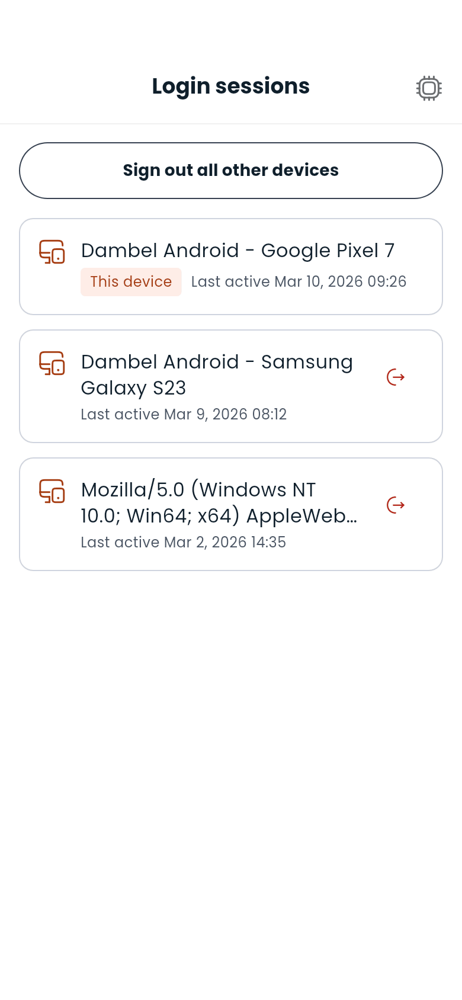

# Login sessions

---

## What login sessions are

Every time you sign in to Dambel — on a phone, on a tablet, or in a browser — the account remembers that device as a **login session**. The Login sessions screen lists every device that is currently signed in to your account, with the one you are using right now marked **This device**.

It is worth a look whenever you have signed in somewhere you do not control, or if you get a notification about a sign-in you do not recognise.

---

## Finding the list

1. Open **Settings**
2. Tap **Login sessions**

Devices are listed with the most recently active first. Each row shows the device's name and when it was last active. A session that has not been used since you signed in says so instead of showing a time.

---

## Signing out a device

Tap the sign-out icon on any row other than **This device**, then confirm. That device is signed out immediately: the next thing it tries to do returns it to the login screen.

You cannot sign the current device out from this list — that is what **Logout** at the bottom of Settings is for, and keeping the two apart means you never end up back at the login screen by accident.

---

## Signing out everywhere else

**Sign out all other devices** ends every session except the one you are using. It is the fastest thing to do if you think someone else has your password — sign out everywhere else, then change your password.

The button is hidden when yours is the only device signed in.

---

## What happens on the device you signed out

Nothing dramatic and nothing immediate. The next time that device asks Dambel for anything, it is returned to the login screen. Signing in again works normally and creates a fresh session.

Anything that was only on that device and never saved — a form half filled in — is lost, the same as if the app had been closed.

---

## New device notifications

When your account is signed in to from a device it has not seen before, you get a notification. Tapping it brings you straight here, so you can sign out anything you do not recognise.

---

> **Next:** [Learn about the AI assistant](ai-assistant.md) or [go back to the docs index](README.md)

---

[← Previous: Settings](settings.md) | [Next: Dashboard →](dashboard.md)
