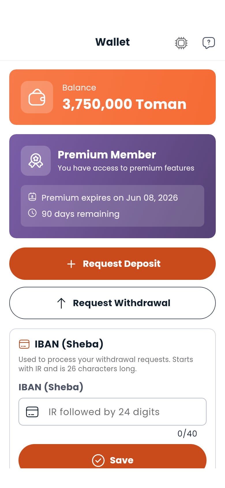

# Premium, Boost and money

Four things in Dambel involve money moving: **Premium**, which upgrades your account; **Boost**, which promotes a listing; the **commission** Dambel takes when you enrol somebody who paid you outside the app; and **referrals**, which pay you in Premium time. All of them settle against your [Wallet](wallet.md).

Everything below is in **تومان**.

---

## Premium

### What it is

Premium is a subscription on your own account. The card in your [Wallet](wallet.md) and on the [Dashboard](dashboard.md) names what it gives you:

- Unlimited workout plans
- Personalised diet plans
- Advanced analytics

Two more things depend on it that the card doesn't list:

- **Gym admins.** Appointing people to help run your gym needs Premium, and keeps needing it — see [Gyms](gyms.md).
- **The assistant's limit.** When you hit the cap on how much you can ask the [AI assistant](ai-assistant.md) for, the message says Premium raises it.

### Buying it

**Buy Premium** on the wallet's Premium card. Pick **1, 3, 6 or 12 months**, confirm the price, and it comes out of your balance. If your balance is short, Dambel says by how much and offers to top up.

### The states

| State | What you see |
|---|---|
| **Never bought** | **Upgrade to Premium**, with the benefits listed under it |
| **Active** | The expiry date and how many days are left |
| **Ending soon** | The same, with the remaining days emphasised and a **Renew** button, from a week out |
| **Expired** | **Premium expired**, and the way to buy again |

Nothing you made while Premium is deleted when it lapses. Your gym admins simply stop being able to act until you renew, and pick up exactly where they were when you do.

---

## Boost

Boost promotes one listing — a gym or a training service — for a set number of days.

| Boosting a | Where |
|---|---|
| **Gym** | **Boost** on the gym's form |
| **Service** | **Boost service** on the service's form |

Choose the length, and the confirmation names the price and the number of days before anything is charged. It comes out of your wallet.

While it runs, the listing sorts to the top of the results and carries a **Boost** badge — on a gym, the map pin is coloured for it and marked in the map's legend. When the days run out the listing goes back to its usual place; nothing else changes.

---

## Commission on enrolling somebody yourself

Two things in Dambel can be set up for a person who paid you *outside* the app:

- A trainer's **Add trainee** ([Trainers](trainers.md))
- A gym's **Add subscriber** ([Gyms](gyms.md))

In both cases the person you're enrolling pays Dambel nothing, so Dambel's commission for that service or plan is charged to **your** wallet instead. The amount is shown to you before you confirm, and you can back out at that point.

There is no commission on a purchase made inside the app — that comes out of the buyer's balance in the ordinary way.

---

## Referrals

Your referral link is behind your photo in the top bar, under **Invite friends**, and on your [profile](profile.md). Anyone who opens it lands on registration with your code already filled in.

The reward is **Premium time, not money**: every **5 points** earns you **7 free days of Premium**. The card counts how many people have taken your link up.

Because it pays in Premium rather than balance, a referral does not show up in your transaction history — check the referral card, not the wallet.

---

> **Next:** [Wallet](wallet.md) or [Using Dambel on a computer](on-a-computer.md)

---

[← Previous: Analytics](analytics.md) | [Next: Using Dambel on a computer →](on-a-computer.md)
