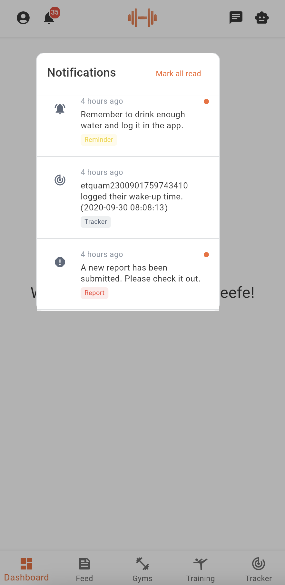

# Notifications Guide

Stay updated with your fitness journey! Dambel sends you notifications about important activities like comments, payments, gym updates, and workout reminders.

## How to View Notifications

Tap the notification bell icon in the app to see all your notifications. The most recent ones appear at the top.

Each notification shows:
- **Icon** - tells you what type of notification it is
- **Time** - when you received it (like "2 hours ago")
- **Message** - what the notification is about
- **Orange dot** - means you haven't read it yet

## Types of Notifications

You'll see different icons for different types of notifications:

- 💬 **Comments** - Someone commented on your post
- 💳 **Payments** - Payment updates or billing info
- ⭐ **Ratings** - New ratings or reviews
- 👤 **Users** - Friend requests or profile updates
- 🏋️ **Gym** - Gym announcements or schedule changes
- 📊 **Reports** - Important reports or issues
- 💬 **Chat** - New messages
- 🤸 **Training** - Workout updates
- 📊 **Tracker** - Progress updates
- 🔔 **Reminders** - Workout reminders

## Managing Notifications

### Mark as Read
- **Tap any notification** to mark it as read (the orange dot disappears)
- **Use "Mark all read"** button to clear all notifications at once

### Getting More Notifications
- **Scroll down** to load older notifications
- **Pull down** to refresh and get new ones

## Troubleshooting

**Notifications not showing?**
- Check your internet connection
- Try refreshing the list
- Make sure you're logged in

**Need help?**
- Contact support if you're having issues
- Check your notification settings in the app

That's it! Notifications help you stay connected with your fitness community and never miss important updates.
