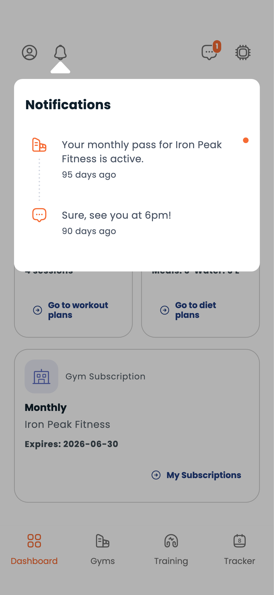

# Notifications

Notifications keep you in the loop — payments, trainer updates, gym stuff, and more.

---

## Accessing notifications

Tap the **bell icon** at the top of the screen. A red badge shows how many unread notifications you have.

---

## What triggers a notification

| Type | Example |
|---|---|
| **Payments** | "Your subscription was renewed" |
| **Ratings & reviews** | "Alex left you a 5-star review" |
| **Role changes** | "You've been granted Trainer status" |
| **Referrals** | "Someone signed up with your code" |
| **Gym events** | "Your gym membership expires in 3 days" |
| **Chat** | "New message from your trainer" |
| **Training updates** | "Your trainer updated your workout plan" |
| **Tracker reminders** | "Don't forget to log today's workout" |
| **Comments** | "Your trainer commented on your progress" |

---

## Mark as read

- Tap a notification to mark it as read and navigate to the relevant screen
- Tap **Mark all as read** to clear everything at once

---

## Load older notifications

Notifications load 20 at a time. Scroll to the bottom of the list to load older ones automatically.

---

## Push notifications

Dambel uses Firebase Cloud Messaging (FCM) to send push notifications to your device even when the app is closed. You'll be prompted to allow notifications on first launch — we recommend enabling them to stay on top of your training.

---

> **Next:** [Check your chat](chat.md) or [edit your profile](profile.md)
