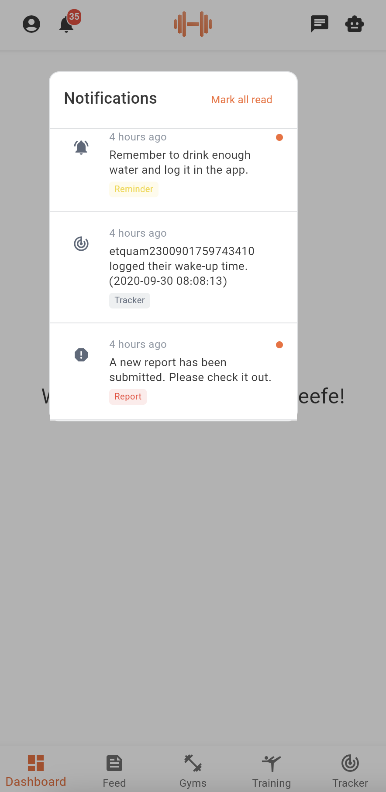

# Notifications

Notifications keep you in the loop with everything happening in your fitness world. New messages, workout reminders, trainer updates, progress milestones – they all show up here so you never miss a beat.

## Getting There

Tap the bell icon at the top of the screen. If you've got unread notifications, you'll see a little badge with the count.

## What You'll See

When you open the notifications panel, your most recent notifications appear at the top. Each one shows an icon that tells you what type it is, the message itself, and how long ago it arrived (like "2 hours ago" or "Just now").

Unread notifications have a small colored dot on the right side. Once you tap a notification, that dot disappears and it's marked as read.

The panel shows 20 notifications at a time. Scroll down to the bottom and more will load automatically if you have older ones.

## Types of Notifications

Different things happening in the app trigger different notifications. Here's what you might see:

Comments on your posts or activity. Payment confirmations when you subscribe to premium features or gym memberships. Ratings and reviews from other users. Role assignments if you become a trainer or get special permissions. Referral rewards when your friends join using your code.

Gym-related stuff like check-ins, check-outs, new subscriptions, or schedule changes. New trainees if you're a trainer, or updates when your trainer creates or modifies your workout and diet plans.

Chat messages from your conversations. Training updates about workouts and diet plans. Tracker notifications when you or people you follow log activities like meals, water, workouts, sleep, supplements, or weight measurements.

Reminders you've set up for workouts, meals, water intake, sleep, weight tracking, supplements, or wake-up times.

Each notification type has its own icon so you can quickly scan and see what's what.

## Managing Notifications

Tap any notification to mark it as read. The colored dot disappears and it moves to your read list.

Got a bunch of unread notifications? Hit the "Mark all read" button at the top right of the panel. It clears them all at once.

Pull down from the top of the list to refresh and check for new notifications. Scroll to the bottom to load older ones.

## Real-Time Updates

Notifications arrive in real-time when you're using the app. No need to refresh manually – they just show up as they happen. The badge on the bell icon updates automatically too.

## When Things Go Wrong

Notifications not loading? Check your internet connection and try pulling down to refresh. If you see an error message, there's usually a "Retry" button you can tap.

If the panel is empty and you're expecting notifications, make sure you're logged in. Sometimes logging out and back in helps reset things.

Still having issues? The support team can help – check the settings menu for contact options.

## Tips

The notification panel is designed to be quick and unobtrusive. Open it, scan what's new, tap what matters, and get back to what you were doing.

If you're a trainer with lots of trainees, you might get a steady stream of notifications. The mark all read button is your friend.

Notifications stick around until you're ready to deal with them. No pressure to clear them immediately – they'll be there when you need them.
