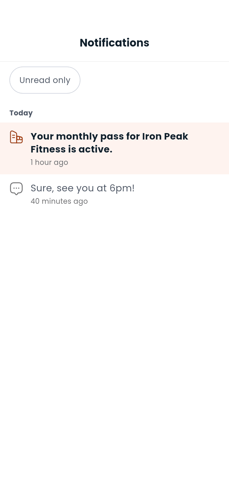
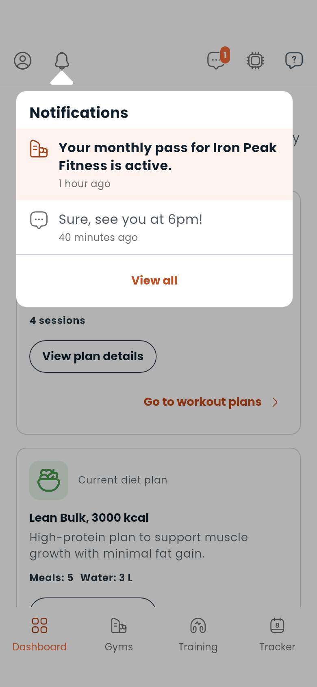

# Notifications

Notifications keep you in the loop — payments, trainer updates, gym stuff, and more.

---

## The bell, and the inbox behind it

Tap the **bell icon** at the top of the screen. A badge shows how many unread notifications you have.

The bell opens a **preview** — the newest few, and a way to the rest. It is there to tell you what's new and then get out of the way. **View all** at its foot opens the inbox, which is its own screen and where everything below happens.

---

## What triggers a notification

| Type | Example |
|---|---|
| **Payments** | "Your subscription was renewed" |
| **Ratings & reviews** | "Alex left you a 5-star review" |
| **Role changes** | "You've been granted Trainer status" |
| **Referrals** | "Someone signed up with your code" |
| **Licence reviews** | "Your trainer license was approved" |
| **Gym events** | "Your gym membership expires in 3 days" |
| **Chat** | "New message from your trainer" |
| **Training updates** | "Your trainer updated your workout plan" |
| **Tracker reminders** | "Don't forget to log today's workout" |
| **Comments** | "Your trainer commented on your progress" |

---

## Reading them

- Tap a notification to mark it read and go to whatever it is about. That works from the preview and from the inbox alike.
- **Mark all as read** is the tick in the inbox's top bar. It appears only while something is unread.
- **Unread only** at the top of the inbox hides everything you have already seen.

---

## Deleting one

Swipe a notification aside in the inbox. It goes straight away, and a message offers to **undo** for a few seconds in case you didn't mean it — after that it is gone.

---

## Older notifications

The inbox loads more as you scroll to the bottom. The preview behind the bell never does; it is only ever the newest few.

---

## Push notifications

Dambel uses Firebase Cloud Messaging (FCM) to send push notifications to your device even when the app is closed. You'll be prompted to allow notifications on first launch — we recommend enabling them to stay on top of your training.

---

> **Next:** [Check your chat](chat.md) or [edit your profile](profile.md)

---

[← Previous: Chat](chat.md) | [Next: Wallet →](wallet.md)
