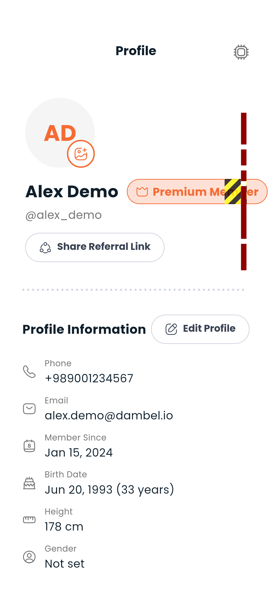

# Profile

Your profile is what other people see when they look you up — trainers, gym owners, whoever.

---

## Editing your profile

Tap the **pencil icon** or **Edit Profile** button on your profile page.

You can update:
- **Display name** and username
- **Phone number** and email
- **Date of birth** (your age is calculated automatically)
- **Height** in centimeters
- **Profile photo** — take a new one or pick from your gallery

Multiple profile pictures are supported. You can upload a gallery of photos that others can scroll through.

---

## Roles & badges

Your profile shows your active roles:
- **Coach** — you offer training services
- **Trainer** — you're affiliated with a gym or organization

Roles are given by Dambel — you'll get a notification if yours changes.

If you have a **Premium** membership, a premium badge appears on your profile.

---

## Education

Add your academic background so potential clients know what you're about.

Tap **Add Education** to enter:
- School or institution name
- Field of study
- Start and end dates
- A short description

---

## Championships

Show off your competitive achievements.

Tap **Add Championship** to enter:
- Competition name
- Date
- A short description of the result

---

## What others see

When someone views your profile — a trainer browsing athletes, or an athlete checking a trainer — they see your name, photo, roles, bio, education, and championships. Your contact details (phone/email) are kept private.

---

> **Next:** [Adjust your settings](settings.md) or [see your wallet](wallet.md)
