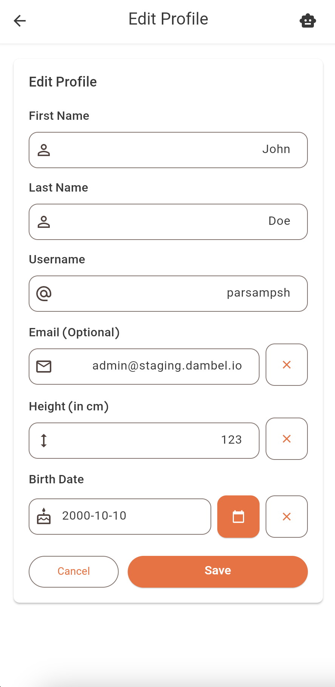
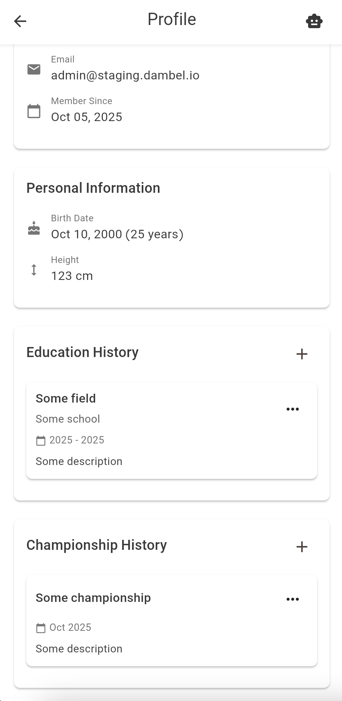
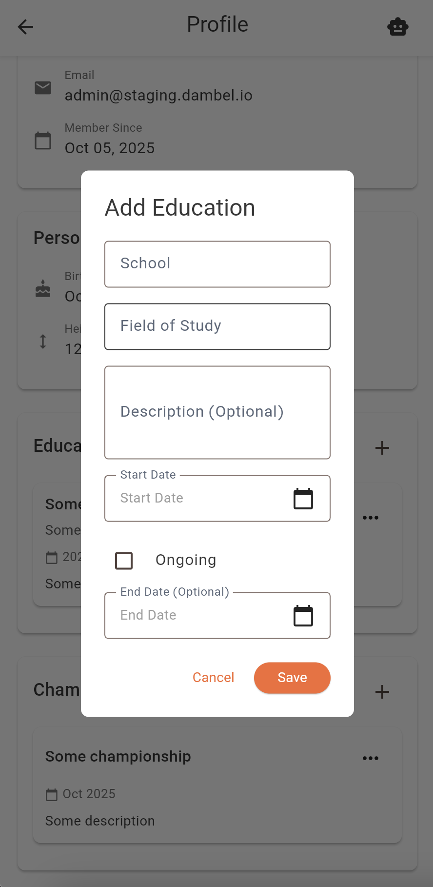
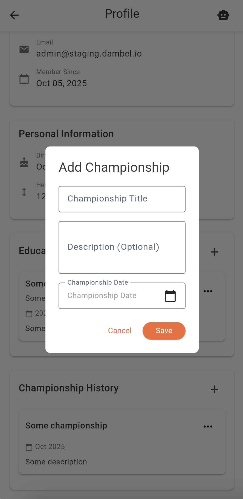

# Your Profile

Your profile is where you show off who you are in the fitness world. Think of it as your digital fitness card – it's got your personal info, achievements, education, and all those championship wins you've been collecting.

## Getting There

Tap your profile picture in the top-right corner, then hit "Profile" from the menu. Easy.

## What You'll See

When you open your profile, here's what's waiting for you:

Your profile picture sits at the top (or your initials if you haven't uploaded one yet). Got a premium membership? You'll see a gold star badge on your avatar. If you've uploaded multiple photos, there's a colored border and a little counter showing how many you have. Tap the avatar to browse through all your photos in a full-screen gallery with swipe navigation.

Right below that is your display name and username (the one with the @ symbol). If you've got special roles like "Coach" or "Trainer", they'll show up as purple badges. Premium members get their own gold badge too.

The rest breaks down into a few sections:

Your account info shows your phone number, email (if you added one), and when you joined. Personal details include your birth date with your age calculated automatically, plus your height in centimeters. Both of these are optional, so if you see "Not set", that just means you haven't filled them in yet.

## Editing Your Profile

Hit the "Edit Profile" button to change things up.

You can update your first name, last name, username, email, height, and birth date. Username is the only required field – it needs to be at least 3 characters and unique. Everything else is optional.

For the birth date, tap the calendar icon to pick a date. Height goes in centimeters. Each field has a little clear button (×) that shows up when you've typed something in.

When you're done, tap "Save". The app will show you any errors if something's wrong (like if that username is already taken). If everything checks out, your changes save and you're back to viewing your profile.

Want to bail? Just hit "Cancel".

### AI Can Help

The AI assistant can actually fill out your profile for you. Just open it (tap the robot icon 🤖) while you're on the edit screen and tell it what you want. Something like "Set my first name to Alex and height to 180" works great. The AI will populate the fields, then you can review and save. You'll see a blue notification when the AI updates something.

## Education & Championships

These two sections work pretty much the same way – they're where you showcase your credentials and wins.

### Education

This is where your academic background lives – degrees, certifications, training programs, all that good stuff.

Each education entry shows the school name, your field of study, and the date range. If you're currently enrolled somewhere, it'll say "Present" instead of an end date. You can add a description too for extra details like honors or specific achievements.

If you don't have any education records yet, you'll see an empty state with a school icon and a message inviting you to add your first one.

### Championships

Your trophy case. Competition wins, awards, achievements – anything you're proud of goes here.

Each championship shows the title, date (in "Month Year" format), and an optional description where you can add details like your placement, category, or what medals you won.

No championships yet? You'll see a trophy icon with a friendly prompt to add your first one.

### Adding & Editing

To add a new record, tap the + icon in the section header. To edit or delete an existing one, tap the three-dot menu (⋮) on that record.

For education, you'll need to fill in the school name, field of study, and start date. End date and description are optional. There's a checkbox for "Ongoing" if you're currently enrolled – check that and the end date field disappears.

For championships, you need the title and date. Description is optional. The date picker lets you choose anything from 1950 to 10 years in the future (in case you're planning ahead).

When you save, you'll see a success message and the new record appears in your list. Deleting requires confirmation – just making sure you really want to do it, since there's no undo.

## Profile Pictures

You can have multiple profile pictures. The last one you upload becomes your main profile picture – that's what shows up in your avatar.

When you have multiple photos, your avatar gets a colored border and shows a count. Tap it to open the gallery where you can swipe through all your photos, see thumbnails, and even pinch to zoom.

The app supports JPEG, JPG, and PNG files.

## Refreshing

Pull down from the top of your profile screen to refresh and load the latest data. Handy if you just made changes from another device.

## When Things Go Wrong

Profile not loading? Check your internet connection and try pulling down to refresh. If you see an error screen, there's usually a "Retry" button. Still stuck? Try logging out and back in.

Can't edit your profile? Make sure you're logged in. Sometimes closing and reopening the app helps.

Changes not saving? Look for red error messages on the fields – they'll tell you what's wrong. Common issues are username already taken, invalid email format, or missing required fields. Make sure you've got a stable internet connection too.

Education or championship sections not showing up? This might be a technical issue. Try refreshing or restarting the app. If it persists, reach out to support.

Photos not loading? Give them a moment – sometimes they take a bit to download. Pull down to refresh if they're stuck. If it keeps happening, try clearing the app cache in settings.

AI not updating the form? Make sure you're on the edit screen when you ask for help, and be specific about what you want. "Fill the first name field with John" works better than "update my name". If it's still not working, try closing and reopening the AI assistant.

## Privacy Stuff

What shows up on your profile depends on your privacy settings. Other users might be able to see your profile, but what they see is controlled by those settings.

You're in control of your information. Most fields can be edited anytime, and optional ones can be cleared out if you change your mind. Education and championship records can be deleted whenever you want. Some core stuff like username and phone number can't be removed, but if you need to delete your whole account, reach out to support.

## Tips

Keep your profile current – add new certifications and championships as they happen. Use a clear profile picture. Fill out the sections that matter to you. The more complete your profile, the better it represents you in the app.

If you need help, the AI assistant is always there (tap that robot icon 🤖), or check out the support options in settings.
