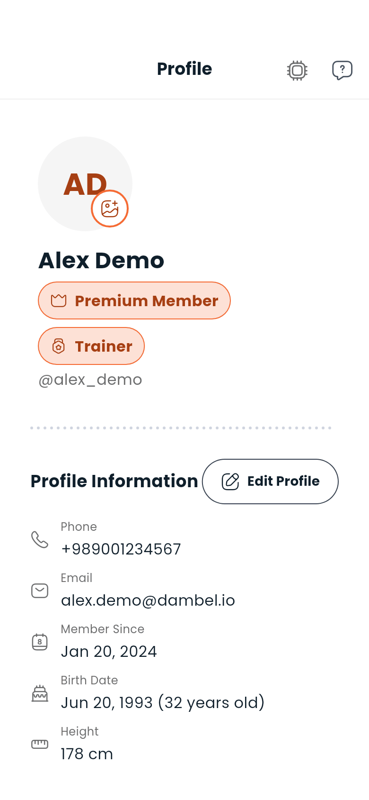
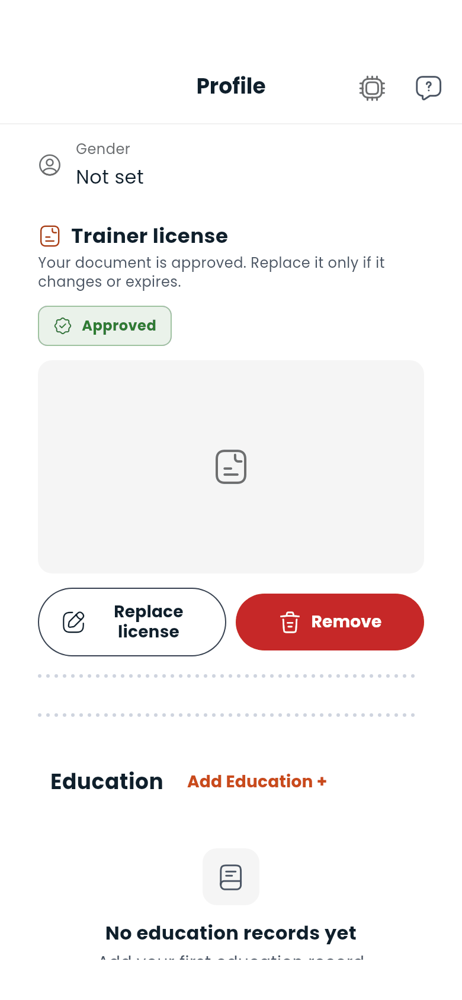

# Profile

Your profile is what other people see when they look you up — trainers, gym owners, whoever.

---

## Editing your profile

Tap the **pencil icon** or **Edit Profile** button on your profile page.

You can update:
- **Display name** and username
- **Phone number** and email
- **Date of birth** (your age is calculated automatically)
- **Height** in centimeters
- **Gender** — select male, female, or other
- **Profile photo** — pick one from your gallery

Tapping the photo badge on your picture opens your gallery, then lets you frame what you chose: drag and pinch until the circle shows what you want, or back out and nothing is uploaded.

Multiple profile pictures are supported. You can upload a gallery of photos that others can scroll through.

### Your roles on Dambel

Two switches in the edit form say how you use Dambel:

- **I'm a trainer** — turns on the trainer sections: your services, the services you've bought, and your trainees.
- **I own a gym** — turns on the gym-owner sections, so your own gyms are one tap away.

Leave both off and Dambel keeps the parts everyone uses — searching for gyms and trainers, your memberships, your tracker.

Turning a switch off only **hides** that part of the app. Nothing is deleted: your services, gyms, trainees and memberships all stay exactly as they are, and switching it back on brings the section straight back. Links you follow from a notification or a shared page still open, whatever the switches say.

---

## Roles & badges

Your profile shows your active roles:
- **Trainer** — you offer training services
- **Gym admin** — you help run a gym

Roles are given by Dambel — you'll get a notification if yours changes.

If you have a **Premium** membership, a premium badge appears on your profile.

---

## Trainer license

If you offer training services, upload your trainer licence here so we can verify you. If you don't train anyone, you can skip this section entirely — nothing else on your profile depends on it.

Tap **Upload license** and take a photo of the document or pick one from your gallery. Your licence then moves through one of four states:

| State | What it means |
|---|---|
| **Not uploaded** | No document yet. You can't publish training services. |
| **Awaiting review** | We've got it and our team is checking it. |
| **Approved** | You're verified and can publish training services. |
| **Rejected** | Something was wrong with the document. The reason is shown right below the status. |

If your licence is rejected, read the reason, tap **Replace license**, and upload a clearer or more current document.

The line under the section heading tells you what to do next rather than repeating what the section is for: whether we are still reviewing, whether it is approved and can be left alone, or whether it needs replacing.

You can remove the document at any time with **Remove**. Doing so also clears its approved status, so you'll need to upload a new one to be verified again. Replacing a document does the same — it goes back to awaiting review.

Your licence is private. Only you and our review team can see it; it never appears on your public profile.

You'll get a notification as soon as your licence is approved or rejected.

---

## Education

Add your academic background so potential clients know what you're about.

Tap **Add Education** to enter:
- School or institution name
- Field of study
- Start and end dates
- A short description

---

## Championships

Show off your competitive achievements.

Tap **Add Championship** to enter:
- Competition name
- Date
- A short description of the result

---

## Referral link

Invite friends to Dambel using your personal referral link.

Tap **Share Referral Link** to copy it to your clipboard. Send it to anyone — when they open it, the registration page loads with your referral code already applied. The card counts how many people have taken it up.

The reward is Premium time, not money: every **5 points** earns you **7 free days of Premium**. See [Premium, Boost and money](monetization.md).

---

## What others see

When someone views your profile — a trainer browsing athletes, or an athlete checking a trainer — they see your name, photo, roles, bio, education, and championships. Your contact details (phone/email) are kept private.

Someone else's profile carries two actions yours does not: **Message**, which opens your conversation with them or starts one, and **Report**, if there is something wrong. See [Reporting](reporting.md).

---

> **Next:** [Adjust your settings](settings.md) or [see your wallet](wallet.md)

---

[← Previous: Authentication Guide](authentication.md) | [Next: AI Assistant →](ai-assistant.md)
