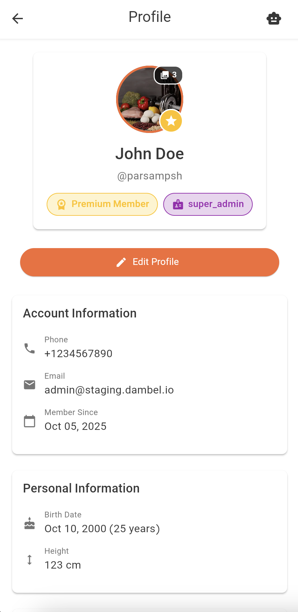

# Profile Guide

Welcome to the Profile section of Dambel. This comprehensive guide will walk you through all features of your profile, including viewing your information, editing details, managing education history, tracking championships, and understanding badges.

## Overview

The Profile section is your personal showcase in Dambel. It displays your fitness credentials, achievements, and personal information. You can view your profile, edit your details, manage your education history, track your championships, and display your earned badges.

Your profile serves multiple purposes:
- **Personal Information Management**: Keep your details up to date
- **Professional Credentials**: Showcase your education and certifications
- **Achievements**: Display your championship wins and accomplishments
- **Status & Recognition**: Show your premium membership and special roles
- **Profile Pictures**: Display multiple photos in your profile gallery

## Accessing Your Profile

You can access your profile from anywhere in the app:

1. Look for your **profile picture** or **avatar** in the top-right corner of the app bar
2. Click on your profile picture to open the profile menu
3. Select **"Profile"** from the dropdown menu

Alternatively, navigate to the profile section from the main menu or sidebar.

## Profile Overview Screen

When you open your profile, you'll see a comprehensive view of all your information organized into several sections.

*The profile overview showing all sections: header with avatar and badges, account info, personal info, education, and championships*

### Profile Header

The profile header is the first section you see and includes:

#### Profile Picture
- Your profile picture is displayed as a circular avatar at the top
- Shows your profile picture or initials if no picture is uploaded
- **Premium Badge**: A gold star icon appears in the bottom-right corner if you have a premium subscription
- **Multiple Photos**: If you have multiple photos, a badge shows the count (e.g., "🖼️ 3") and a colored border appears
- Click on the avatar to view all photos in a gallery with swipe navigation and thumbnails

#### Display Name & Username
- **Display Name**: Shown prominently (constructed from first name, last name, or username)
- **Username**: Displayed below with "@" prefix (e.g., "@johndoe")

#### Badges
Badges appear below your username in colorful pill-shaped containers:

**Premium Badge**: 
- Gold/amber colored with star icon (⭐)
- Text: "Premium Member"
- Indicates active premium subscription
- Grants access to premium features throughout the app

**Role Badges**:
- Purple colored with badge icon (🏅)
- Shows role name (e.g., "Admin", "Coach", "Trainer")
- Indicates special permissions and responsibilities
- Multiple role badges can be displayed

### Account Information Section

This card displays your account-related information:

- **Phone Number** (📱): Your registered phone number used for login
- **Email Address** (✉️): Your email address (if provided, optional)
- **Member Since** (📅): Date you created your account (format: "MMM dd, yyyy")

### Personal Information Section

This card displays your personal details:

- **Birth Date** (🎂): Your birth date with calculated age (format: "MMM dd, yyyy (XX years)")
  - Shows "Not set" if not provided
- **Height** (📏): Your height in centimeters (format: "XXX cm")
  - Shows "Not set" if not provided

## Editing Your Profile

To update your profile information, tap the **"Edit Profile"** button below the profile header.

*The edit profile screen showing all editable fields in a clean form*

### Editable Fields

#### First Name (Optional)
- Text input with person icon (👤)
- Used to construct your display name
- Clear button appears when field has content

#### Last Name (Optional)
- Text input with person icon (👤)
- Used to construct your display name
- Clear button appears when field has content

#### Username (Required)
- Text input with @ symbol icon
- Must be at least 3 characters
- Must be unique in the system
- Errors: "Username is required", "Username must be at least 3 characters long", "This username is already in use"

#### Email (Optional)
- Email input with envelope icon (✉️)
- Must be valid email format if provided
- Clear button appears when field has content
- Errors: "Please enter a valid email address", "This email is already in use"

#### Height (Optional)
- Number input with height icon (📏)
- Must be a positive number in centimeters
- Clear button appears when field has content
- Error: "Height must be a positive number"

#### Birth Date (Optional)
- Date picker with cake icon (🎂)
- Format: "YYYY-MM-DD"
- Range: 1900 to current date
- Tap the calendar button to open date picker
- Clear button appears when date is set

### Saving Changes

After making your changes:

1. Review all modified fields
2. Ensure all required fields (username) are filled
3. Tap the **"Save"** button

**What Happens**:
- Loading indicator shows: "Saving changes..."
- Data is sent to the server
- **If successful**: Success message appears, you're redirected to profile view with changes visible
- **If error**: Error message explains the issue, you remain on edit screen to fix and retry

### Canceling Changes

Tap the **"Cancel"** button to discard changes and return to profile view.

### AI Assistant Integration

The Edit Profile screen integrates with the AI Assistant:

**AI Can Help**:
- Fill out form fields based on conversation
- Suggest values for empty fields
- Correct formatting issues
- Guide through required fields

**How to Use**:
1. Open AI Assistant while on edit screen (tap robot icon 🤖)
2. Ask for help: "Help me fill out my profile"
3. Provide information in conversation
4. AI automatically populates form fields
5. Review and adjust as needed
6. Save when satisfied

A blue notification appears when AI updates the form: "AI updated the form"

## Education & Championship History

Both education and championship sections work similarly, allowing you to showcase your credentials and achievements.

*The education and championship sections displaying records with add buttons*

### Education History

The Education section showcases your academic background, certifications, and training credentials.

**What's Displayed**:
- **School/Institution Name**: Bold title (e.g., "State University")
- **Field of Study**: Specialization or program (e.g., "Exercise Science")
- **Date Range**: "YYYY - YYYY" or "YYYY - Present" for ongoing education
- **Description** (Optional): Additional details, honors, achievements

**Empty State**:
If no education records exist, you'll see a school icon (🎓) with message: "No education records yet" and "Add your first education record"

### Championship History

The Championship section showcases your competition wins, awards, and achievements.

**What's Displayed**:
- **Championship Title**: Bold title (e.g., "State Powerlifting Championship")
- **Date**: "MMM yyyy" format (e.g., "Jun 2023")
- **Description** (Optional): Additional details like placement, category, medals

**Empty State**:
If no championship records exist, you'll see a trophy icon (🏆) with message: "No championship records yet" and "Add your first championship record"

### Adding & Editing Records

Both sections have similar workflows:

1. **To Add**: Tap the **+ (plus)** icon in the section header
2. **To Edit**: Tap the **⋮ (three dots)** menu on any record, select "Edit"
3. **To Delete**: Tap the **⋮ (three dots)** menu on any record, select "Delete" (requires confirmation)

### Education Record Fields

*The add/edit dialog for education records*

**Required Fields**:
- **School** (Required): Institution name
  - Error: "Please enter the school name"
- **Field** (Required): Field of study or program
  - Error: "Please enter the field of study"
- **Start Date** (Required): When program began (displayed as "MMM YYYY")
  - Error: "Please select a start date"

**Optional Fields**:
- **Description** (Optional): Multi-line text for additional information
- **End Date** (Optional): When program completed (displayed as "MMM YYYY")
- **Ongoing** (Checkbox): Check if currently enrolled (hides end date, shows "Present")

### Championship Record Fields

*The add/edit dialog for championship records*

**Required Fields**:
- **Championship Title** (Required): Name of championship or competition
  - Error: "Please enter the championship title"
- **Championship Date** (Required): When it took place (displayed as "MMM yyyy")
  - Range: 1950 to 10 years in the future
  - Error: "Please select a championship date"

**Optional Fields**:
- **Description** (Optional): Multi-line text for additional information (placement, category, medals)

### Saving Records

After filling out the dialog:
1. Tap **"Save"**
2. Success message appears: "Education/Championship record created/updated successfully"
3. Dialog closes and profile refreshes
4. New/updated record appears in the list

### Deleting Records

When deleting:
1. Confirmation dialog appears: "Are you sure you want to delete this record?"
2. **"Cancel"**: Keeps the record
3. **"Delete"** (red): Permanently removes the record
4. Success message: "Record deleted successfully"
5. This action cannot be undone

### Permissions

Both education and championship sections use permission-based access control:

**For Your Own Profile**:
- View: Requires `education.view` or `championships.view` permission
- Create: Requires `education.create` or `championships.create` permission
- Update: Requires `education.update` or `championships.update` permission
- Delete: Requires `education.delete` or `championships.delete` permission

**For Other Users' Profiles** (with special roles):
- Requires the "_any" variant of permissions (e.g., `education.view_any`)

**Note**: If you don't have view permission, the entire section is hidden.

## Profile Pictures & Media

Your profile can include multiple photos to showcase yourself.

**Features**:
- Circular avatar display with initials fallback
- Premium badge overlay (if applicable)
- Photo count indicator and colored border for multiple photos
- Click avatar to open fullscreen gallery
- Gallery supports swipe navigation, thumbnails, pinch-to-zoom

**Supported Formats**: JPEG/JPG, PNG with transparency

## Refreshing Your Profile

To ensure you're seeing the latest information:

**Pull to Refresh**:
1. On your profile screen, pull down from the top
2. A refresh indicator appears
3. The app reloads your profile data

This is useful after making changes from another device or after system updates.

## Troubleshooting

### Profile Not Loading

**Solutions**:
1. Check internet connection
2. Pull down to refresh
3. Tap "Retry" button if error screen appears
4. Logout and login again
5. Clear app cache in settings
6. Update to latest app version

### Cannot Edit Profile

**Solutions**:
1. Check you have update permissions
2. Ensure you're logged in
3. Close and reopen the app
4. Contact support if issue persists

### Changes Not Saving

**Solutions**:
1. Check for validation errors (red messages on fields)
2. Ensure username field is filled
3. Try different username if "already in use" error appears
4. Try different email if conflict error appears
5. Verify stable internet connection
6. Wait and try again

### Education/Championship Sections Not Visible

**Solutions**:
1. Check if you have view permissions
2. Contact administrator about permissions
3. Check other profiles to compare visibility

### Cannot Add/Edit/Delete Records

**Solutions**:
1. Verify you have appropriate permissions
2. For your own profile: need create/update/delete permissions
3. For other profiles: need "_any" variant permissions
4. Contact administrator to request permissions

### Photos Not Loading

**Solutions**:
1. Verify stable internet connection
2. Wait for images to load
3. Pull down to refresh
4. Clear app cache
5. Report persistent issues to support

### AI Assistant Not Updating Form

**Solutions**:
1. Ensure you have AI assistant permissions
2. Be explicit: "Please fill the first name field with John"
3. Verify you're on the edit profile screen
4. Close and reopen AI assistant
5. Check AI response for error messages

## Privacy and Data

### What Information is Visible

**Your Profile Shows**:
- Profile pictures (if uploaded)
- Display name, username
- Badges (Premium, Roles)
- Account information (based on privacy settings)
- Personal information (based on privacy settings)
- Education and championship history (based on permissions)

**Who Can See**: Depends on privacy settings. Other app users may view your profile based on these settings.

### Editing & Deleting Information

- You control your personal information
- Most fields can be edited anytime
- Optional fields (email, height, birth date) can be cleared
- Education and championship records can be deleted
- Some core information cannot be removed (username, phone)
- Contact support for account deletion requests

## Best Practices

### Keep Your Profile Updated
- Regularly update personal information
- Add new education and certifications promptly
- Log championships and achievements as they happen
- Update profile picture periodically

### Professional Presentation
- Use clear, professional profile picture
- Fill out all relevant sections
- Provide detailed descriptions
- Keep information accurate and current

### Showcase Achievements
- Add all relevant championships
- Include education and certifications
- Provide context in descriptions
- Highlight unique qualifications

### Privacy Considerations
- Be mindful of shared personal information
- Use privacy settings to control visibility
- Review profile from another user's perspective

## Getting Help

If you need assistance:

1. **AI Assistant**: Ask for help (tap robot icon 🤖)
2. **In-App Support**: Check support options in settings
3. **Documentation**: Browse other help articles
4. **Contact Support**: Reach out to Dambel support team
5. **Community**: Join Dambel community for tips

Your profile is an important part of your Dambel experience. Keep it updated and showcase your fitness journey!
