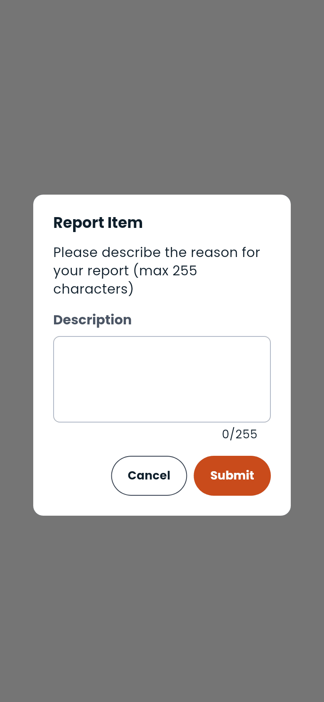

# Reporting

If something on Dambel is wrong — a fake gym, a service that isn't what it says, someone behaving badly — tell us. Reporting takes a few seconds and goes straight to the team that reviews it.

---

## What you can report

| What | Where the **Report** action is |
|---|---|
| **A person** | **Report**, on their profile beside **Message** |
| **A gym** | The flag icon over the gym's photo |
| **A training service** | The flag icon over the service's photo |

Those are the three. There is no way to report an individual chat message today — if a conversation is the problem, report the person.

**Report** appears on other people's profiles only; on your own it isn't there. The flag on a gym or a service is not filtered that way, so you will see it on your own listing too.

---

## How to report

1. Open the profile, gym or service
2. Tap **Report**
3. Describe the problem in your own words — **up to 255 characters**
4. Tap **Submit**

There is no list of reasons to pick from: the description is the report. Say what is wrong and, if it helps, when you saw it. A description is required — an empty report is not accepted.

---

## What happens next

Your report is sent to Dambel's review team. You'll see a confirmation that it went through.

After that, the process is on our side and you are **not** told the outcome — you won't get a notification saying a report was upheld or dismissed. That is deliberate: what happens to another person's account is not something we report back to whoever raised it.

Reporting the same thing twice does no harm, but it doesn't speed anything up either.

---

## What reporting is not

- **It is not a support channel.** If Dambel itself is broken, or a payment went wrong, use **Settings → Support** instead.
- **It is not a block.** Reporting somebody does not hide them from you.
- **It is not anonymous to us.** Reports are attached to the account that made them, which is what stops the feature being abused.

---

> **Next:** [Settings](settings.md) if you need support instead, or [go back to the docs index](README.md)

---

[← Previous: Gyms](gyms.md) | [Next: Analytics →](analytics.md)
