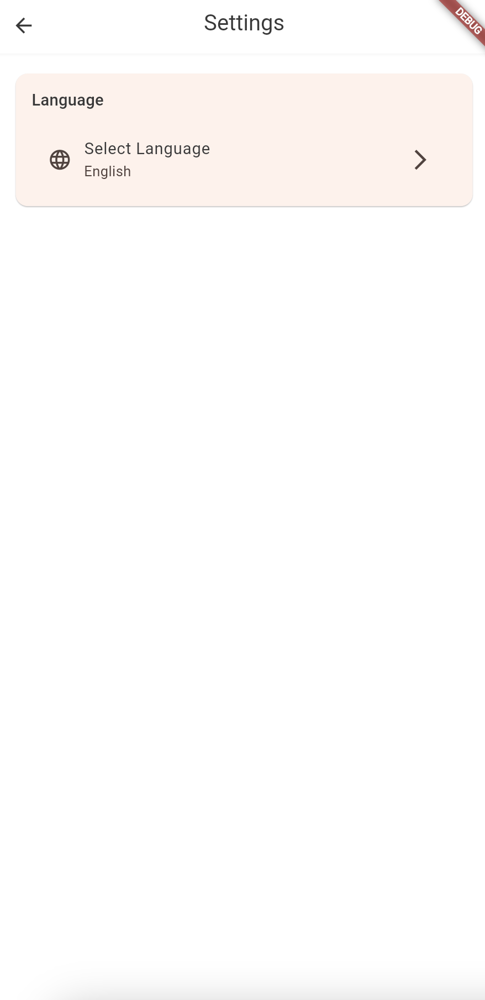
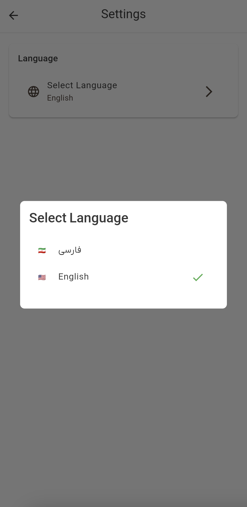

# Settings Guide

The Settings page in Dambel allows you to customize your app experience. Here's everything you need to know about configuring your preferences.

## Accessing Settings

To open the Settings page:

1. From the main navigation, tap on the **Settings** tab
2. You'll see the settings screen with various configuration options

## Language Settings

One of the most important settings is your language preference. Dambel supports multiple languages, and you can change it anytime.

### Changing Your Language

1. In the Settings page, find the **Language** section
2. Tap on **"Select Language"** 
3. A dialog will appear with available language options
4. Choose your preferred language:
   - **🇮🇷 فارسی** - Persian/Farsi
   - **🇺🇸 English** - English

5. The app will immediately switch to your selected language
6. The change is saved automatically for future sessions

### Current Language Display

The settings page shows your current language selection:
- The language name is displayed under "Select Language"
- A checkmark (✓) appears next to your current selection in the dialog

## Language Features

### Supported Languages

Currently, Dambel supports:
- **English (EN)**: Full interface in English
- **Persian/Farsi (FA)**: Full interface in Persian with RTL support

### Automatic Text Direction

The app automatically adjusts text direction based on your language:
- **English**: Left-to-right (LTR) text direction
- **Persian**: Right-to-left (RTL) text direction

### Language Persistence

Your language choice is:
- Saved immediately when changed
- Remembered across app sessions
- Applied to all screens and features
- Synced with your account (when logged in)

## Future Settings

The Settings page is designed to expand with more features in future updates. Potential upcoming settings may include:

- **Account Management**: Profile settings, password changes
- **Notifications**: Push notification preferences
- **Privacy**: Data sharing and privacy controls
- **Appearance**: Theme selection, font size
- **Data & Storage**: Cache management, offline settings
- **About**: App version, terms, privacy policy

## Troubleshooting Settings

### Language Not Changing

If the language doesn't change after selection:

1. **Check your selection**: Make sure you tapped the correct language option
2. **Wait a moment**: Language changes may take a second to apply
3. **Restart the app**: Close and reopen the app if the change doesn't appear
4. **Check for updates**: Make sure you're using the latest app version

### Settings Not Saving

If your settings don't persist:

1. **Check internet connection**: Some settings require internet to sync
2. **Restart the app**: Close and reopen to refresh settings
3. **Clear app cache**: If problems persist, try clearing the app's cache
4. **Contact support**: If issues continue, reach out to our support team

### Missing Language Options

If you don't see your preferred language:

1. **Check app version**: New languages are added in app updates
2. **Update the app**: Download the latest version from your app store
3. **Request a language**: Contact us to request support for your language

## Tips for Using Settings

### Quick Language Switch

- You can change language from the login screen as well
- Look for the language selector in the top-right corner
- Changes apply immediately without needing to restart

### Language Learning

- Switching between languages can help you learn
- Try using the app in different languages to practice
- All features work the same regardless of language

### Accessibility

- Language settings help make the app more accessible
- Choose the language you're most comfortable with
- RTL languages like Persian are fully supported

## Getting Help

If you need assistance with settings:

1. **Check this guide**: Review the troubleshooting section above
2. **App help**: Look for help options within the app
3. **Contact support**: Reach out to our support team
4. **Community**: Check our community forums for tips

## Settings Best Practices

### Regular Updates

- Keep your app updated to access new settings
- Check for new language options in updates
- Review settings after major app updates

### Security

- Be cautious when changing account-related settings
- Always use official app updates
- Report any suspicious behavior in settings

### Performance

- Language changes don't affect app performance
- Settings are stored locally for fast access
- Large settings changes may require a brief loading time

---

*Last updated: [Current Date]*
