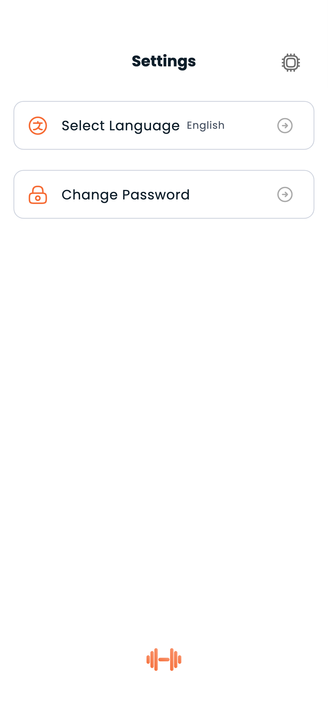

# Settings

---

## Language

Dambel supports **English** and **Persian (فارسی)**. Switch languages anytime — the change is instant and the layout adjusts automatically (LTR for English, RTL for Persian).

To switch:
1. Go to **Settings**
2. Tap **Language**
3. Select your preferred language

Your choice is saved and applied on every launch.

---

## AI Assistant

Access the AI assistant from Settings if you want to start a fresh conversation or manage your AI threads. You can also reach the assistant from within any feature screen via the sparkle icon.

---

## Support

Have a question or ran into a problem? Use the **Support** link in Settings to reach the Dambel team.

---

## Logout

Tap **Logout** at the bottom of the Settings page to sign out of your account. You'll be taken back to the login screen.

---

> **Next:** [Learn about the AI assistant](ai-assistant.md) or [go back to the docs index](README.md)
