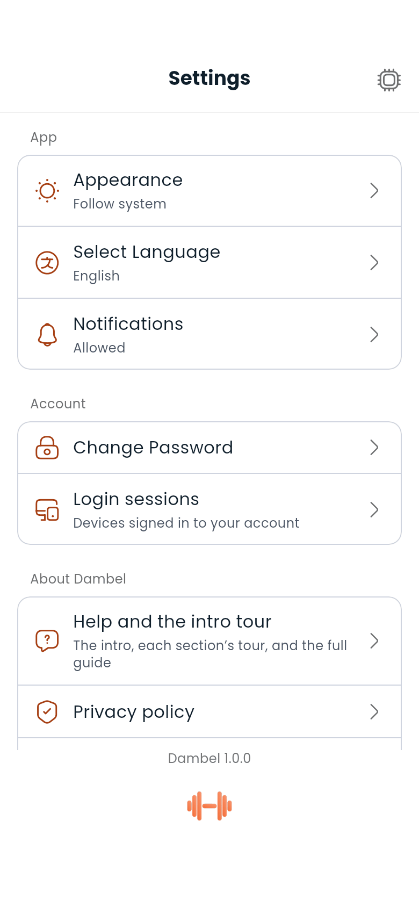
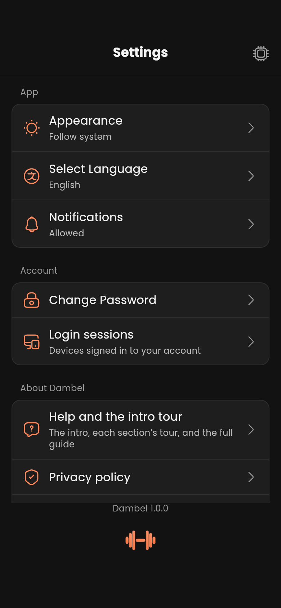

# Settings

Settings is reached from your photo in the top bar. Its rows sit in three groups — **App**, **Account** and **About Dambel**.

---

## App

### Appearance

Dambel has a light and a dark look. By default it **follows your device**: when your phone or computer switches to dark mode, Dambel switches with it.

To choose for yourself:
1. Go to **Settings**
2. Tap **Appearance**
3. Pick **Follow system**, **Light** or **Dark**

The change is instant and the choice is remembered on this device.

### Language

Dambel supports **English** and **Persian (فارسی)**. Switch languages anytime — the change is instant and the layout adjusts automatically (LTR for English, RTL for Persian).

To switch:
1. Go to **Settings**
2. Tap **Language**
3. Select your preferred language

Your choice is saved and applied on every launch.

### Notifications

The **Notifications** row says whether Dambel is allowed to notify you: allowed, not allowed, or blocked. If you said "not now" when your phone first asked, tap it to be asked again; if you blocked notifications outright, it takes you to your device's settings, which is the only place that can undo it.

---

## Account

### Change password

Enter your current password and the new one twice. The new password must be at least 8 characters. You stay signed in on this device; other devices are unaffected — sign them out from **Login sessions** if that's what you're after.

### Login sessions

**Login sessions** lists every device currently signed in to your account and lets you sign any of them out — see [Login sessions](login-sessions.md).

### AI assistant permissions

If you have told the assistant to **always allow** an action, an **AI assistant permissions** row appears here showing how many actions you have approved that way. It carries an **Ask again** button — the row is not a page to open, it is a thing to undo — and pressing it makes the assistant ask for your approval again before every action. The row is hidden while you have not always-allowed anything.

---

## About Dambel

### Help and the intro tour

**Help and the intro tour** is where you see the introduction again. It offers three things:

- **The first-run introduction** — the welcome questions, from the start
- **One section's tour** — the highlighted walk-through for the Dashboard, Gyms, Training, Tracker, Wallet, Profile, Chat or the assistant
- **Show everything again** — resets the lot, so every tour is offered afresh as you reach each screen

All of it is remembered on this device only, which is why it lives here rather than on your account.

### Privacy policy · Terms and conditions · About Dambel · Support

Four rows that open the matching page on dambel.io, in the language you are reading the app in. **Support** is where to write to us with a question or a problem.

---

## The foot of the page

Below the last group you'll find the **version of Dambel you are running** — worth quoting if you ever report a problem — and the Dambel logo, which opens dambel.io.

---

## What is *not* here

**Logout** is not in Settings. It is in the menu behind your photo in the top bar, deliberately apart from the rows you come here to change. See [Authentication](authentication.md).

---

> **Next:** [Learn about the AI assistant](ai-assistant.md) or [go back to the docs index](README.md)

---

[← Previous: Wallet](wallet.md) | [Next: Login Sessions →](login-sessions.md)
