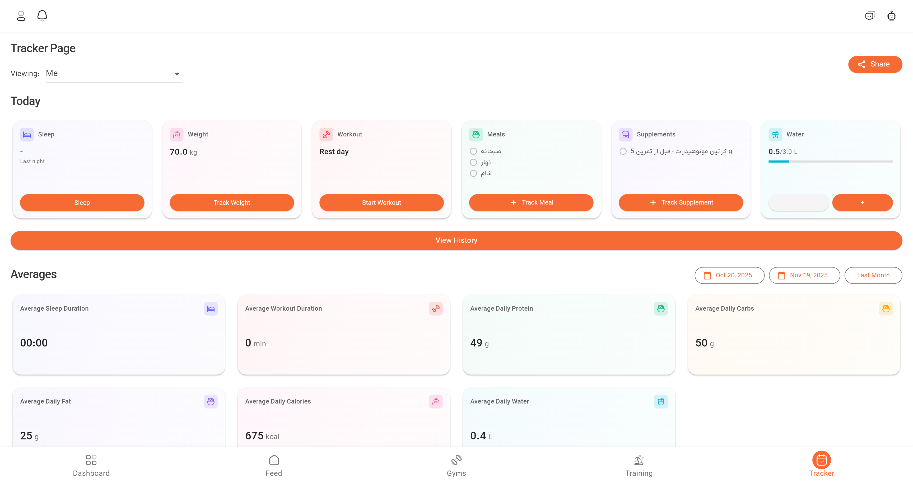
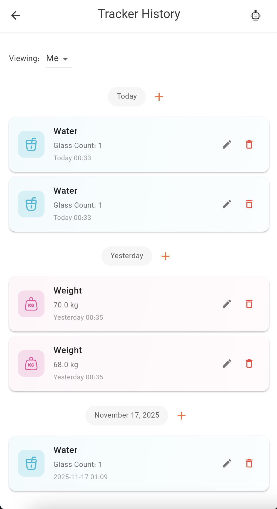

# Tracker System Guide

Welcome to the Tracker System in Dambel. This comprehensive guide will walk you through tracking your daily activities, including meals, workouts, sleep, weight, water intake, supplements, and more.

## Overview

The Tracker System allows you to log and monitor all aspects of your fitness journey. You can track multiple types of activities, view them in a unified timeline, and manage your data over time. The system supports both personal tracking and shared tracking with coaches or trainers.

The tracker supports:
- **Meals**: Log meals with nutritional information
- **Workouts**: Track workout sessions with exercises and sets
- **Sleep**: Record sleep times
- **Wakeup**: Track wake-up times
- **Weight**: Log body weight measurements
- **Water**: Track daily water intake
- **Supplements**: Record supplement intake

## Accessing the Tracker

You can access the tracker from multiple places:

1. **Today Section**: View and log today's activities from the main dashboard
2. **Tracker History**: View all past tracking records in chronological order
3. **Workout Details**: Detailed view for individual workout sessions

*The today section showing all tracker cards for quick access*

## Today Section

The Today section provides quick access to track today's activities:

### Available Trackers

**Sleep** (Indigo):
- Track sleep time
- View last sleep record
- Add new sleep entry

**Weight** (Pink):
- Log current weight
- View last weight measurement
- Track weight over time

**Workout** (Red):
- Start a new workout
- View active workout
- Access workout details

**Meals** (Green):
- Log meals
- View meals logged today
- Track nutritional intake

**Supplements** (Purple):
- Log supplement intake
- View supplements taken today
- Link to diet plan supplements

**Water** (Cyan):
- Track water intake by glasses
- View daily water progress
- Set water goals

### Using Today Section

1. Tap on any tracker card
2. Fill out the tracking form
3. Save to log the activity
4. View your progress for the day

## Tracker History

The Tracker History screen shows all your tracking records in chronological order:

### Timeline View

**Date Headers**:
- Records are grouped by date
- Date headers show "Today", "Yesterday", or specific dates
- Each date has an add button (+) to quickly log activities

**Activity Cards**:
Each activity is displayed as a card with:
- **Icon**: Color-coded icon for activity type
- **Title**: Activity name or description
- **Details**: Relevant information (weight, duration, etc.)
- **Timestamp**: When the activity occurred
- **Actions**: Edit and delete buttons (if available)

*The tracker history showing a timeline of all activities with date headers*

### Activity Types

**Meals**:
- Shows meal notes or nutritional information
- Displays protein, carbs, fat, and calories if available
- Green color theme

**Sleep**:
- Shows sleep notes
- Indigo color theme

**Wakeup**:
- Shows wakeup notes
- Indigo color theme

**Water**:
- Shows glass count
- Displays notes if available
- Cyan color theme

**Weight**:
- Shows weight in kilograms
- Displays notes if available
- Pink color theme

**Supplements**:
- Shows supplement notes
- Purple color theme

**Workouts**:
- Shows workout title
- Displays duration if workout is finished
- Shows notes if available
- Red color theme
- Tap to view detailed workout information

### Adding Activities

To add an activity from history:

1. Find the date header for the desired date
2. Tap the **+ (plus)** button next to the date
3. Select activity type from the menu
4. Fill out the form
5. Save to log the activity

### Editing Activities

1. Tap the **edit icon** (pencil) on any activity card
2. Modify the information
3. Save changes

**Note**: You can only edit activities you created.

### Deleting Activities

1. Tap the **delete icon** (trash) on any activity card
2. Confirm deletion
3. The activity will be permanently removed

**Note**: Deleting cannot be undone.

## Workout Details

When you tap on a workout in the history, you'll see the detailed workout screen:

### Workout Information

**Duration Timer**:
- Shows elapsed time for active workouts
- Updates in real-time
- Displays total duration for finished workouts

**Exercises Section**:
- Lists all exercises performed
- Shows sets with weight and reps
- Displays rest time between sets
- Organizes exercises from workout plan if linked

**Workout Plan Integration**:
- If workout is linked to a plan session, shows planned exercises
- Checkboxes indicate completed exercises
- Can add sets directly from plan exercises

### Adding Sets

1. Tap **"Add Exercise"** button or the + icon on a plan exercise
2. Select exercise from dropdown (if not from plan)
3. Enter weight (optional)
4. Enter reps
5. Start and end times are auto-calculated
6. Add notes (optional)
7. Save the set

### Editing Sets

1. Tap on any set card or tap edit icon
2. Modify weight, reps, times, or notes
3. Save changes

### Deleting Sets

1. Tap the delete icon on a set
2. Confirm deletion
3. The set will be removed

### Finishing a Workout

1. Tap **"End Workout"** button
2. Confirm ending the workout
3. End time is automatically set to current time
4. Workout is marked as finished

### Workout Metadata

You can edit:
- **Start Time**: When workout began
- **End Time**: When workout ended (for finished workouts)
- **Workout Title**: Name of the workout
- **Workout Plan Session**: Link to a workout plan session
- **Notes**: Additional information

## Shared Tracking

If tracking data has been shared with you, you can view it:

### Viewing Shared Data

1. In Tracker History, use the **"View As"** dropdown at the top
2. Select **"Me"** for your own data or a shared tracker name
3. The timeline updates to show that person's data

**Read-Only Mode**:
- When viewing shared data, you cannot add, edit, or delete records
- All action buttons are hidden
- You can only view the data

## AI Assistant Integration

The Tracker screens integrate with the AI Assistant:

**AI Can Help**:
- Suggest activities to log
- Help fill out tracking forms
- Analyze your tracking patterns
- Provide insights on your progress

**How to Use**:
1. Open AI Assistant while viewing tracker (tap robot icon 🤖)
2. Ask for help: "What should I track today?"
3. AI provides guidance based on your goals
4. Use AI suggestions to log activities

## Troubleshooting

### Activities Not Loading

**Solutions**:
1. Check internet connection
2. Pull down to refresh
3. Check if you're viewing shared data (read-only mode)
4. Logout and login again
5. Contact support if issue persists

### Cannot Add Activities

**Solutions**:
1. Ensure you're not in read-only mode (viewing shared data)
2. Check that all required fields are filled
3. Try again after a moment
4. Contact support if issue persists

### Cannot Edit/Delete Activities

**Solutions**:
1. Ensure you're not viewing shared data (read-only)
2. Check that the activity belongs to you
3. Try refreshing the page
4. Contact support if issue persists

### Workout Not Saving

**Solutions**:
1. Ensure workout title is filled
2. Check start time format (YYYY-MM-DD HH:MM:SS)
3. Verify end time format if provided
4. Check for validation errors
5. Try saving again

### Sets Not Adding

**Solutions**:
1. Ensure exercise is selected
2. Verify reps is a positive number
3. Check that workout is saved first
4. Try refreshing and adding again

## Best Practices

### Daily Tracking

- Log activities as soon as possible after they occur
- Be consistent with tracking times
- Add notes for context or observations
- Review your tracking data regularly

### Workout Tracking

- Start workout when you begin exercising
- Add sets as you complete them
- Log accurate weights and reps
- Add notes about form or difficulty
- End workout when finished

### Nutrition Tracking

- Log meals promptly after eating
- Include all nutritional information when available
- Link meals to diet plan meals when applicable
- Track supplements with meals

### Data Management

- Review history regularly to spot patterns
- Use shared tracking for accountability
- Keep notes detailed for future reference
- Clean up duplicate or incorrect entries

## Getting Help

If you need assistance:

1. **AI Assistant**: Ask for help (tap robot icon 🤖)
2. **In-App Support**: Check support options in settings
3. **Documentation**: Browse other help articles
4. **Contact Support**: Reach out to Dambel support team

The tracker system is your fitness journal. Use it consistently to monitor your progress and achieve your goals!

