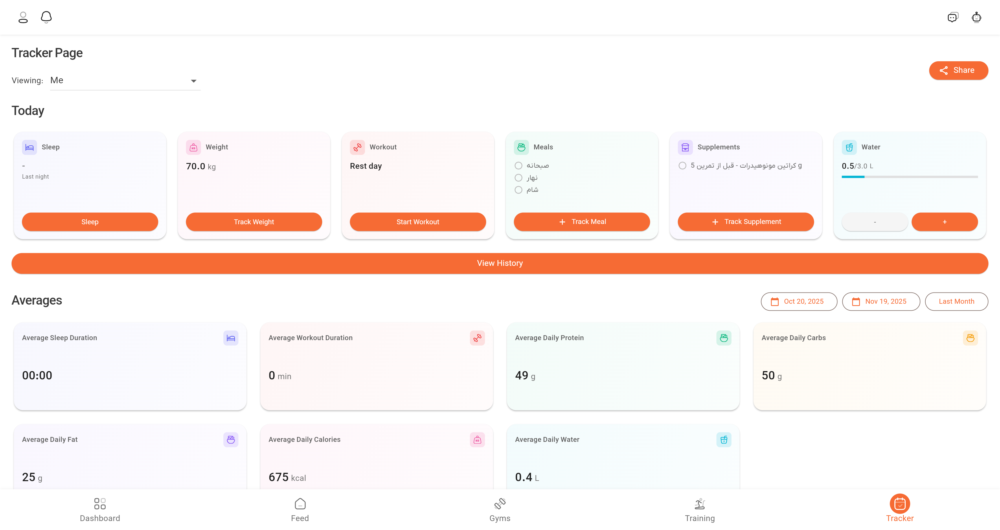
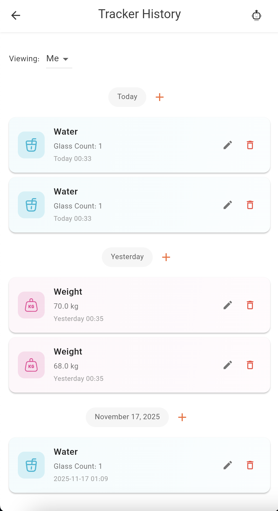

# Tracker

Your fitness journal lives here. Track everything from meals and workouts to sleep and water intake. Think of it as your personal log that keeps tabs on your progress and helps you stay consistent.

## Getting There

You've got two main spots to access your tracker. The "Today" section shows up on your main dashboard with quick cards for logging today's activities. For the full timeline of everything you've tracked, head to the Tracker History screen from the main menu.

## Today Section

This is your quick-access hub for logging what's happening right now. Six colorful cards give you one-tap access to track different things.

Sleep (indigo card) shows your last sleep record and lets you log new ones. Weight (pink) displays your most recent weigh-in. Workout (red) shows if you've got an active workout going or lets you start a new one. Meals (green) tracks what you're eating throughout the day. Supplements (purple) logs your supplement intake. Water (cyan) counts your glasses and shows your daily progress.

Each card is designed to get you in and out fast. Tap one, fill in what you need, save, and you're done. The cards adapt to your screen size too – on phones you'll see them in a grid, on tablets and desktops they spread out for easier access.

## Tracker History

This is where all your logged activities live in one continuous timeline. Everything's organized by date with the most recent stuff at the top.

Each date gets its own header showing "Today", "Yesterday", or the actual date for older entries. Next to each date header there's a + button – tap it to quickly log something for that specific day. Handy when you forgot to track something earlier.

Your activities show up as cards with color-coded icons matching the today section. Meals are green, workouts are red, sleep is indigo, you get the idea. Each card shows the relevant details – meal notes and nutrition info, workout duration, weight measurements, water glass count, whatever makes sense for that activity type.

If you can edit or delete an activity, you'll see little pencil and trash icons on the card. Tap the pencil to make changes, tap the trash to delete (you'll get a confirmation prompt first, since there's no undo).

### Viewing Someone Else's Data

Got a coach or trainer who's shared their tracking data with you? Or maybe you're a coach viewing a client's logs? There's a dropdown at the top of the history screen that lets you switch between viewing your own data and any shared trackers you have access to.

When you're viewing someone else's data, everything goes read-only. You can see their timeline but you can't add, edit, or delete anything. All the action buttons disappear. Switch back to "Me" in the dropdown to get back to your own data.

## Workout Details

Workouts get their own detailed screen since there's more to track than just "I worked out today". Tap any workout card in your history to see the full breakdown.

At the top you'll see a duration timer. If the workout's still active, it counts up in real-time. Finished workouts show the total time you spent.

Below that is where all your exercises and sets live. Each exercise you performed shows up with its sets listed underneath – weight, reps, rest time between sets, all that good stuff. If you linked the workout to a workout plan session, you'll see the planned exercises with checkboxes showing what you've completed.

### Adding Sets

Hit the "Add Exercise" button to log a new set. If your workout is linked to a plan, you can also tap the + icon next to any planned exercise to quickly add a set for that exercise.

Pick your exercise from the dropdown (or it's pre-selected if you tapped from a plan exercise), enter the weight and reps, add any notes you want, and save. Start and end times get calculated automatically based on when you add the set.

### Editing and Deleting Sets

Tap any set card to edit it. Change the weight, reps, times, or notes, then save. To delete a set, tap the trash icon and confirm.

### Finishing a Workout

When you're done, hit the "End Workout" button. The end time gets set to right now and the workout is marked as finished. The timer stops and shows your total duration.

You can still edit workout details even after it's finished – change the title, adjust the start or end times, update notes, or link it to a different workout plan session. The metadata stays editable, you just can't add more sets once it's done.

## Tracking Different Activities

Each activity type has its own form with fields that make sense for what you're tracking.

Meals let you log notes, link to a diet plan meal (which auto-fills nutrition info), and manually enter protein, carbs, fat, and calories. There's a "cheat meal" checkbox too if you're tracking those separately.

Sleep and wakeup just need a time and optional notes. Simple.

Weight asks for your weight in kilograms and optional notes.

Water is even simpler – just the number of glasses and optional notes.

Supplements need you to pick which supplement from a dropdown, optionally link it to a diet plan supplement, and add notes.

Workouts need a title, start time, and optional end time. You can link them to a workout plan session, which pulls in the planned exercises. Notes are optional.

## AI Assistant

The AI assistant can help you track things faster. Open it (tap the robot icon 🤖) while you're on any tracker screen and tell it what you want to log. "Log a meal with 30g protein and 40g carbs" or "Start a workout" works great. The AI will open the right form and fill in what it can, then you just review and save.

## When Things Go Wrong

Timeline not loading? Check your internet connection and pull down to refresh.

Can't add activities? Make sure you're not in read-only mode (viewing someone else's data). Check that you've filled in all required fields.

Activities not saving? Look for error messages on the form fields. Common issues are invalid date formats, missing required fields, or network problems. The app expects dates in YYYY-MM-DD HH:MM:SS format.

Workout sets not adding? Make sure the workout itself is saved first. You need to select an exercise and enter at least the reps. Weight is optional.

Shared tracker dropdown not showing? You might not have any shared trackers set up. Check with your coach if you think you should have access to their data.

## Tips

Track things as soon as they happen. It's easier to remember details when they're fresh. The today section makes this quick – just tap, fill, save.

For workouts, start the workout when you begin and add sets as you complete them. This gives you accurate timing and makes it easier to track rest periods.

Use notes liberally. Future you will appreciate the context. "Felt strong today" or "Lower back was tight" can help you spot patterns over time.

If you're working with a coach, consistent tracking gives them better data to work with. They can see what's actually happening and adjust your program accordingly.

The timeline is searchable by scrolling, but if you're looking for patterns, the AI assistant can help analyze your data. Just ask it questions like "How many workouts did I do this week?" or "What's my average protein intake?"

Need help? The AI assistant is always available (tap that robot icon 🤖), or check the support options in settings.
