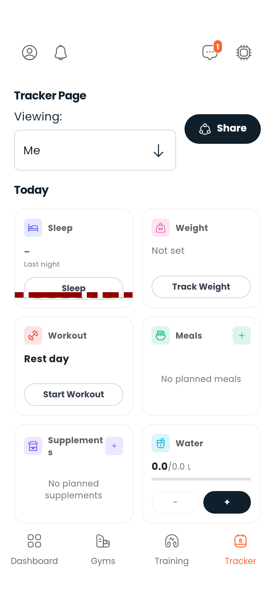
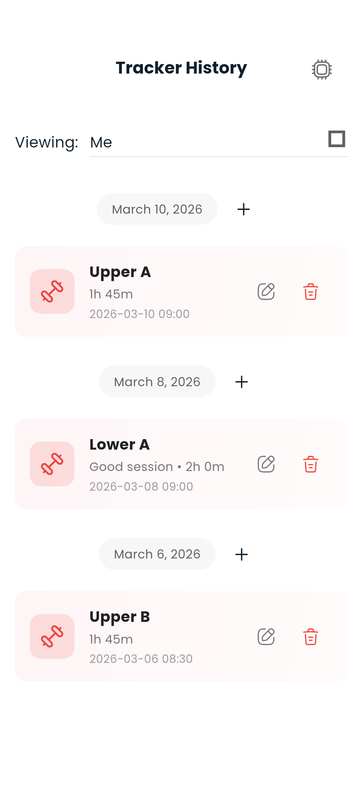
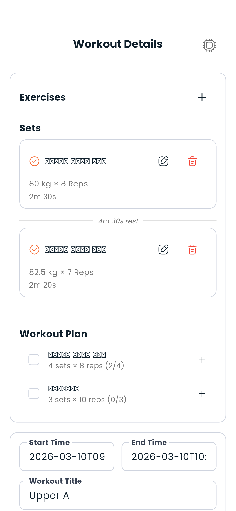

# Tracker

Everything you log ends up here — workouts, meals, sleep, water — all sorted by date so you can see how you're doing over time.

---

## Logging from the Dashboard

The fastest way to log is through the six quick-log cards on your Dashboard. Tap any card and fill in the details.

---

## Activity types

### Workout

Log a training session with:
- **Duration** — how long you trained
- **Exercises** — sets, reps, and weight for each
- **Notes** — anything worth remembering
- **Link to plan** — optionally attach it to a session from your active workout plan

While logging, you can use the **active workout timer** to track rest periods or total session time.

### Meals

Log what you ate with:
- **Notes** — describe the meal
- **Macros** — protein, carbs, fat, and calories
- **Link to diet plan** — attach it to a meal from your active diet plan
- **Cheat meal flag** — toggle if this was an off-plan meal

### Sleep

Log your sleep with:
- **Duration** — how many hours
- **Notes** — sleep quality, anything unusual

### Weight

Log your body weight in **kilograms** with optional notes.

### Water

Log the number of **glasses** you drank today. If you have a water target set in your diet plan, your progress toward it is shown.

### Supplements

Log which supplements you took:
- **Select supplement** from your list
- **Link to diet plan** — optionally tie it to a supplement in your active plan
- **Notes**

---

## Tracker history

The Tracker tab shows a timeline of all your logged activities, grouped by date. Scroll back to see older entries. Tap any entry to see details or edit it.

---

## Workout details

Tap a logged workout to see the full breakdown:
- Total duration
- Each exercise with all sets (weight × reps)
- Notes

---

## Trainer access

If you're working with a trainer, they can view your tracker data in **read-only mode**. You stay in control — they see your history, but can't edit it.

---

> **Next:** [Build the plans your tracker links to](workout-plans.md) or [check your full history](tracker.md)
