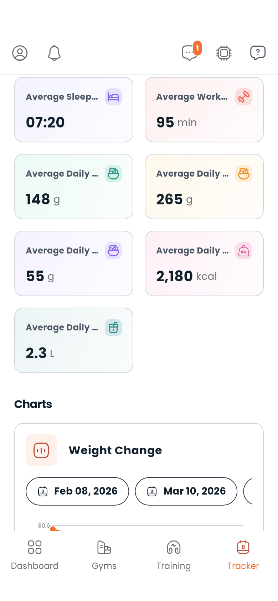

# Tracker

Everything you log ends up here — workouts, meals, sleep, water — all sorted by date so you can see how you're doing over time.

---

## Today

Logging happens on the **Tracker**, at the top of the tab, in a block called **Today**: six cards, one per kind of thing you log. Tap a card and fill in the details.

The Dashboard carries a one-line summary of the same day with a **Log today** link back here. The Dashboard reports; the Tracker records.

---

## The six cards

### Workout

Log a training session with:
- **Duration** — how long you trained
- **Exercises** — sets, reps, and weight for each
- **Notes** — anything worth remembering
- **Link to plan** — optionally attach it to a session from your active workout plan

While logging, you can use the **active workout timer** to track rest periods or total session time.

The workout card on your tracker shows the running session and its elapsed
time. **End workout** is on that card, so you can close a session without
opening it first. A workout you started on an earlier day stops counting and
says when it began instead — end it there and its length is recorded.

### Meals

Log what you ate with:
- **Notes** — describe the meal
- **Macros** — protein, carbs, fat, and calories
- **Link to diet plan** — attach it to a meal from your active diet plan
- **Cheat meal flag** — toggle if this was an off-plan meal

### Sleep

The sleep card is a pair: **Sleep** when you turn in, **Wake up** when you get up, and the card counts the hours between them. Last night's total stays on the card during the day.

### Weight

Log your body weight in **kilograms** with optional notes.

### Water

Log the number of **glasses** you drank today. If you have a water target set
in your diet plan, your progress toward it is shown — the figure is in litres,
because that is what your target is in, while the **+ glass** and **− glass**
buttons log by the glass. The card says so under the figure.

### Supplements

Log which supplements you took:
- **Select supplement** from your list
- **Link to diet plan** — optionally tie it to a supplement in your active plan
- **Notes**

---

## Averages

Under Today, **Averages** summarises a stretch of days — pick the start and end dates, or reset back to the default range. It is the quickest way to see whether this month looks like last month.

---

## Charts

**Charts** plots the same data over a date range you choose, so a trend shows up as a shape rather than a number.

---

## Records

**Records** is your best set for each exercise. A switch turns it **by rep count**, so you can see your best single, your best set of five, and so on, rather than one number per exercise. The list starts short and expands.

---

## Tracker history

**View history** on the Tracker opens the full timeline as its own screen, grouped by date.
Scroll back and older entries load automatically, always below what you are
already reading. Tap any entry to see details or edit it. A supplement entry
names the supplement you took; a workout entry says how long it lasted.

The foot of the list tells you how far back it currently reaches, and whether
there is more to load — the seven kinds of entry are fetched separately, so
the timeline stops wherever the shallowest of them has got to rather than
pretending that is everything.

If you haven't logged anything yet, the page tells you so rather than showing an empty screen.

---

## Workout details

Open a workout to see it built around **the exercise you are on right now**:

- A header with the workout name, live elapsed time, and how many of the planned exercises you have finished
- **The current exercise**, with its illustration, its target sets and reps, and every set you have logged for it
- A **Log set** button right underneath — tap it and the weight and reps are already filled in **from your previous set of that exercise**, so a normal set is one confirmation away. With no previous set, it falls back to the plan's target reps.
- An **Add another exercise** button for anything you do that the plan doesn't list — pick it from the searchable exercise list and log its sets like any other
- A **rest timer** that starts counting as soon as you log a set
- The remaining planned exercises below — tap any one to switch to it
- **Extra exercises** — anything you logged outside the plan, listed under its own heading with the number of sets you did; tap one to switch to it, or use its **+** to add another set

To edit a set's weight or reps, tap the pencil on its row and change the numbers in place. Tap the set itself for the full editor (exercise, notes, times).

The workout's own details — title, notes, start and end time, and the linked plan session — live behind the **⋮** menu in the header, out of the way while you train. Times are shown in a readable, localized format and are set with a date and time picker.

---

## Sharing your tracker

Nobody sees your tracker unless you share it. Sharing is yours to set up, from the picker at the top of the Tracker: choose who may look, and from when until when. You can change a share's dates later, or delete it, and the person loses access straight away.

The same picker is how you *read* a tracker somebody has shared with you — switch from your own to theirs and the whole tab shows their data instead.

A shared tracker is strictly **read-only**. You see their history, but nothing can be edited, and that holds all the way in: a workout opened from a shared tracker has no **Log set**, no **End workout** and no settings menu, only what they logged.

---

> **Next:** [Build the plans your tracker links to](workout-plans.md) or [see what your trainer can do with a share](trainers.md)

---

[← Previous: Diet Plans](diet-plans.md) | [Next: Trainers →](trainers.md)
