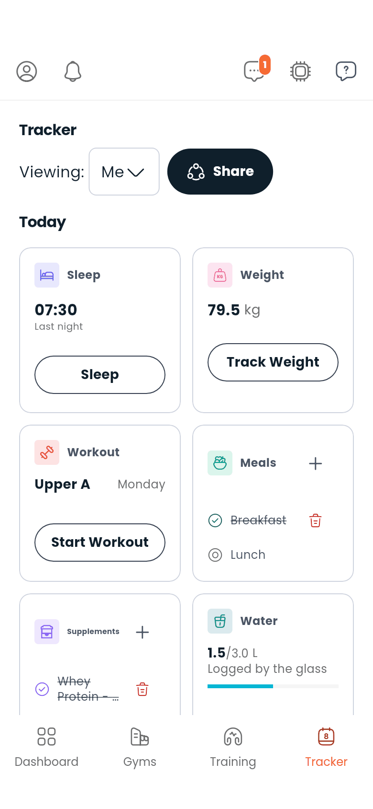
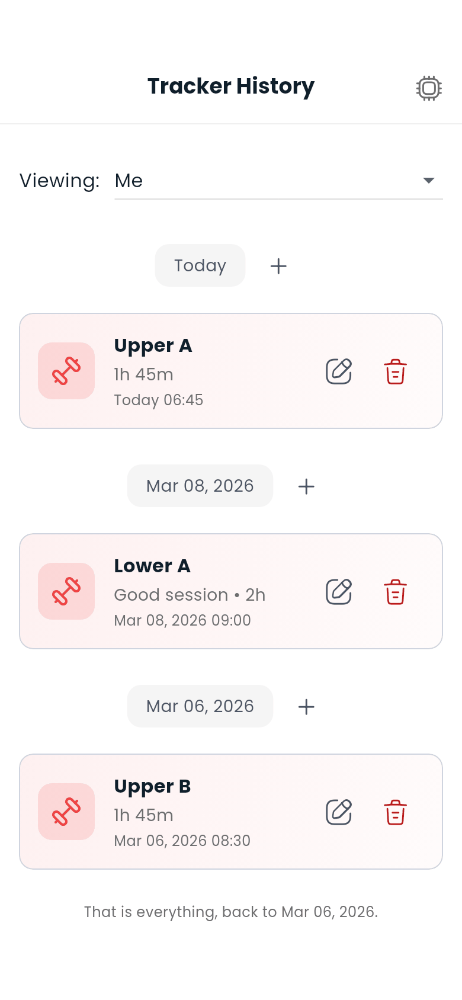
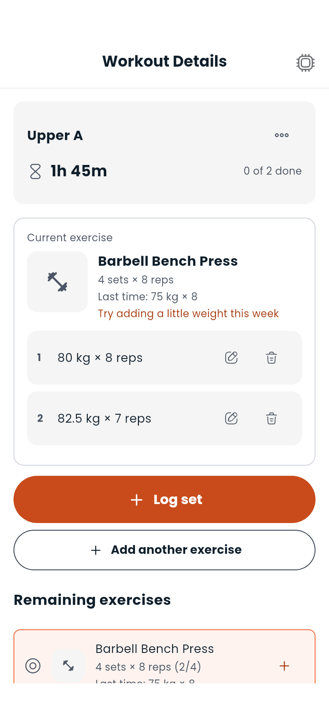

# Tracker

Everything you log ends up here — workouts, meals, sleep, water — all sorted by date so you can see how you're doing over time.

---

## Logging from the Dashboard

The fastest way to log is through the six quick-log cards on your Dashboard. Tap any card and fill in the details.

---

## Activity types

### Workout

Log a training session with:
- **Duration** — how long you trained
- **Exercises** — sets, reps, and weight for each
- **Notes** — anything worth remembering
- **Link to plan** — optionally attach it to a session from your active workout plan

While logging, you can use the **active workout timer** to track rest periods or total session time.

### Meals

Log what you ate with:
- **Notes** — describe the meal
- **Macros** — protein, carbs, fat, and calories
- **Link to diet plan** — attach it to a meal from your active diet plan
- **Cheat meal flag** — toggle if this was an off-plan meal

### Sleep

Log your sleep with:
- **Duration** — how many hours
- **Notes** — sleep quality, anything unusual

### Weight

Log your body weight in **kilograms** with optional notes.

### Water

Log the number of **glasses** you drank today. If you have a water target set in your diet plan, your progress toward it is shown.

### Supplements

Log which supplements you took:
- **Select supplement** from your list
- **Link to diet plan** — optionally tie it to a supplement in your active plan
- **Notes**

---

## Tracker history

The Tracker tab shows a timeline of all your logged activities, grouped by date. Scroll back and older entries load automatically, always below what you are already reading. Tap any entry to see details or edit it.

If you haven't logged anything yet, the page tells you so rather than showing an empty screen.

---

## Workout details

Open a workout to see it built around **the exercise you are on right now**:

- A header with the workout name, live elapsed time, and how many of the planned exercises you have finished
- **The current exercise**, with its illustration, its target sets and reps, and every set you have logged for it
- A **Log set** button right underneath — tap it and the weight and reps are already filled in **from your previous set of that exercise**, so a normal set is one confirmation away. With no previous set, it falls back to the plan's target reps.
- An **Add another exercise** button for anything you do that the plan doesn't list — pick it from the searchable exercise list and log its sets like any other
- A **rest timer** that starts counting as soon as you log a set
- The remaining planned exercises below — tap any one to switch to it
- **Extra exercises** — anything you logged outside the plan, listed under its own heading with the number of sets you did; tap one to switch to it, or use its **+** to add another set

To edit a set's weight or reps, tap the pencil on its row and change the numbers in place. Tap the set itself for the full editor (exercise, notes, times).

The workout's own details — title, notes, start and end time, and the linked plan session — live behind the **⋮** menu in the header, out of the way while you train. Times are shown in a readable, localized format and are set with a date and time picker.

---

## Trainer access

If you're working with a trainer, they can view your tracker data in **read-only mode**. You stay in control — they see your history, but can't edit it.

---

> **Next:** [Build the plans your tracker links to](workout-plans.md) or [check your full history](tracker.md)

---

[← Previous: Diet Plans](diet-plans.md) | [Next: Trainers →](trainers.md)
