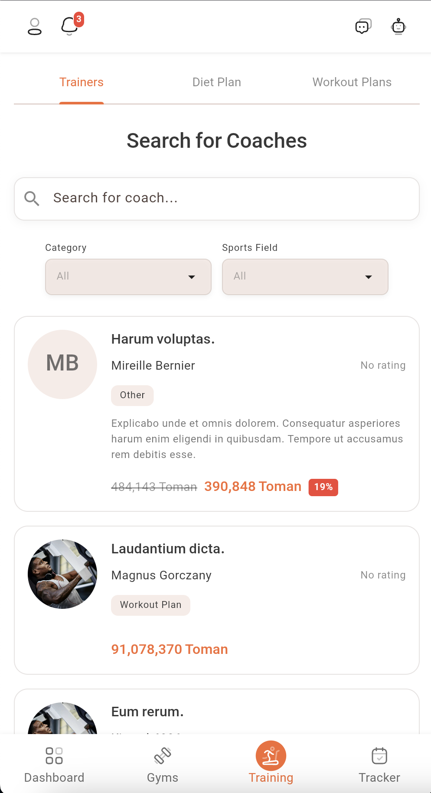

# Trainers Guide

Welcome to the Trainers Search feature in Dambel. This guide will help you understand how to search for trainers and coaches, filter results by categories and specialties, and find the right fitness professional for your needs.

## Overview

The Trainers Search page allows you to discover and connect with certified trainers and coaches in the Dambel community. You can search by name, filter by service categories (workout plans, diet plans) and specialties (majors), and browse through available training services.

Key features:
- **Search Functionality**: Find trainers by name or keywords
- **Category Filters**: Filter by workout plans or diet plans
- **Specialty Filters**: Filter by trainer specialties and expertise areas
- **Service Listings**: View detailed trainer service cards
- **Pagination**: Navigate through multiple pages of results
- **Pull to Refresh**: Refresh results manually

## Accessing Trainers Search

### Step 1: Navigate to Training Section

1. Open the main navigation menu
2. Select the **Training** section
3. Tap on the **Trainers** tab

### Step 2: View Trainers Search Page

When you open the Trainers tab, you'll see the search interface with a search bar, filter options, and results list.

*The trainers search page showing search bar, filters, and trainer service listings*

## Search Functionality

### Using the Search Bar

The search bar is located at the top of the page, below the "Search for Coaches" title.

**How to Search**:
1. Tap in the search input field
2. Type the trainer's name or any keywords
3. Results update automatically as you type (with a 300ms delay)
4. The search is case-insensitive and searches across trainer names and service descriptions

**Search Behavior**:
- **Real-time Updates**: Results filter automatically as you type
- **Debounced Input**: Small delay prevents excessive API calls while typing
- **Clear Search**: Delete all text to see all trainers again
- **Empty Search**: Leaving the field empty shows all available trainers

## Filtering Results

### Category Filters

You can filter trainers by the type of services they offer:

**Available Categories**:
- **Workout Plans**: Trainers offering workout/exercise programs
- **Diet Plans**: Trainers offering nutrition and meal planning services

**How to Use**:
1. Tap on a category button to toggle it on/off
2. Selected categories appear highlighted
3. Multiple categories can be selected simultaneously
4. Results update automatically when filters change

**Selected Filter Tags**:
- When categories are selected, they appear as removable chips above the filter buttons
- Tap the X icon on a chip to remove that filter
- Use "Clear All" button to remove all category filters at once

### Specialty Filters (Majors)

Trainers can have specialties or "majors" that indicate their areas of expertise.

**How to Use**:
1. Scroll through the available specialties in the filter section
2. Tap on a specialty to toggle it on/off
3. Selected specialties appear highlighted
4. Multiple specialties can be selected
5. Results update automatically when filters change

**Selected Filter Tags**:
- Selected specialties appear as removable chips
- Each chip shows the specialty name
- Tap the X icon to remove a specialty filter
- Use "Clear All" button to remove all specialty filters at once

### Combining Filters

You can combine multiple filters for precise results:
- **Search + Categories**: Search for specific trainers offering certain service types
- **Search + Specialties**: Find trainers with specific expertise matching your search
- **Categories + Specialties**: Filter by both service type and expertise area
- **All Filters**: Combine search, categories, and specialties for the most specific results

## Viewing Results

### Trainer Service Cards

Each trainer appears as a service card showing:

- **Trainer Information**: Profile picture, name, and basic details
- **Service Type**: Whether they offer workout plans, diet plans, or both
- **Specialties**: Their areas of expertise
- **Additional Details**: Any other relevant information about their services

**Interacting with Cards**:
- Tap on a card to view more details about the trainer
- Cards are scrollable and organized in a list
- Each card provides enough information to make an informed decision

### Empty State

If no trainers match your search or filters, you'll see:
- A message: "No trainers found"
- The message appears in a styled container
- You can adjust your search or filters to find results

### Error State

If there's an error loading trainers:
- An error message appears explaining the issue
- A "Retry" button allows you to try loading again
- The error is displayed prominently with an error icon

## Pagination

When there are many trainers matching your criteria, results are divided into pages.

### Page Navigation

**Pagination Controls**:
- **Previous Button** (◀): Go to the previous page (disabled on first page)
- **Page Indicator**: Shows current page and total pages (e.g., "2/5")
- **Next Button** (▶): Go to the next page (disabled on last page)
- **Row Information**: Shows which results you're viewing (e.g., "1-10 of 45")

**How to Navigate**:
1. Scroll to the bottom of the results list
2. Find the pagination controls
3. Tap Previous or Next to change pages
4. The page indicator shows your current position

**Loading State**:
- While loading a new page, a loading indicator appears at the top
- Results update once the new page loads
- Your current filters and search are preserved when changing pages

## Refreshing Results

### Pull to Refresh

To manually refresh the trainers list:
1. Pull down from the top of the page
2. A refresh indicator appears
3. The app reloads trainers with current search and filters
4. Results update once refreshed

**When to Refresh**:
- After changing filters or search
- If results seem outdated
- After network connectivity issues
- To see newly added trainers

## Loading States

### Initial Load

When first opening the page:
- A circular progress indicator appears in the center
- The page loads trainers and filter options
- Once loaded, the full interface appears

### Subsequent Loads

When loading new pages or refreshing:
- A linear progress indicator appears at the top
- The existing results remain visible
- New results replace or append to the list

## Troubleshooting

### Trainers Not Loading

If the trainers list isn't loading:

1. **Check Internet**: Ensure you have a stable internet connection
2. **Refresh**: Pull down to refresh the page
3. **Retry**: Tap the "Retry" button if an error appears
4. **Restart App**: Close and reopen the app
5. **Check Permissions**: Verify you have appropriate permissions to view trainers

### Search Not Working

If search isn't returning results:

1. **Clear Search**: Try clearing the search field and searching again
2. **Check Spelling**: Verify your search terms are spelled correctly
3. **Broaden Search**: Try more general keywords
4. **Remove Filters**: Clear all filters and search again
5. **Refresh**: Pull down to refresh the page

### Filters Not Applying

If filters aren't working:

1. **Check Selection**: Ensure filters are actually selected (highlighted)
2. **Clear and Reapply**: Clear all filters and select them again
3. **Refresh**: Pull down to refresh the page
4. **Check Internet**: Ensure stable internet connection

### No Results Found

If you see "No trainers found":

1. **Clear Filters**: Remove all active filters
2. **Clear Search**: Clear the search field
3. **Try Different Terms**: Use different search keywords
4. **Check Categories**: Try different category combinations
5. **Refresh**: Pull down to refresh and see all trainers

### Pagination Not Working

If you can't navigate pages:

1. **Check Internet**: Ensure stable internet connection
2. **Wait for Load**: Allow current page to finish loading
3. **Refresh**: Pull down to refresh the page
4. **Try Again**: Tap the navigation buttons again

## Best Practices

### Effective Searching

Tips for finding the right trainer:

1. **Start Broad**: Begin with general search or no filters
2. **Refine Gradually**: Add filters one at a time to narrow results
3. **Use Keywords**: Search for specific expertise areas or service types
4. **Combine Filters**: Use multiple filters for precise matching
5. **Review Results**: Check multiple trainers before making a decision

### Using Filters

Best practices for filtering:

1. **Category First**: Start with service type (workout/diet plans)
2. **Add Specialties**: Then filter by specific expertise areas
3. **Clear When Needed**: Don't hesitate to clear filters and start over
4. **Combine Wisely**: Too many filters may return no results

### Managing Results

Tips for navigating results:

1. **Use Pagination**: Don't miss trainers on later pages
2. **Refresh Regularly**: Pull to refresh to see new trainers
3. **Save Favorites**: Note trainers you're interested in
4. **Compare Options**: Review multiple trainers before choosing

## Privacy and Data

### What Information is Visible

When searching for trainers:

- **Public Profiles**: Trainer profile information is visible to all users
- **Service Details**: Service offerings and specialties are public
- **Search History**: Your search queries are not stored or shared

### Data Usage

- **Server Requests**: Searches and filters send requests to Dambel servers
- **Real-time Updates**: Results update based on current database state
- **Caching**: Some data may be cached for performance

## Getting Help

If you need additional assistance:

1. **AI Assistant**: Ask the AI Assistant for help finding trainers (tap robot icon 🤖)
2. **Check Other Guides**: Browse other help documentation in the app
3. **Contact Support**: Reach out to Dambel support for technical issues
4. **Community**: Join the Dambel community for user tips and advice

The Trainers Search feature helps you find the perfect fitness professional for your needs. Use search and filters effectively to discover trainers that match your goals!

