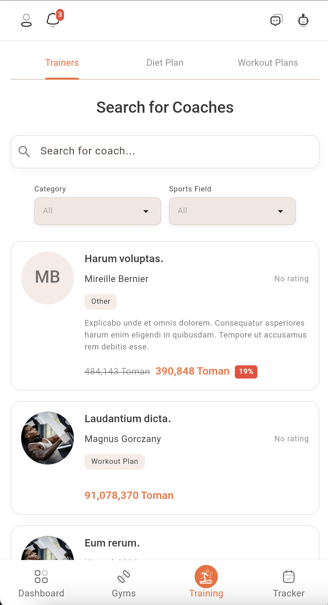

# Finding Trainers

Looking for a coach? This is where you find trainers offering workout plans, diet plans, and other fitness services. Search, filter, and pick someone who matches what you're after.

## Getting There

Head to the Training section from the main menu, then tap the Trainers tab. You'll land on the search page with all available trainers and their services.

At the top, you've got two quick buttons: "My Services" takes you to services you're offering (if you're a trainer), and "Purchased Services" shows what you've bought from other trainers.

## Searching

Type a trainer's name or keywords into the search bar. Results update as you type, so you'll see matches instantly. The search looks through trainer names and service descriptions, and it's not picky about uppercase or lowercase.

Clear the search field to see everyone again.

## Filtering

Below the search bar, you've got two filter dropdowns: Category and Sports Field.

Category lets you pick between Workout Plans and Diet Plans. Tap the dropdown, check what you want, and hit "Clear" if you change your mind. You can select both if you're looking for trainers who do it all.

Sports Field is where you filter by specialty – things like bodybuilding, powerlifting, CrossFit, whatever's available. Same deal: tap the dropdown, pick your specialties, and the list updates automatically.

When you select filters, they show up as little chips above the dropdowns. Tap the X on any chip to remove that filter quickly.

Mix and match however you want. Search for a name, filter by category and specialty, and narrow it down until you find exactly what you need.

## What You See

Each trainer shows up as a card with their profile picture on the left (or initials if they haven't uploaded one). You'll see their name, the service title, rating and review count, specialties, a short description, and the price.

If there's a discount, you'll see the original price crossed out, the discounted price, and a percentage badge. Some services have a green "BOOST" badge – that means the trainer paid to feature their service at the top of the list.

Tap any card to see the full details, including reviews, comments, and more about what they offer.

If nothing matches your search or filters, you'll get a "No trainers found" message. Just adjust your filters or clear them to see more results.

Errors? You'll see a message with a "Retry" button. Usually means a connection issue.

## Pagination

When there are lots of trainers, results split into pages. Scroll to the bottom and you'll see page controls: previous and next buttons, plus a page counter showing where you are (like "2/5"). There's also a row count telling you which results you're viewing out of the total.

Your search and filters stick around when you flip pages, so you don't lose your place.

## Refreshing

Pull down from the top to refresh the list. Handy if you just made changes elsewhere or want to see if new trainers have joined.

## When Things Go Wrong

List not loading? Check your internet connection and try pulling down to refresh. If you see an error screen, hit "Retry".

Search not working? Clear the search field and try again. Make sure you're spelling things right, or try broader keywords. Remove filters if you're getting no results.

Filters acting weird? Make sure they're actually selected (they should be highlighted). Clear them all and reapply if needed. Refresh the page.

No results? Clear your filters and search, then try different combinations. Sometimes being too specific returns nothing.

Pagination stuck? Wait for the current page to finish loading, check your connection, and try again.

## Tips

Start broad when searching – no filters, just browse. Then narrow it down by category, add specialties, and search for specific names if you know who you're looking for.

Don't skip the later pages. Good trainers might not be on page one, especially if they're not boosting their services.

Check multiple trainers before deciding. Look at their ratings, reviews, specialties, and prices. Tap into their full profile to see everything they offer.

If you need help, the AI assistant can guide you (tap the robot icon). Just ask it to help you find trainers with specific expertise or services.

