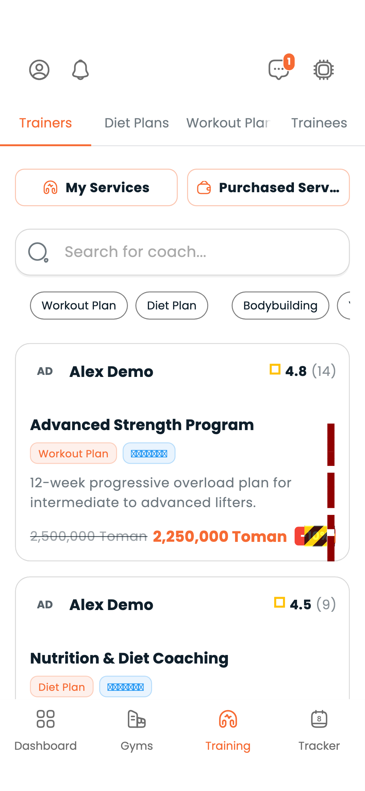
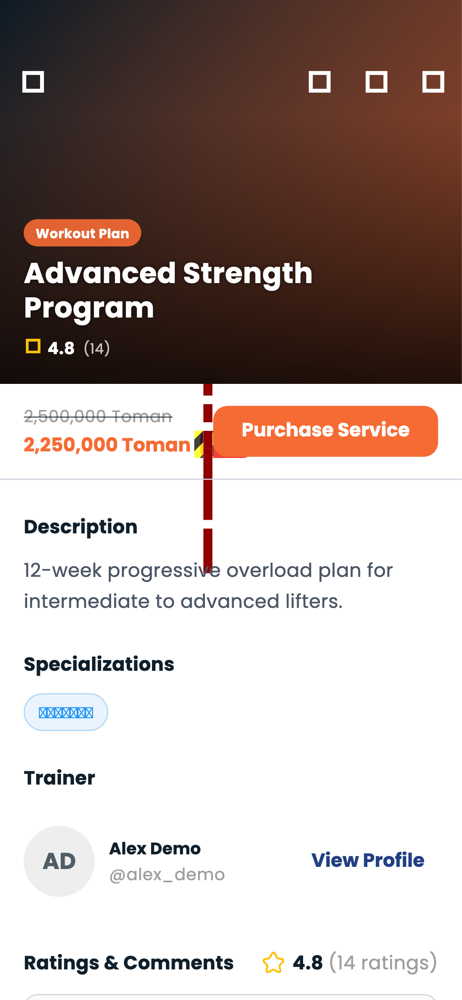
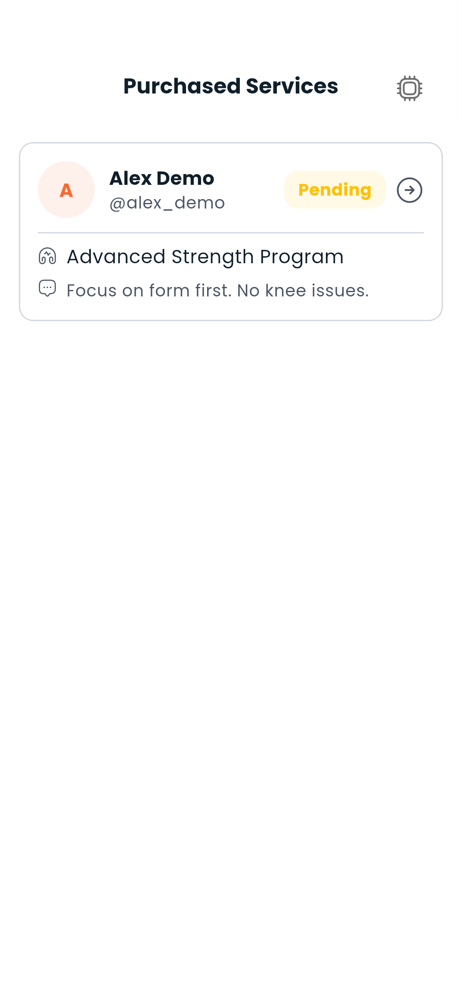
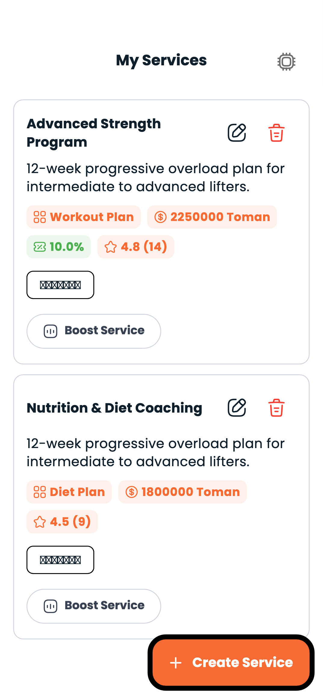
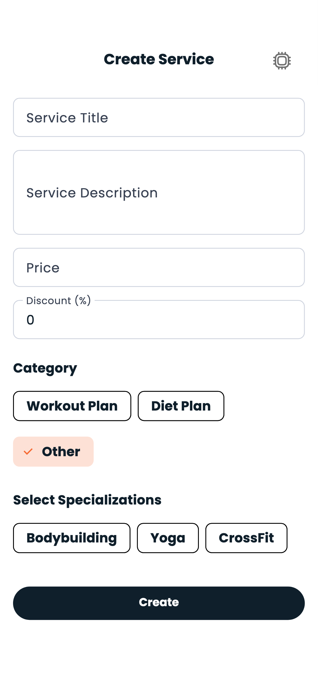
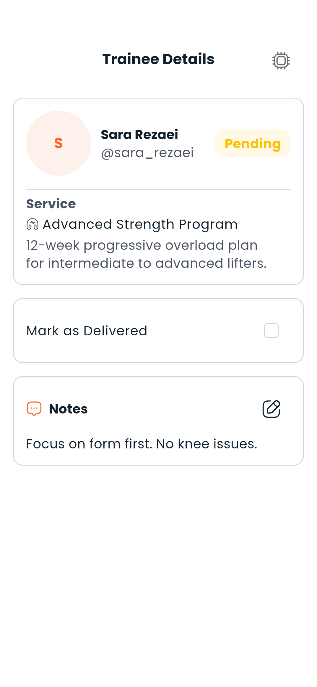

# Trainers

Looking for a trainer? Search, browse their profiles, and subscribe to a service right here in the app.

---

## Finding a trainer

Go to **Training → Trainers**.

You can:
- **Search by name** or keyword
- **Filter by category:** Workout Plans or Diet Plans
- **Filter by sports field:** bodybuilding, CrossFit, powerlifting, yoga, and more

Trainers with boosted listings appear at the top of the list. Tap any trainer card to open their profile.

---

## Trainer profiles

A trainer's profile shows:
- Their bio, specializations, and sports fields
- Ratings and reviews from past clients
- Available services with pricing

---

## Purchasing a service

On a trainer's profile, tap a service to see its full details. When you're ready:
1. Tap **Subscribe**
2. Confirm the purchase from your Dambel wallet

---

## Your subscriptions

Go to **Training → My Subscriptions** to see all the services you're currently subscribed to. Tap any subscription to see details and communicate with your trainer.

---

## For trainers — offering services

If you're a trainer, you can create and manage the services you offer.

### My Services

Go to **Training → My Services** to see all services you've created.

### Creating a service

Tap **+** and fill in:
- Service name and description
- Category (Workout Plans / Diet Plans)
- Price and duration
- Sports field

### Managing trainees

Go to **Training → Trainees** to see all your current clients. Tap any trainee to:
- View their profile and stats
- Access their tracker data (read-only)
- Open a direct chat

---

> **Next:** [Chat with your trainer](chat.md) or [view your wallet](wallet.md)
