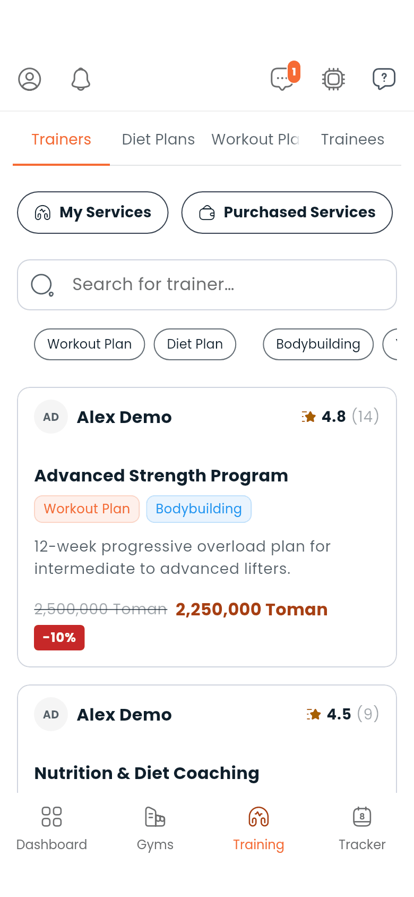
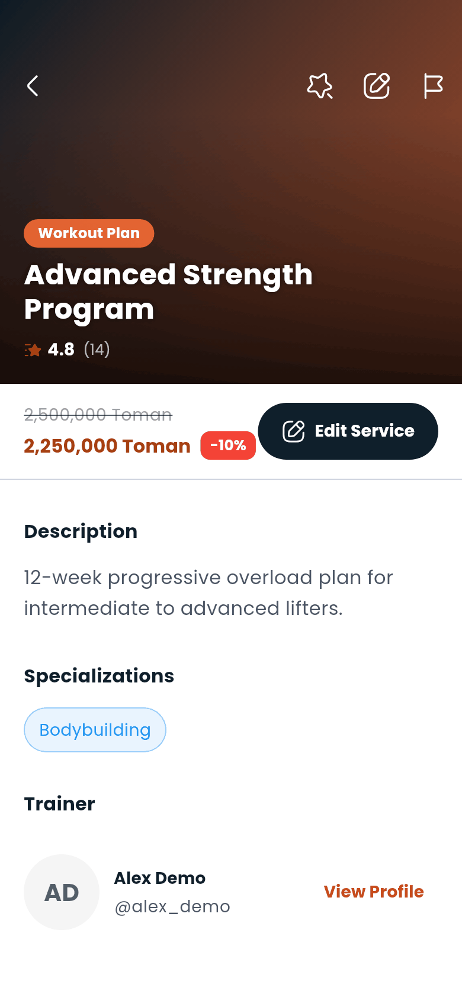
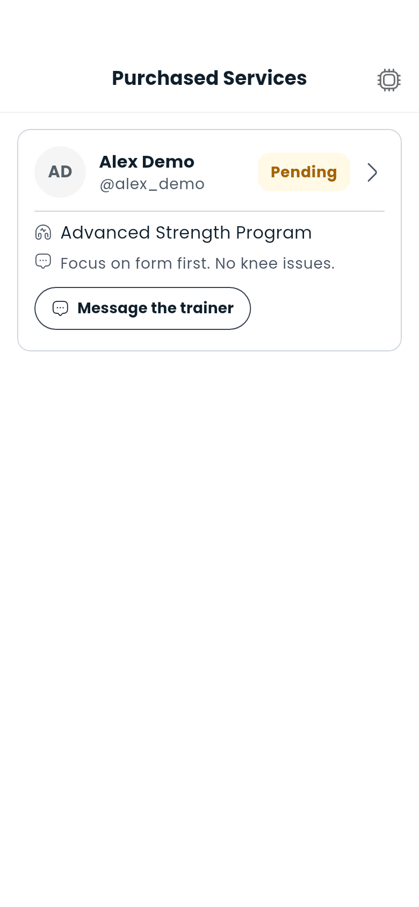
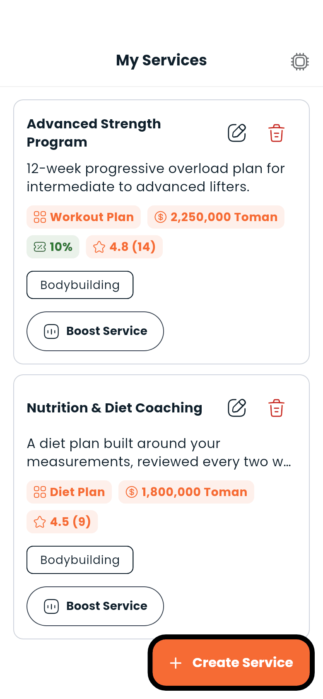
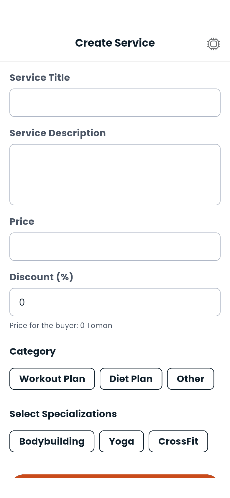
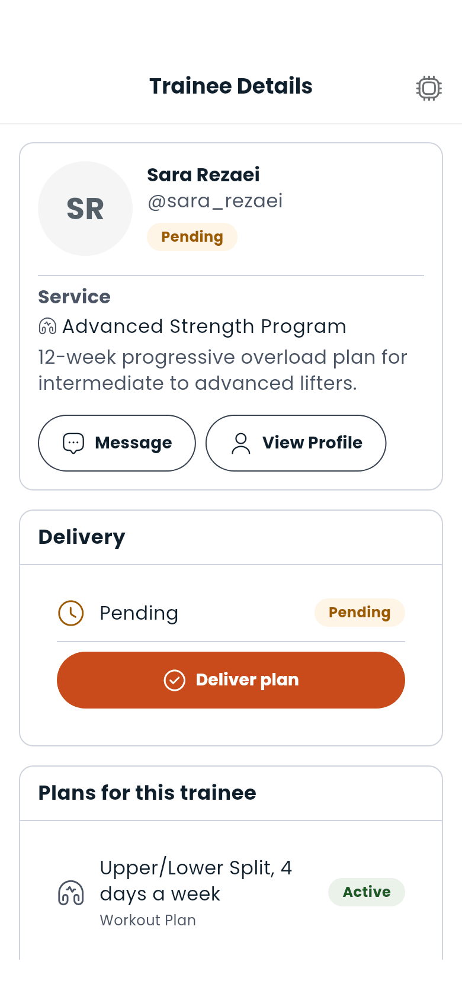

# Trainers

Looking for a trainer? Search, browse their profiles, and buy a service right here in the app.

---

## Finding a trainer

Go to **Training → Trainers**. It is the first tab of the Training area; which other tabs you see — Diet plans, Workout plans, Trainees — depends on what your account is for.

You can:
- **Search by name** or keyword
- **Filter by category:** Workout Plans or Diet Plans
- **Filter by sports field:** bodybuilding, CrossFit, powerlifting, yoga, and more

Trainers with boosted listings appear at the top of the list. Tap any trainer card to open their profile.

---

## Trainer profiles

A trainer's profile shows:
- Their name and username, with an **Approved licence** badge when Dambel has
  approved their trainer licence
- Their trainer rating, averaged across every service of theirs that has been
  rated
- The services they publish, with what each costs — tap one to open it

From there you can message the trainer, or open their full account profile.

---

## Purchasing a service

On a trainer's profile, tap a service to see its full details. When you're ready:
1. Tap **Purchase service**
2. Confirm — the app names the service and what it costs
3. The purchase comes out of your Dambel wallet

Once it's yours, the button is replaced by **Purchased** and a link to the record it created, so you can't buy the same service twice. A trainer looking at their own service sees **Edit service** instead.

---

## Your purchased services

**Purchased services**, at the top of the **Trainers** tab, lists everything you've bought — it is not a tab of its own. Tap a row to open its record, or **Message the trainer** to start a conversation without leaving the list.

Rating a service is for the people who bought it: the form appears once the purchase is yours, and says whether you're adding a rating or changing the one you already left.

---

## For trainers — offering services

If you're a trainer, you can create and manage the services you offer.

### My Services

**My services**, at the top of the **Trainers** tab, lists everything you've published.

### Creating a service

Tap **+** and fill in:
- Service name and description
- **Price**, and a **discount** as a percentage — the form shows what the buyer will actually pay, underneath the two fields
- Category (Workout Plans / Diet Plans)
- Sports fields

There is no duration to set: a service is a piece of work, not a subscription with an end date.

**Your licence has to be approved first.** A service published while your trainer licence is missing, pending or rejected is shown to nobody, and the form says so at the top with a link to your profile rather than letting you find out from the silence.

### Getting seen, and how it's doing

An existing service's form carries two more sections: **Boost**, which puts it at the top of the results for a set number of days and is paid from your wallet ([Premium, Boost and money](monetization.md)), and **Data reports** — how often it turned up in search, how often people opened it, and when ([Analytics](analytics.md)).

### Managing trainees

Go to **Training → Trainees** to see all your current clients. Tap any trainee to:
- See the workout and diet plans you wrote for them, and open any of them
- Hand the programme over with **Deliver plan** — you pick which plan you are
  delivering, confirm, and the record changes to **Delivered** in the list
  straight away. Your trainee is notified. If you need to undo it, the same
  card offers **Set back to pending**
- Message them, or open their profile
- Keep a private note about their training

Delivering needs a plan to deliver: if you have not written one for this
trainee yet, the app says so instead of marking anything.

To enrol somebody who paid you outside the app, tap **Add trainee**, search for the athlete, pick one of your services, and add a note if you want to. Dambel's commission for that service is charged to your wallet, because the athlete pays nothing in the app — you are told before you confirm.

---

---

## Something wrong with a service?

**Report** on a service's page sends it to us with a short description of the problem. See [Reporting](reporting.md).

---

> **Next:** [Chat with your trainer](chat.md) or [view your wallet](wallet.md)

---

[← Previous: Tracker](tracker.md) | [Next: Gyms →](gyms.md)
