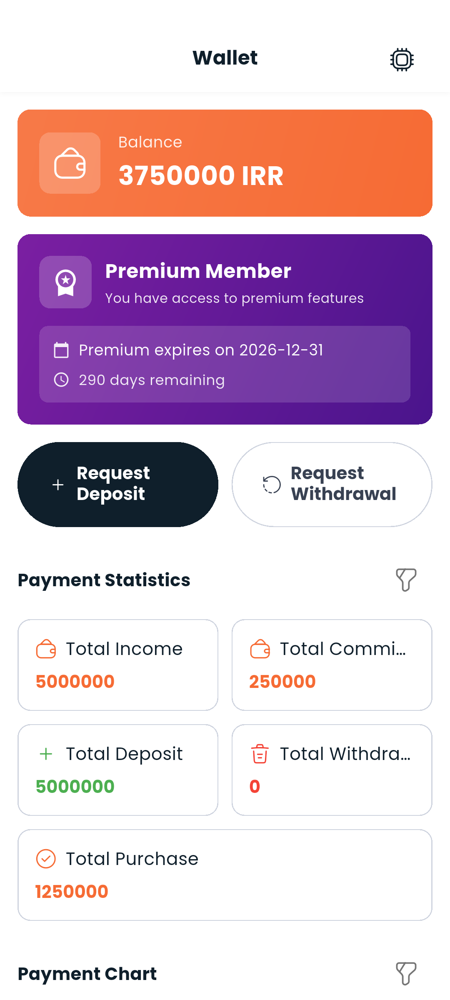

# Wallet

Your wallet balance is what you use to pay for gym memberships, trainer services, and premium features.

---

## Your balance

The current balance is displayed at the top of the wallet screen and also on your Dashboard.

---

## Transaction history

Below your balance, you'll find a full list of transactions:
- **Credits** — top-ups, referral bonuses, refunds
- **Debits** — gym subscriptions, trainer services, premium purchases

Each transaction shows the amount, date, and a short description of what it was for.

---

## Paying for services

When you subscribe to a gym or purchase a trainer service, the amount is automatically deducted from your wallet. If your balance is too low, you'll be prompted to top up.

---

## Referrals

If someone signs up using your referral code, you may receive a credit to your wallet. Check your transaction history to see referral bonuses.

---

> **Next:** [Find a gym to subscribe to](gyms.md) or [browse trainer services](trainers.md)
