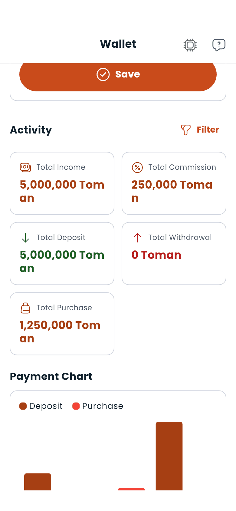

# Wallet

Your wallet balance is what you use to pay for gym memberships, trainer services, and premium features.

---

## Your balance

The current balance is displayed at the top of the wallet screen and also on your Dashboard. Every figure in Dambel — balances, prices, commissions — is in **تومان**.

---

## Topping up

**Request deposit** opens the amount box and then your bank's payment page. The smallest deposit Dambel accepts is **10,000 تومان**; the box says so rather than letting a smaller one fail at the gateway.

A deposit is only credited once the gateway confirms it, which is not instantaneous. Until then the wallet carries a **deposit awaiting confirmation** banner with the amount, a **Check status** button and a way back to the payment page — so a payment you completed but never saw land is visible rather than lost. The banner clears itself once the money arrives.

If a purchase costs more than you have, Dambel says how much is missing and offers to top up rather than simply refusing.

---

## Premium

Premium is bought here, for **1, 3, 6 or 12 months**, paid from your balance. What it unlocks, and what happens when it lapses, is on [Premium, Boost and money](monetization.md).

---

## Transaction history

Below your balance, you'll find a full list of transactions:
- **Credits** — top-ups, referral bonuses, refunds
- **Debits** — gym subscriptions, trainer services, premium purchases

Each transaction shows the amount, its type, and the date and time it happened. Tap a row to open its details, including the reference number to quote if you ever need to ask about it.

A chart above the list shows the same activity over time, and moves with the filters below.

### Narrowing the list

Tap **Filter** above the activity section to narrow everything below it — the totals, the chart and the history — at once. You can filter by transaction type, by a date range (the last week, month or three months, or dates you pick yourself), by whether the transaction has completed, and by order.

---

## Your bank account number

On the wallet screen you can save a **bank account number** (IBAN). This is the account your withdrawal requests are paid out to, so double-check that it's correct before saving. You can update it at any time — just edit the field and tap **Save**.

### Withdrawing

**Request Withdrawal** needs that account on file first: without one, the wallet says so and takes you straight to the field. With one saved, the withdrawal box shows how much is available and will not accept more than your balance.

---

## Paying for services

When you subscribe to a gym or purchase a trainer service, the amount is automatically deducted from your wallet. If your balance is too low, you'll be prompted to top up.

---

## Referrals

Inviting people does not pay into your wallet — the reward is Premium time. Every **5 points** earns you **7 days of Premium**, free. Your link, and how many people have taken it up, are behind your photo in the top bar under **Invite friends**. See [Premium, Boost and money](monetization.md).

---

> **Next:** [Find a gym to subscribe to](gyms.md) or [browse trainer services](trainers.md)

---

[← Previous: Notifications](notifications.md) | [Next: Settings →](settings.md)
